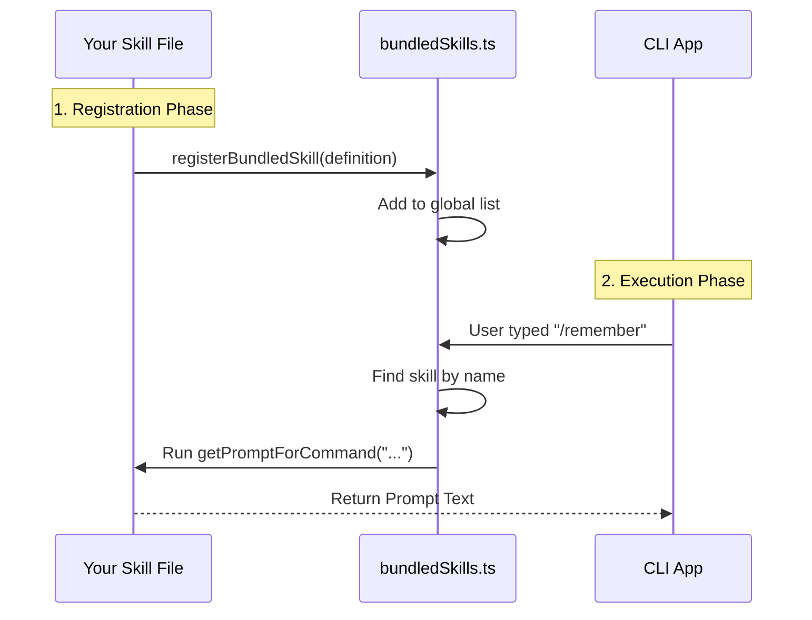

# Chapter 2: Bundled Skill Definition

Welcome back! In the previous chapter, [Skill Registration Pattern](01_skill_registration_pattern.md), we learned how to tell the system that a new tool exists by "registering" it.

But simply saying "I have a tool called Remember" isn't enough. The AI needs to know:
1.  **What** is it?
2.  **When** should I use it?
3.  **How** does it work?

This is where the **Bundled Skill Definition** comes in.

## Motivation: The Job Description

Think of the AI as a hiring manager and your skills as potential employees. You can't just hand the manager a sticky note with a name on it. You need to provide a full **Job Description**.

The **Bundled Skill Definition** is that job description. It is a strict contract (or "blueprint") that ensures every skill speaks the same language. If you fill out the blueprint correctly, the system automatically handles the complex parts—like showing the skill to the user or generating the right instructions for the AI.

### The Use Case

We are continuing with our **"Remember"** skill. We want to define it so that:
1.  Its name is `remember`.
2.  It tells the user: "I save important information."
3.  When triggered, it creates a specific message for the AI model to process.

## Key Concepts

A skill definition is just a JavaScript object with specific properties. Here are the three most important ones:

1.  **Metadata**: The `name` and `description`. This is what the user sees when they list available commands.
2.  **Trigger Logic**: The `whenToUse` field. This helps the AI decide *if* this is the right tool for the current conversation.
3.  **Prompt Generator**: The `getPromptForCommand` function. This is the brain. It takes the user's input and converts it into instructions the AI can understand.

## Step-by-Step Implementation

Let's build the definition for our "Remember" skill.

### 1. Defining the Metadata

First, we define who the skill is.

```typescript
const rememberDefinition = {
  name: 'remember',
  description: 'Stores key details in memory.',
  argumentHint: '<text to save>',
  // This helps the AI understand intent
  whenToUse: 'Use this when the user asks to save information.'
}
```

*Explanation:* This acts like the label on a tool. `argumentHint` tells the user what to type next (e.g., `/remember buy milk`). `whenToUse` is a hint specifically for the AI model to know when this skill is relevant.

### 2. The Prompt Generator

Next, we define what happens when the skill is actually used. We need a function that returns the "Prompt"—the text sent to the AI model.

```typescript
import type { ToolUseContext } from '../Tool.js'

// This function receives the user's arguments
async function generatePrompt(args: string, context: ToolUseContext) {
  return [
    {
      type: 'text',
      text: `ACTION: Save this to memory:\n"${args}"`
    }
  ]
}
```

*Explanation:* When a user types `/remember buy milk`, the `args` variable will contain `"buy milk"`. This function wraps that text into a structured format (Blocks) that the AI model understands. We will dive deeper into this in [Prompt Generation Logic](04_prompt_generation_logic.md).

### 3. Putting it Together

Finally, we combine the metadata and the generator into one object and pass it to the registration function we learned about in Chapter 1.

```typescript
import { registerBundledSkill } from '../bundledSkills.js'

export function registerRememberSkill(): void {
  registerBundledSkill({
    name: 'remember',
    description: 'Stores key details in memory.',
    // Link the function we wrote above
    getPromptForCommand: generatePrompt 
  })
}
```

*Explanation:* This is the complete package. We are handing the system a single object that contains everything it needs to run the skill.

## Internal Implementation: Under the Hood

What happens when you call `registerBundledSkill`? The system doesn't run the skill immediately. It stores it in a secure list (registry) and waits for the user.

Here is the flow of data:



### The Registry Code

Let's look at the actual code in `src/skills/bundledSkills.ts` to see how it handles your definition.

First, it creates a holding area for all skills.

```typescript
// File: src/skills/bundledSkills.ts
import type { Command } from '../types/command.js'

// The central list of all registered skills
const bundledSkills: Command[] = []

export function getBundledSkills(): Command[] {
  return [...bundledSkills]
}
```

*Explanation:* `bundledSkills` is just a simple array. `getBundledSkills` allows other parts of the app to read this list without being able to delete things from it.

### The Registration Logic

When you register a skill, the system converts your simple "Definition" into a strictly typed "Command" object used by the engine.

```typescript
// File: src/skills/bundledSkills.ts
export function registerBundledSkill(definition: BundledSkillDefinition): void {
  // We transform the definition into a standard Command
  const command: Command = {
    type: 'prompt',
    name: definition.name,
    description: definition.description,
    getPromptForCommand: definition.getPromptForCommand,
    // ... maps other fields like aliases, permissions, etc.
  }
  
  bundledSkills.push(command)
}
```

*Explanation:* The `registerBundledSkill` function is a converter. It takes your user-friendly definition and maps it to the internal `Command` structure required by the application's core loop.

### Advanced: Handling Static Files

Sometimes a skill needs reference files (like a strict set of rules or a documentation file). The definition allows you to bundle these files directly.

The registry handles a clever trick here: it intercepts your prompt generator to ensure files are written to disk *before* your logic runs.

```typescript
// File: src/skills/bundledSkills.ts
if (files) {
    // Wrap the original function with file extraction logic
    const inner = definition.getPromptForCommand
    
    getPromptForCommand = async (args, ctx) => {
      // 1. Write files to a temporary folder
      const dir = await extractBundledSkillFiles(definition.name, files)
      
      // 2. Run the original logic
      const blocks = await inner(args, ctx)
      
      // 3. Prepend the file location to the prompt
      return prependBaseDir(blocks, dir)
    }
}
```

*Explanation:* This is a "Wrapper Pattern." If you provide files in your definition, the system automatically modifies your function. It ensures the files are extracted to a real folder on the computer, and then tells the AI model: "Hey, look in this folder for extra context!"

## Summary

The **Bundled Skill Definition** is the blueprint for your capability.

1.  It is a simple **Object** containing metadata and logic.
2.  It uses **`getPromptForCommand`** to translate user input into AI instructions.
3.  The system **converts** this definition into a standardized Command.
4.  It supports **advanced features** like file bundling automatically.

Now that we have defined *what* a skill is, we need to understand how the system loads skills that aren't hardcoded into the binary—skills that live on your hard drive.

[Next Chapter: Filesystem Skill Loader](03_filesystem_skill_loader.md)

---

Generated by [Code IQ](https://github.com/adityasoni99/Code-IQ)