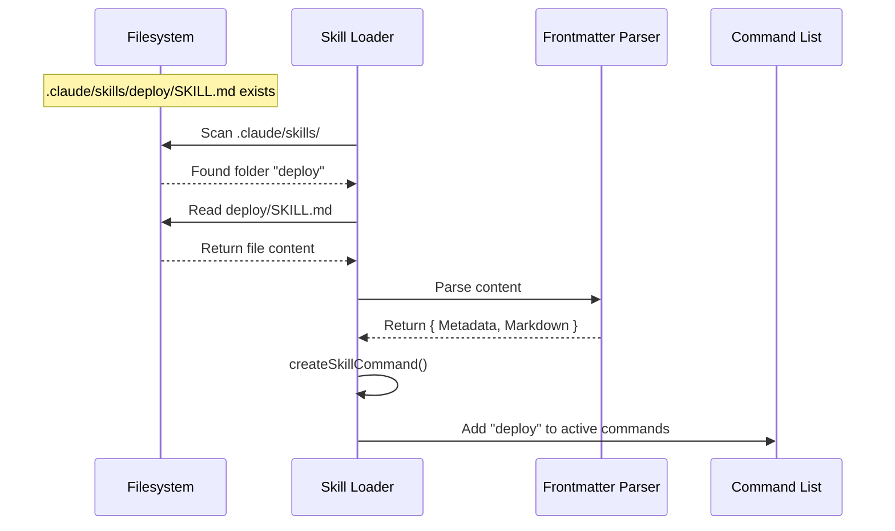

# Chapter 3: Filesystem Skill Loader

Welcome to Chapter 3! In the previous chapter, [Bundled Skill Definition](02_bundled_skill_definition.md), we defined what a skill actually *is*—a JavaScript object containing a name, description, and logic.

However, in Chapter 2, we wrote that definition directly into the application's source code. But what if a user wants to add a skill **without** recompiling the entire application? What if they want to just drop a file into a folder and have it work?

This is the job of the **Filesystem Skill Loader**.

## Motivation: The "Plugin" Analogy

Imagine a video game that allows "mods." You don't need to be a developer at the game studio to add a new map or character. You just download a file, drop it into the `mods/` folder, and the game automatically finds it when it starts up.

The **Filesystem Skill Loader** works exactly the same way. It scans specific directories on your computer, finds skill files, and converts them into the executable commands we learned about in the previous chapter.

### The Use Case

Let's say a user wants a custom command called `/deploy` that helps them push code to production.
1.  They create a folder: `.claude/skills/deploy/` inside their project.
2.  They create a file: `SKILL.md` inside that folder.
3.  They want the AI to immediately recognize `/deploy`.

## Key Concepts

To bridge the gap between a text file on a disk and a running command in memory, we need three concepts:

1.  **Discovery**: The engine must know *where* to look (e.g., user settings, project settings).
2.  **Frontmatter**: A special section at the top of the Markdown file that contains the metadata (name, description) that we used to write in JavaScript.
3.  **The Factory**: A function that reads the text file and "manufactures" a Command object from it.

## Step-by-Step Implementation

Let's look at how the loader processes a user's skill.

### 1. The Structure on Disk

The loader expects a specific folder structure. It looks for a `.claude/skills` directory. Inside, every skill gets its own folder.

```text
my-project/
├── .claude/
│   └── skills/
│       └── deploy/       <-- The Skill Name
│           └── SKILL.md  <-- The Definition
```

### 2. The File Content (SKILL.md)

Instead of writing TypeScript, the user writes Markdown with **YAML Frontmatter**.

```markdown
---
name: deploy
description: Deploys the current branch to staging.
when_to_use: Use when the user wants to update the staging server.
---

# Deployment Instructions

To deploy this app, please run the following shell command:
...
```

*Explanation:* The content between the `---` lines is the **Frontmatter**. The loader reads this to fill in the `name` and `description` fields of the Command object.

### 3. The Loading Logic

Now, let's look at the TypeScript code that powers this discovery. It lives in `src/skills/loadSkillsDir.ts`.

First, the loader finds the directories.

```typescript
// File: src/skills/loadSkillsDir.ts
async function loadSkillsFromSkillsDir(basePath: string) {
  const fs = getFsImplementation()
  
  // 1. Get a list of all folders in .claude/skills
  const entries = await fs.readdir(basePath)
  
  // ... iterate through them
}
```

*Explanation:* We use the filesystem (`fs`) to list everything in the target directory.

### 4. Reading the Skill File

For every folder found (like `deploy`), the loader looks for `SKILL.md`.

```typescript
// Inside the loop...
const skillDirPath = join(basePath, entry.name) // e.g., .claude/skills/deploy
const skillFilePath = join(skillDirPath, 'SKILL.md')

// 2. Read the text content of the file
const content = await fs.readFile(skillFilePath, { encoding: 'utf-8' })
```

*Explanation:* If the file exists, we read it into a giant string. If it doesn't exist, the loader skips this folder.

### 5. Parsing Frontmatter

The loader needs to separate the metadata (YAML) from the instructions (Markdown).

```typescript
import { parseFrontmatter } from '../utils/frontmatterParser.js'

// 3. Split the file into two parts
const { frontmatter, content: markdownContent } = parseFrontmatter(
  content,
  skillFilePath
)
```

*Explanation:* `frontmatter` becomes an object (like `{ name: 'deploy' }`), and `markdownContent` is the rest of the text.

### 6. The Command Factory

Finally, we convert these raw parts into the `Command` object we studied in Chapter 2.

```typescript
// 4. Create the executable Command object
return createSkillCommand({
  skillName: entry.name,
  description: frontmatter.description,
  markdownContent: markdownContent,
  // ... other flags from frontmatter
})
```

*Explanation:* `createSkillCommand` is a helper that takes the static data from the text file and wraps it in the necessary functions to make it run within the app.

## Internal Implementation: How it Works

Let's visualize the journey of the "Deploy" skill from the hard drive to the application memory.



### Handling Duplicates

A complex challenge the loader faces is **Deduplication**. A user might have the same skill defined in their user settings *and* their project settings. Or, they might use "symlinks" (shortcuts) that make one file appear in two places.

The loader is smart enough to handle this.

```typescript
// File: src/skills/loadSkillsDir.ts

// We use realpath to find the "true" location of a file
const fileId = await realpath(filePath)

if (seenFileIds.has(fileId)) {
  // We already loaded this exact file!
  logForDebugging(`Skipping duplicate skill...`)
  continue
}
```

*Explanation:* By checking the `realpath` (the canonical path on the physical disk), the loader ensures that even if you link to a skill from multiple places, it only loads into memory once.

### Dynamic Discovery

The loader doesn't just run once at startup. It can also "walk up" the directory tree. If you are deep inside `project/src/components`, the loader looks for skills in:
1.  `project/src/components/.claude/skills`
2.  `project/src/.claude/skills`
3.  `project/.claude/skills`

```typescript
export async function discoverSkillDirsForPaths(filePaths, cwd) {
  // Start from the file's directory and move up
  let currentDir = dirname(filePath)
  
  while (currentDir !== root) {
     // Check if .claude/skills exists here
     // If yes, add to list
     currentDir = parent(currentDir)
  }
}
```

*Explanation:* This ensures that skills relevant to a specific sub-project are only available when you are working inside that sub-project.

## Summary

The **Filesystem Skill Loader** is the bridge between static files and dynamic capabilities.

1.  It scans standard directories (like `.claude/skills`).
2.  It parses `SKILL.md` files to separate **Metadata** (Frontmatter) from **Instructions** (Markdown).
3.  It handles complex filesystem logic like **deduplication** and **directory traversal**.
4.  It uses `createSkillCommand` to turn text files into the executable objects we defined in Chapter 2.

Now that we have loaded the skill and have its Markdown content in memory, how does the AI actually use it? How do we take `markdownContent` and turn it into a prompt that guides the Large Language Model?

[Next Chapter: Prompt Generation Logic](04_prompt_generation_logic.md)

---

Generated by [Code IQ](https://github.com/adityasoni99/Code-IQ)