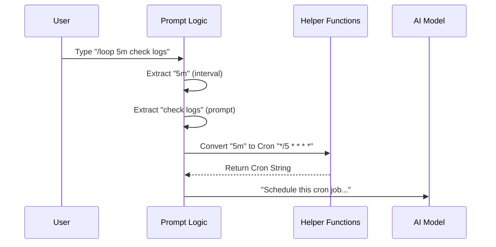

# Chapter 4: Prompt Generation Logic

Welcome back! In the previous chapter, [Filesystem Skill Loader](03_filesystem_skill_loader.md), we learned how to load skills from disk. But loading a skill is like buying a tool; now we need to learn how to *use* it.

When a user types a command like `/loop 5m check status`, the AI doesn't inherently know what that means. We need a way to translate that raw text into a clear, structured instruction manual for the AI.

This translation process is called **Prompt Generation Logic**.

## Motivation: The Briefing Officer

Imagine the AI is a high-ranking General. The General is very smart but doesn't have time to look up small details. You are the **Briefing Officer** (the Skill).

When a request comes in ("The troops need supplies!"), you don't just run to the General and yell. You:
1.  **Analyze** the request.
2.  **Gather Context** (check the map, check inventory).
3.  **Write a Briefing** (a prompt) that says: *"Sir, troops at Sector 7 need food. We have trucks available. Please authorize deployment."*

**Prompt Generation Logic** is the code that writes that briefing. It is the bridge between the user's messy typing and the AI's need for clarity.

### The Use Case

We will look at the **Loop Skill** (`/loop`).
User types: `/loop 5m check server`

If we just sent "loop 5m check server" to the AI, it might get confused. Does "5m" mean 5 meters? 5 million? Instead, the Prompt Generation Logic transforms it into:

> "Run the command 'check server' every 5 minutes. Use the Cron Tool with expression `*/5 * * * *`."

## Key Concepts

To write this logic, we use three main ingredients:

1.  **User Arguments (`args`)**: The text the user typed after the command name.
2.  **Runtime Context**: Information about the world right now (Time, OS, File Contents).
3.  **The Generator Function**: A function named `getPromptForCommand` that mixes #1 and #2 to produce instructions.

## Step-by-Step Implementation

Let's build the logic for a simple skill called `/greet`. It greets the user differently depending on the time of day.

### 1. The Function Signature

In your skill definition (which we learned about in [Bundled Skill Definition](02_bundled_skill_definition.md)), you add a specific function.

```typescript
// Inside your skill definition object
async getPromptForCommand(args: string, context: ToolUseContext) {
  // Logic goes here...
}
```

*Explanation:* This function receives `args` (what the user typed) and `context` (system details). It must return a Promise that resolves to the prompt.

### 2. Processing Logic

The "Intelligence" of the skill lives here. We can use standard JavaScript to manipulate data.

```typescript
async getPromptForCommand(args: string) {
  // 1. Logic: Check the current time
  const hour = new Date().getHours()
  const timeOfDay = hour < 12 ? 'Morning' : 'Evening'
  
  // 2. Logic: Handle empty arguments
  const name = args.trim() || "User"
  
  // ... continue to step 3
}
```

*Explanation:* The AI doesn't know what time it is unless we tell it. Here, we calculate `timeOfDay` dynamically *before* generating the prompt.

### 3. Returning the Prompt

Finally, we return the instructions structured as a "Block".

```typescript
  // ... inside the function
  return [
    {
      type: 'text',
      text: `Context: It is currently ${timeOfDay}.
             Task: Please wish ${name} a happy ${timeOfDay}.`
    }
  ]
}
```

*Explanation:* We return an array of blocks. The AI reads this `text` and acts accordingly. To the AI, it looks like a user typed this detailed paragraph, even though the user only typed `/greet`.

## Internal Implementation: Real World Example

Let's look at how the **Loop Skill** (`src/skills/bundled/loop.ts`) handles this. It's a bit more complex because it has to parse time intervals (like "5m" or "2h").

### The Workflow



### Parsing User Input

The Loop skill first tries to figure out what the user meant.

```typescript
// File: src/skills/bundled/loop.ts

function buildPrompt(args: string): string {
  return `# /loop — schedule a recurring prompt
  
  Parse the input below into [interval] <prompt>...
  1. If input starts with "5m", that is the interval.
  2. If input ends with "every 5 minutes", that is the interval.
  
  ## Input
  ${args}`
}
```

*Explanation:* The Loop skill actually delegates the hard work! It constructs a prompt that *tells the AI* how to parse the arguments. This is a technique called **"Prompt Engineering via Code."** instead of writing complex Regex in TypeScript, we ask the AI to figure out the user's intent based on rules we provide.

### Dynamic Context: Reading Files

Sometimes, the logic needs to read a file to be useful. Let's look at the **Debug Skill** (`src/skills/bundled/debug.ts`). It reads the application's log file to help the user fix errors.

```typescript
// File: src/skills/bundled/debug.ts
import { open, stat } from 'fs/promises'

async getPromptForCommand(args) {
  // 1. Get path to the log file
  const debugLogPath = getDebugLogPath()
  
  // 2. Read the last 20 lines of the file
  const stats = await stat(debugLogPath)
  // ... complex file reading logic ...
  const tail = buffer.toString() 
  
  // ... continue
}
```

*Explanation:* The skill uses Node.js filesystem commands (`fs/promises`) to grab data.

Then, it injects that data into the prompt:

```typescript
  // 3. Create the prompt with the file content included
  return [{ 
    type: 'text', 
    text: `Here are the last 20 lines of the log:\n\n${tail}\n\n` 
  }]
} // End of function
```

*Explanation:* This is powerful. The user didn't have to find the log file, open it, copy the text, and paste it. The **Prompt Generation Logic** did it automatically.

### The `ToolUseContext`

The second argument, `context`, provides access to tools and the environment.

```typescript
// src/skills/bundled/scheduleRemoteAgents.ts

async getPromptForCommand(args, context: ToolUseContext) {
  // We can access available MCP clients
  const connectors = context.options.mcpClients
  
  // formatting logic...
}
```

*Explanation:* `ToolUseContext` allows your skill to be aware of the "Outside World," such as other servers (MCP) the user is connected to.

## Summary

**Prompt Generation Logic** is the functional core of a skill.
1.  It takes **Input** (`args`) and **Context** (`time`, `files`, `tools`).
2.  It runs **Logic** (Parsing, Reading Files, Calculations).
3.  It returns a **Structured Prompt** that guides the AI.

By using this logic, we can make the AI appear much smarter and more context-aware than it actually is. We do the heavy lifting of gathering information so the AI can focus on reasoning.

Sometimes, however, a skill doesn't need *logic*—it just needs to provide a lot of static text, like a tutorial or a reference guide. Writing huge strings inside JavaScript files is messy.

[Next Chapter: Static Content Assets](05_static_content_assets.md)

---

Generated by [Code IQ](https://github.com/adityasoni99/Code-IQ)