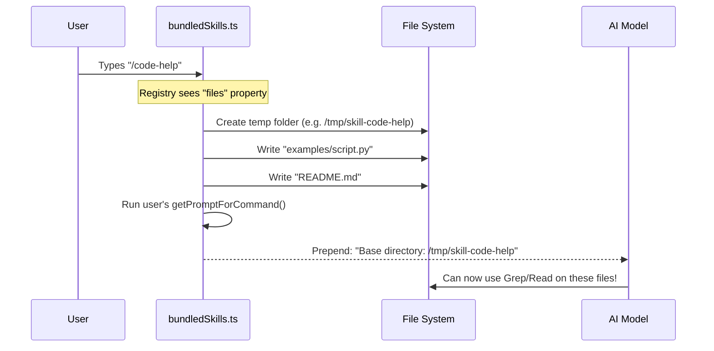

# Chapter 5: Static Content Assets

Welcome back! In the previous chapter, [Prompt Generation Logic](04_prompt_generation_logic.md), we learned how to write the "brain" of a skill—the code that takes user input and transforms it into instructions for the AI.

Sometimes, however, a skill doesn't need complex logic. It simply needs **knowledge**.

Imagine you are building a skill called `/help-api` that explains how to use a complex software library. You have 50 pages of documentation written in Markdown. Where do you put this text?

1.  **In the code?** Putting 50 pages of text into a TypeScript variable makes your code unreadable.
2.  **In loose files?** If you distribute your app as a single binary file, you can't rely on `documentation.md` existing on the user's hard drive.

This is where **Static Content Assets** come in.

## Motivation: The Encyclopedia in a Backpack

Imagine you are going on a hike (starting the application). You have a massive encyclopedia (the documentation) that you *might* need, but probably won't.

*   **Bad Approach:** You memorize the entire encyclopedia before you start walking. (This slows down application startup and wastes memory).
*   **Good Approach:** You keep the encyclopedia in your backpack. You don't look at it or think about it until someone asks a specific question. Then, and only then, do you pull it out.

**Static Content Assets** allow us to bundle large text files directly into our application binary but keep them "asleep" (lazy-loaded) until the specific moment they are needed.

### The Use Case

We will build a skill called `/docs`.
1.  We have a large file: `manual.md`.
2.  We want to bundle it inside our executable.
3.  When the user types `/docs`, we read the content and give it to the AI.

## Key Concepts

To achieve this, we rely on three concepts:

1.  **The Asset Loader:** A build tool feature (like in Bun) that allows us to import a `.md` file as if it were a string variable.
2.  **Lazy Loading:** Using JavaScript's `await import(...)` to load a file only when a function is executed, not when the app starts.
3.  **File Extraction:** A feature of our Skills engine that can write these internal assets to a temporary real folder so the AI can use tools like `grep` on them.

## Step-by-Step Implementation

Let's implement our `/docs` skill using the Static Content pattern.

### 1. Creating the Asset

First, we just write normal Markdown. No TypeScript here.

```markdown
<!-- File: src/skills/bundled/docs/manual.md -->
# Super Complex Manual

Here is how to configure the flux capacitor...
1. Turn it on.
2. Set speed to 88mph.
... (imagine 1000 more lines) ...
```

### 2. The "Barrel" File

We create a TypeScript file solely responsible for importing these assets. This acts as our "backpack."

```typescript
// File: src/skills/bundled/docs/content.ts
import manual from './manual.md'

// We export it so other files can see it
export const MANUAL_TEXT = manual
```

*Explanation:* Because of our build system setup, `manual` is now a string containing the text from the file.

### 3. Lazy Loading the Asset

Now, inside our skill definition, we import the content dynamically.

```typescript
// File: src/skills/bundled/docsSkill.ts
import { registerBundledSkill } from '../bundledSkills.js'

export function registerDocsSkill() {
  registerBundledSkill({
    name: 'docs',
    description: 'Read the manual.',
    getPromptForCommand: async (args) => {
      // MAGICAL LINE: Only load the huge text now!
      const content = await import('./docs/content.js')
      
      return [{ type: 'text', text: content.MANUAL_TEXT }]
    }
  })
}
```

*Explanation:* Notice we use `await import(...)` inside the function. If the user never types `/docs`, the application never loads `content.ts` into memory. This keeps our app fast and lightweight.

## Advanced: File Extraction

Sometimes, the documentation is *too big* to dump into the chat context all at once. Or, perhaps it's a collection of code examples (Python, Java, TypeScript) and we want the AI to be able to search through them.

Our engine supports **Extracting Assets to Disk**.

Instead of returning the text directly, we tell the engine: "Here is a map of virtual files. When this skill runs, write them to a temporary folder and tell the AI where they are."

### Defining Virtual Files

We add a `files` property to our registration.

```typescript
// File: src/skills/bundled/codingSkill.ts
import pythonExample from './examples/script.py'

registerBundledSkill({
  name: 'code-help',
  description: 'Provides coding examples.',
  // Define files to be written to disk
  files: {
    'examples/script.py': pythonExample, // content of file
    'README.md': '# Help\nRead the script.'
  },
  // ... logic continues below
```

*Explanation:* The `files` object maps filenames (keys) to their string content (values).

### The Prompt with Extraction

When we define `files`, the engine does the heavy lifting. We just write our prompt logic as usual.

```typescript
  getPromptForCommand: async (args) => {
    return [{
      type: 'text',
      text: "I have provided examples in the directory above."
    }]
  }
})
```

*Explanation:* You might wonder, "Where is the directory?" The engine automatically prepends the location of the temporary folder to the prompt before the AI sees it.

## Internal Implementation: Under the Hood

How does the system take a string from memory and turn it into a physical file on the user's disk?

### The Flow of Execution



### The Code: Extracting Files

Let's look at `src/skills/bundledSkills.ts`. This is the core engine code that handles the extraction.

It uses a wrapper pattern. It takes your `getPromptForCommand` and wraps it inside another function.

```typescript
// File: src/skills/bundledSkills.ts

if (files) {
  // Save your original function
  const inner = definition.getPromptForCommand
  
  // Create a new wrapped function
  getPromptForCommand = async (args, ctx) => {
    // 1. Write files to disk (Memoized: only happens once)
    const dir = await extractBundledSkillFiles(definition.name, files)
    
    // 2. Run your original logic
    const blocks = await inner(args, ctx)
    
    // 3. Add the directory path to the message
    return prependBaseDir(blocks, dir)
  }
}
```

*Explanation:* 
1.  `extractBundledSkillFiles`: This helper function loops through your `files` object and uses Node.js `fs` (filesystem) commands to write them to a temp folder.
2.  `prependBaseDir`: This modifies the message sent to the AI, adding: `Base directory for this skill: <path>`.

### Real World Example: The Claude API Skill

The most complex use of this system in our project is the **Claude API Skill** (`src/skills/bundled/claudeApi.ts`).

It contains documentation for Python, TypeScript, Go, and Java. It uses a smart detector to only show relevant docs.

1.  **Detection:** It scans the user's current folder for `package.json` (TypeScript) or `requirements.txt` (Python).
2.  **Filtering:** It loads a massive object containing *all* docs (`claudeApiContent.ts`).
3.  **Selection:** It picks only the Markdown strings matching the detected language.

```typescript
// Simplified logic from src/skills/bundled/claudeApi.ts

async getPromptForCommand(args) {
  // 1. Lazy load the massive content file
  const content = await import('./claudeApiContent.js')
  
  // 2. Detect language (e.g., 'python')
  const lang = await detectLanguage()
  
  // 3. Filter keys that start with "python/"
  const filePaths = getFilesForLanguage(lang, content)
  
  // 4. Return just those docs
  return buildInlineReference(filePaths, content)
}
```

## Summary

**Static Content Assets** solve the problem of distributing knowledge with your code.

1.  **Bundle** text files using `import content from './file.md'`.
2.  **Lazy Load** them using `await import(...)` to save memory.
3.  **Extract** them using the `files: {}` property if you want the AI to be able to grep/search them as real files.

This mechanism allows our AI assistant to carry a massive library of documentation "in its backpack" without being weighed down by it during normal operation.

So far, we have built skills that run logic inside our own application (Loop, Remember, Docs). But what if we want to talk to *other* servers? What if we want to control a database or a web browser that lives outside our binary?

[Next Chapter: MCP Skill Bridge](06_mcp_skill_bridge.md)

---

Generated by [Code IQ](https://github.com/adityasoni99/Code-IQ)