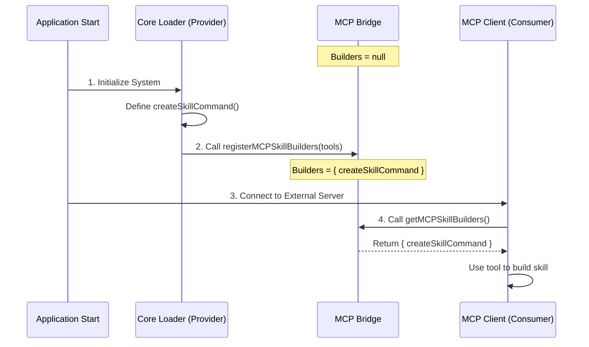

# Chapter 6: MCP Skill Bridge

Welcome to Chapter 6! In the previous chapter, [Static Content Assets](05_static_content_assets.md), we learned how to bundle large text files (like manuals) inside our application so the AI can read them on demand.

So far, all the skills we have built live **inside** our application. But the Model Context Protocol (MCP) is designed to let the AI talk to **external** tools—like a database server, a web browser, or a specialized analysis tool running on a different computer.

This introduces a tricky architectural problem called a **Circular Dependency**. The **MCP Skill Bridge** is the solution to that problem.

## Motivation: The "Chicken and Egg" Problem

Imagine you are building a house.
1.  ** The Carpenter** needs the **Hammer**.
2.  But the **Hammer** is locked inside the **Toolbox**.
3.  And the **Toolbox** can only be opened by the **Carpenter**.

If the Carpenter is inside the Toolbox, and the Toolbox is inside the Carpenter... well, in programming, this crashes the computer. This is called a **Circular Dependency**.

### The Use Case

In our project, we have two main parts:
1.  **The Core Loader** (from [Filesystem Skill Loader](03_filesystem_skill_loader.md)): It knows *how* to build a skill command. It holds the "Factory Functions."
2.  **The MCP Client**: It connects to external servers. When an external server says "I have a tool," the MCP Client needs to build a command for it.

**The Problem:** The MCP Client needs the Core Loader's logic to build skills. But the Core Loader eventually needs to know about MCP to register those skills. If they import each other directly, the app won't start.

**The Solution:** We create a "Bridge"—a neutral location where they can exchange tools without crashing.

## Key Concepts

To solve this, we use a pattern often called **Dependency Injection** or a **Service Locator**. We can think of it as a **Secure Drop-off Box**.

1.  **The Bridge**: A tiny, independent file that has no dependencies. It just holds a variable.
2.  **The Provider (Core Loader)**: At startup, it puts its "Skill Building Tools" into the Bridge.
3.  **The Consumer (MCP Client)**: Later, when it connects to a server, it asks the Bridge: "Do you have the tools I need?"

## Step-by-Step Implementation

Let's look at how we implement this bridge to keep our code clean and crash-free.

### 1. The Bridge File

This file (`mcpSkillBuilders.ts`) is the neutral ground. It is very simple. It doesn't import the heavy logic; it just defines what the logic *looks* like (Types).

```typescript
// File: src/skills/mcpSkillBuilders.ts

// A variable to hold the tools. Starts empty (null).
let builders: MCPSkillBuilders | null = null

// Method for the Provider to drop off tools
export function registerMCPSkillBuilders(b: MCPSkillBuilders): void {
  builders = b
}
```

*Explanation:* We create a global variable `builders`. We export a function that allows someone to fill this variable.

### 2. The Retrieval Function

In the same file, we need a way for the Consumer to pick up the tools.

```typescript
// File: src/skills/mcpSkillBuilders.ts

export function getMCPSkillBuilders(): MCPSkillBuilders {
  // Safety check: Did the Provider arrive yet?
  if (!builders) {
    throw new Error('Tools not yet registered!')
  }
  
  return builders
}
```

*Explanation:* If the MCP system tries to grab the tools before the Core Loader has started, we throw an error. This ensures the startup order is correct.

### 3. The Provider (Core Loader)

Now, let's look at `loadSkillsDir.ts` (the file we discussed in [Filesystem Skill Loader](03_filesystem_skill_loader.md)). When this file runs, it registers its factory functions.

```typescript
// File: src/skills/loadSkillsDir.ts
import { registerMCPSkillBuilders } from './mcpSkillBuilders.js'

// We define the tools we have available
import { createSkillCommand } from './skillFactory.js'

// DROP-OFF: We put the tools in the bridge
registerMCPSkillBuilders({
  createSkillCommand: createSkillCommand,
  // ... other helpers
})
```

*Explanation:* The Core Loader imports the bridge and calls `register...`. It effectively says: "Hey Bridge, here is the function `createSkillCommand`. Keep it safe for anyone who needs it."

### 4. The Consumer (MCP Client)

Finally, the MCP system (`mcpSkills.ts`) needs to create a skill from a remote server's definition. It doesn't import `loadSkillsDir.ts` directly (which would cause the crash). Instead, it asks the Bridge.

```typescript
// File: src/skills/mcpSkills.ts
import { getMCPSkillBuilders } from './mcpSkillBuilders.js'

export function convertMcpToolToSkill(tool: any) {
  // PICK-UP: Get the factory function from the bridge
  const { createSkillCommand } = getMCPSkillBuilders()

  // Now we can use the logic without a direct dependency!
  return createSkillCommand({
    name: tool.name,
    // ...
  })
}
```

*Explanation:* By using `getMCPSkillBuilders()`, the MCP system gets access to the powerful logic defined elsewhere, without directly linking to the file that defines it.

## Internal Implementation: Under the Hood

Let's visualize exactly what happens when the application starts up. The order of events is critical here.



### Why this works

In JavaScript/TypeScript, modules are executed the first time they are imported.

1.  **`mcpSkillBuilders.ts`** is a "Leaf Node." It sits at the bottom of the tree. It depends on nothing.
2.  **`loadSkillsDir.ts`** imports the Bridge.
3.  **`mcpSkills.ts`** imports the Bridge.

Because neither `loadSkillsDir` nor `mcpSkills` import *each other*, the circle is broken. They both just point to the neutral Bridge.

### The Type Definitions

To make TypeScript happy, the Bridge needs to know what the tools *look like* without actually importing the code. We use `typeof` imports for this.

```typescript
// File: src/skills/mcpSkillBuilders.ts

// We import ONLY the type, not the code
import type { createSkillCommand } from './loadSkillsDir.js'

export type MCPSkillBuilders = {
  createSkillCommand: typeof createSkillCommand
  // other functions...
}
```

*Explanation:* `import type` is a special TypeScript feature. It tells the compiler "I need to know the shape of this function, but don't actually load the file at runtime." This is crucial for avoiding the circular dependency while keeping our code strictly typed.

## Summary

The **MCP Skill Bridge** is a helper pattern that keeps our application architecture healthy.

1.  It solves **Circular Dependencies** by decoupling the "Creator" of skills from the "User" of skills.
2.  It acts as a **Registry** where factory functions are stored at startup.
3.  It allows the MCP system to reuse the robust skill creation logic (from [Filesystem Skill Loader](03_filesystem_skill_loader.md)) without crashing the app.

By using this bridge, we ensure that whether a skill comes from a local file, a bundled asset, or a remote MCP server, it is always built using the exact same logic.

This concludes our tutorial on the **Skills** project! You now understand:
1.  How skills are registered.
2.  How they are defined.
3.  How they are loaded from disk.
4.  How prompts are generated.
5.  How assets are managed.
6.  How we connect to external MCP servers safely.

You are now ready to extend the AI's capabilities with your own custom tools! Happy coding!

---

Generated by [Code IQ](https://github.com/adityasoni99/Code-IQ)