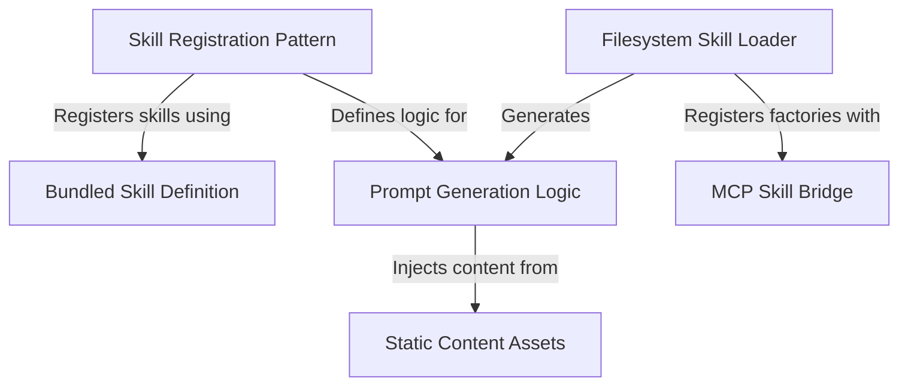

# Tutorial: skills

This project manages **skills**, which are custom capabilities or commands (like `/loop` or `/debug`) available to the AI model. It supports two main types of skills: **bundled skills** built directly into the CLI binary, and **user-defined skills** loaded dynamically from markdown files in the filesystem. The system handles discovery, parsing, and the dynamic generation of context-aware **prompts** that guide the model's behavior.

## Chapters

1. [Skill Registration Pattern](01_skill_registration_pattern.md)
2. [Bundled Skill Definition](02_bundled_skill_definition.md)
3. [Filesystem Skill Loader](03_filesystem_skill_loader.md)
4. [Prompt Generation Logic](04_prompt_generation_logic.md)
5. [Static Content Assets](05_static_content_assets.md)
6. [MCP Skill Bridge](06_mcp_skill_bridge.md)

---

Generated by [Code IQ](https://github.com/adityasoni99/Code-IQ)