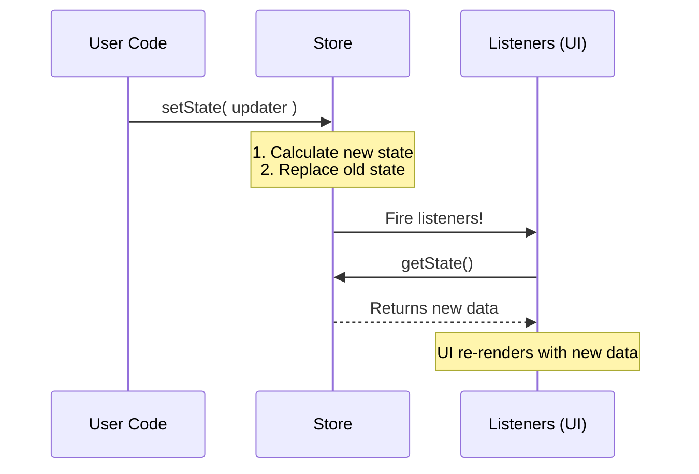

# Chapter 1: Core State Definition (The Store)

Welcome to the **state** project! If you are building a complex application, you face a difficult challenge: keeping everyone on the same page.

Imagine an application where the User Interface (UI) thinks the user is logged out, but the background data fetcher thinks the user is logged in. That leads to bugs and confusion.

To solve this, we use a concept called the **Single Source of Truth**.

### The Motivation: The Central Whiteboard

Think of your application as a busy office.
*   **Without a Store:** Everyone creates their own sticky notes. To find out if "Dark Mode" is on, you have to ask three different people, and they might give different answers.
*   **With a Store:** There is one giant **Whiteboard** in the middle of the room. If you want to know if "Dark Mode" is on, you look at the whiteboard. If you want to change it, you write the new value on the whiteboard.

In our project, this whiteboard is called the **Store**.

---

### Key Concept: The `AppState` Object

Before we look at the whiteboard mechanism, let's look at *what* is written on it.

The entire state of our application is defined in one massive JSON object called `AppState`. It holds everything:
1.  **User Preferences:** (e.g., `verbose` mode, `settings`)
2.  **UI State:** (e.g., `footerSelection`, `expandedView`)
3.  **Data:** (e.g., `tasks`, `inbox`, `notifications`)

Here is a simplified look at what this object looks like in `AppStateStore.ts`:

```typescript
// AppStateStore.ts (Simplified)
export type AppState = {
  // Is the user looking at the "tasks" view or "teammates"?
  expandedView: 'none' | 'tasks' | 'teammates'

  // Is the "Brief Mode" toggle enabled?
  isBriefOnly: boolean

  // A dictionary of all active tasks
  tasks: { [taskId: string]: TaskState }
  
  // ... and many more fields
}
```

This object is our "snapshot" of the world at any given moment.

---

### Key Concept: The Store Mechanism

Now that we have the data structure, we need a way to manage it. We don't want people scribbling on the whiteboard randomly. We need a system.

We use a custom implementation in `store.ts` that provides three main features:
1.  **`getState()`**: Read the board.
2.  **`setState()`**: Update the board safely.
3.  **`subscribe()`**: Get notified when the board changes.

#### Use Case: Toggling "Brief Mode"

Let's see how a beginner would use the Store to toggle a simple setting.

**1. Reading the State**
To see the current value, we access the store instance.

```typescript
import { store } from './storeInstance' // conceptual import

// Get the huge JSON object
const currentState = store.getState()

// Read a specific value
console.log(currentState.isBriefOnly) // Output: false
```

**2. Writing to the State**
To change data, we use `setState`. We provide an "updater" function. This function receives the *old* state and returns the *new* state.

```typescript
// Toggle the value from false to true
store.setState((prevState) => {
  return {
    ...prevState, // Keep all other 100+ properties exactly the same
    isBriefOnly: !prevState.isBriefOnly // Flip this one specific switch
  }
})
```
*Note: We use `...prevState` (spread syntax) to copy everything else. We only change what we need.*

**3. Listening for Changes**
If we want to update the UI automatically when data changes, we subscribe.

```typescript
// This runs every time ANY part of the state changes
const unsubscribe = store.subscribe(() => {
  console.log("Something changed on the whiteboard!")
})

// Later, stop listening
unsubscribe()
```

---

### Internal Implementation: How it Works

Let's peek under the hood of `store.ts`. It acts as the guardian of the state.

When you call `setState`, the Store doesn't just change a variable; it acts like a town crier, notifying everyone who is listening.



#### Code Walkthrough: `store.ts`

The implementation is surprisingly minimal. It does not depend on React or any heavy library.

**1. Holding the State**
We create a variable `state` inside a function closure. No one can touch it directly.

```typescript
// store.ts
export function createStore<T>(initialState: T) {
  // This variable holds the "Single Source of Truth"
  let state = initialState
  
  // A collection of functions to run when state changes
  const listeners = new Set<() => void>()
  
  // ...
}
```

**2. The Updater (`setState`)**
This function ensures we move safely from the old state to the new state.

```typescript
  // ... inside createStore returns ...
  setState: (updater: (prev: T) => T) => {
    const prev = state
    const next = updater(prev)
    
    // Optimization: If nothing changed, do nothing
    if (Object.is(next, prev)) return
    
    state = next // Update the local variable
    for (const listener of listeners) listener() // Notify everyone
  },
```

**3. The Subscriber**
This allows outside code to register a callback function.

```typescript
  // ... inside createStore returns ...
  subscribe: (listener: () => void) => {
    listeners.add(listener)
    
    // Return a function to "unsubscribe" (clean up)
    return () => listeners.delete(listener)
  },
```

### Initializing the App (`AppStateStore.ts`)

Finally, the whiteboard can't start empty. We need to set up the default values. This happens in `AppStateStore.ts`.

The function `getDefaultAppState` creates the initial massive JSON object.

```typescript
// AppStateStore.ts
export function getDefaultAppState(): AppState {
  return {
    // We set safe defaults for everything
    settings: getInitialSettings(),
    tasks: {}, 
    expandedView: 'none',
    isBriefOnly: false,
    verbose: false,
    // ... hundreds of other default values
  }
}
```

### Conclusion

In this chapter, we learned:
1.  **The Store** is the single source of truth (the Whiteboard).
2.  **AppState** is the definition of *what* can be written on that board.
3.  **store.ts** provides the tools to read, write, and watch that data safely.

This system is powerful because it is **portable**. It works inside React components, but also in background scripts, CLI tools, or tests, because it's just plain TypeScript.

However, listening to the *entire* store every time *anything* changes can be inefficient. What if we only care about one specific value?

[Next Chapter: State Selectors (Derived Data)](02_state_selectors__derived_data_.md)

---

Generated by [Code IQ](https://github.com/adityasoni99/Code-IQ)