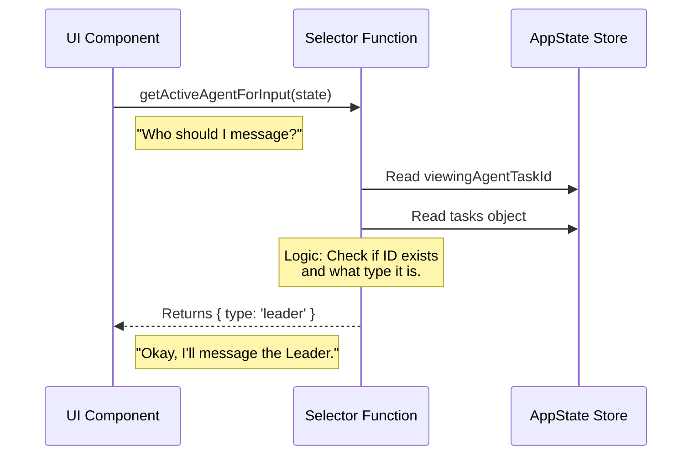

# Chapter 2: State Selectors (Derived Data)

In the previous chapter, [Core State Definition (The Store)](01_core_state_definition__the_store_.md), we learned how to create a "Single Source of Truth" (our Whiteboard) using `AppState`. We learned how to write data to it and how to read the raw data back.

However, reading raw data is often messy. The raw database might be complex, but your UI usually wants a simple answer to a simple question.

This is where **State Selectors** come in.

### The Motivation: The Librarian

Imagine your `AppState` store is a massive library containing thousands of books (data).
*   **Without Selectors:** Every time you want to know "How many books are about cooking?", you have to walk through every shelf, count them yourself, and do the math.
*   **With Selectors:** You ask the **Librarian**. You say, "Get me the count of cooking books." The Librarian (the Selector) runs off, does the logic, and returns just the number.

In technical terms, Selectors are **pure functions** that take the raw state as input and return **derived data**.

---

### Central Use Case: "Who am I talking to?"

Let's look at a real problem in our application.

We have a chat input box. When the user types a message and hits Enter, where should that message go?
1.  Is it for the main AI Leader?
2.  Is it for a specific Teammate the user is currently looking at?

**The "Bad" Way (Doing it manually everywhere):**
Every time we render the Input box, we would have to write complex logic like this:

```typescript
// messy_component_logic.ts
const state = store.getState();

// Check if we are viewing a specific agent
if (state.viewingAgentTaskId) {
  const task = state.tasks[state.viewingAgentTaskId];
  // Check if that task actually exists and is the right type
  if (task && task.type === 'in_process_teammate') {
     console.log("Send to Teammate");
  }
} else {
  console.log("Send to Leader");
}
```

This is fragile. If we change how tasks are stored, we have to fix this code in 10 different places.

**The "Selector" Way:**
We move that logic into a helper function (a Selector).

```typescript
// component.ts
import { getActiveAgentForInput } from './selectors';

// Just ask the question!
const destination = getActiveAgentForInput(store.getState());
```

---

### Key Concept: Derived Data

**Derived Data** is information that doesn't need to be saved in the database because it can be calculated from existing data.

*   **Raw State:** `birthYear: 1990`
*   **Derived Data:** `age: 34` (Calculated as `CurrentYear - birthYear`)

We do not store `age` in `AppState`. We calculate it using a Selector. This ensures the data never gets out of sync.

---

### Internal Implementation: How it Works

A Selector is not a special framework feature. It is just a standard TypeScript function.

1.  It accepts `AppState` as an argument.
2.  It reads the parts it needs.
3.  It returns a clean result.

Here is the flow of data when a component uses a selector:



---

### Code Walkthrough: `selectors.ts`

Let's build the solution for our "Who am I talking to?" use case. We will break it down into two small selectors.

#### 1. The Helper Selector
First, we make a small selector just to find the "Viewed Teammate".

```typescript
// selectors.ts (Part 1)
export function getViewedTeammateTask(appState: AppState) {
  const { viewingAgentTaskId, tasks } = appState

  // 1. Are we even looking at an agent?
  if (!viewingAgentTaskId) return undefined

  // 2. Does the task exist in our list?
  const task = tasks[viewingAgentTaskId]
  if (!task) return undefined

  // 3. Is it the right type (a teammate)?
  // (We use a helper check function here)
  if (!isInProcessTeammateTask(task)) return undefined

  return task
}
```
*Explanation:* This function safely digs through the data. If anything is missing, it returns `undefined`. The UI doesn't need to know *how* to find the task, it just gets the result.

#### 2. The Main Selector
Now we solve the main problem: Where does the input go? We use the result of the helper above.

```typescript
// selectors.ts (Part 2)
export function getActiveAgentForInput(appState: AppState) {
  // Reuse logic from the helper above!
  const viewedTask = getViewedTeammateTask(appState)

  // Case A: We are looking at a teammate
  if (viewedTask) {
    return { type: 'viewed', task: viewedTask }
  }

  // Case B: Default to the Leader
  return { type: 'leader' }
}
```
*Explanation:* This function returns a simple object (a "Discriminated Union") that tells the UI exactly what to do.

---

### Why use Selectors?

1.  **Refactoring is Easy:** If we rename `viewingAgentTaskId` to `focusedId` in the future, we only have to update code in *one file* (`selectors.ts`). The rest of the app doesn't care.
2.  **Less Bugs:** We don't risk forgetting to check `if (task)` in our components. The selector handles the safety checks.
3.  **Readability:** `getActiveAgentForInput(state)` is much easier to read than a 5-line `if/else` statement.

### Conclusion

In this chapter, we learned:
1.  **Selectors** are helper functions that interpret raw state.
2.  They help us calculate **Derived Data** (like converting a raw ID into a full User object).
3.  They keep our logic centralized, so our UI components stay "dumb" and simple.

Now that we know how to *read* complex data, let's learn how to *change* it in a structured way. Instead of random updates, we will use **Domain Actions**.

[Next Chapter: Teammate View Logic (Domain Actions)](03_teammate_view_logic__domain_actions_.md)

---

Generated by [Code IQ](https://github.com/adityasoni99/Code-IQ)