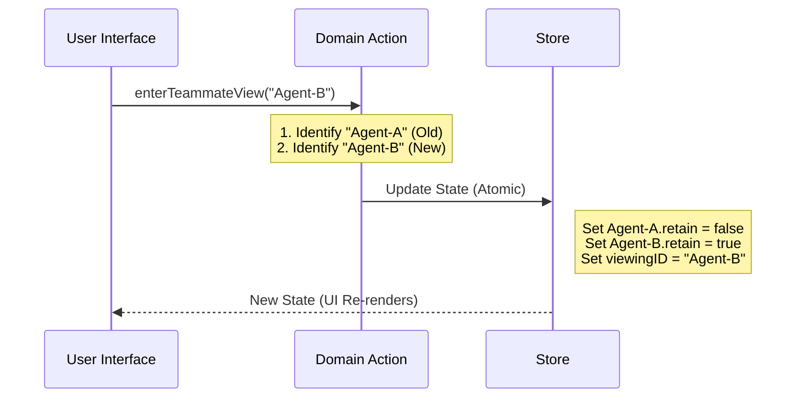

# Chapter 3: Teammate View Logic (Domain Actions)

In the previous chapter, [State Selectors (Derived Data)](02_state_selectors__derived_data_.md), we learned how to use Selectors to ask questions about our data (like "Who am I talking to?").

Now, we need to **change** the data.

You might be thinking, "Can't I just use `store.setState` like we learned in Chapter 1?" You could, but for complex features, that gets dangerous quickly.

### The Motivation: The TV Director

Imagine your application is a live TV show. You have a main camera (the Leader) and several side cameras (the Teammates).

When the user clicks a Teammate, you want to switch views. But it's not just about changing the video feed. You also need to:
1.  **Unplug** the previous camera (clean up memory).
2.  **Plug in** the new camera (load logs from disk).
3.  **Switch** the monitor (update the UI ID).

If you do this manually in every button click handler, you might forget to unplug the old camera, causing your app to run out of memory.

We solve this with **Domain Actions**. These are specialized functions that handle the entire "choreography" of a complex change in one safe step.

---

### Central Use Case: Switching Views

Our goal is to create a function called `enterTeammateView`.

When a user clicks a teammate's name in the sidebar, we call this function. It ensures that we stop "holding onto" the previous agent's data and start "holding onto" the new one.

**The "Bad" Way (Manual updates):**
```typescript
// Don't do this!
store.setState(prev => ({
  ...prev,
  viewingAgentTaskId: 'agent-123',
  // We forgot to clean up the old agent! Memory leak!
}))
```

**The "Domain Action" Way:**
```typescript
import { enterTeammateView } from './teammateViewHelpers';

// The UI just gives the command
enterTeammateView('agent-123', store.setState);
```

This keeps our UI simple and our logic safe.

---

### Internal Implementation: The Choreography

Let's visualize what happens inside `enterTeammateView`. It acts as a transaction manager.



### Code Walkthrough: `teammateViewHelpers.ts`

This file contains our Domain Actions. Let's break down the logic into bite-sized pieces.

#### 1. The Cleanup Helper (`release`)

First, we need a helper function to "let go" of an agent. When we stop viewing an agent, we want to clear their heavy message logs from RAM (`retain: false`) and potentially schedule them for deletion (`evictAfter`).

```typescript
// Helper function (Simplified)
function release(task: LocalAgentTaskState) {
  return {
    ...task,
    retain: false,       // Allow garbage collection of logs
    messages: undefined, // Clear heavy data immediately
    diskLoaded: false,   // Mark as not loaded
  }
}
```
*Explanation:* This function takes a task and returns a "lighter" version of it. It doesn't update the store itself; it just prepares the data object.

#### 2. The Director (`enterTeammateView`)

This is the main action. It uses `setAppState` to perform the swap.

```typescript
export function enterTeammateView(
  taskId: string,
  setAppState: (updater: (prev: AppState) => AppState) => void,
): void {
  // We pass a function to setAppState to get the 'prev' state
  setAppState(prev => {
    const prevId = prev.viewingAgentTaskId
    const prevTask = prevId ? prev.tasks[prevId] : undefined
    
    // ... logic continues below ...
```

Inside this update function, we handle the swap. Notice how we modify the `tasks` dictionary. We create a copy of the dictionary, update the old task, update the new task, and return the result.

```typescript
    // ... inside setAppState ...
    
    // 1. Copy the tasks dictionary so we can modify it
    const nextTasks = { ...prev.tasks }

    // 2. If we were looking at someone else, release them
    if (prevTask) {
       nextTasks[prevId] = release(prevTask)
    }

    // 3. Lock in the new teammate (retain: true)
    nextTasks[taskId] = { 
      ...prev.tasks[taskId], 
      retain: true 
    }

    // 4. Return the fully updated world
    return {
      ...prev,
      viewingAgentTaskId: taskId,
      tasks: nextTasks
    }
  })
}
```
*Explanation:* This block ensures that `viewingAgentTaskId` and the `retain` status of both agents update at the exact same time. The UI will never render a frame where the ID is set but the data isn't locked.

#### 3. Exiting the View (`exitTeammateView`)

When the user clicks "Back" or hits Escape, we need to return to the main view. This is simpler: we just release the current agent.

```typescript
export function exitTeammateView(
  setAppState: (updater: (prev: AppState) => AppState) => void,
): void {
  setAppState(prev => {
    const currentId = prev.viewingAgentTaskId
    const currentTask = prev.tasks[currentId]

    return {
      ...prev,
      viewingAgentTaskId: undefined, // Go back to main view
      // Release the task we were just looking at
      tasks: {
        ...prev.tasks,
        [currentId]: release(currentTask) 
      }
    }
  })
}
```

---

### Why is this "Domain Logic"?

We call these **Domain Actions** because they contain business rules specific to our "domain" (Agent Management):

1.  **Rule:** Only one agent can be viewed at a time.
2.  **Rule:** Viewed agents must be kept in memory (`retain: true`).
3.  **Rule:** Non-viewed agents should drop their logs to save RAM (`messages: undefined`).

If we put this logic inside a React Component, it would be mixed with UI code (like `<div>` or CSS classes). By keeping it in `teammateViewHelpers.ts`, the logic is pure, testable, and reusable.

### Conclusion

In this chapter, we learned:
1.  **Domain Actions** act like directors, choreographing complex state changes.
2.  **Atomic Updates** prevent bugs by updating related data (like "current ID" and "memory status") simultaneously.
3.  We encapsulate complex rules (like memory management) inside helper functions like `enterTeammateView`.

Now we have a Store (Chapter 1), Selectors (Chapter 2), and Logic (Chapter 3). But how do we actually make buttons appear on the screen?

[Next Chapter: React Integration Layer](04_react_integration_layer.md)

---

Generated by [Code IQ](https://github.com/adityasoni99/Code-IQ)