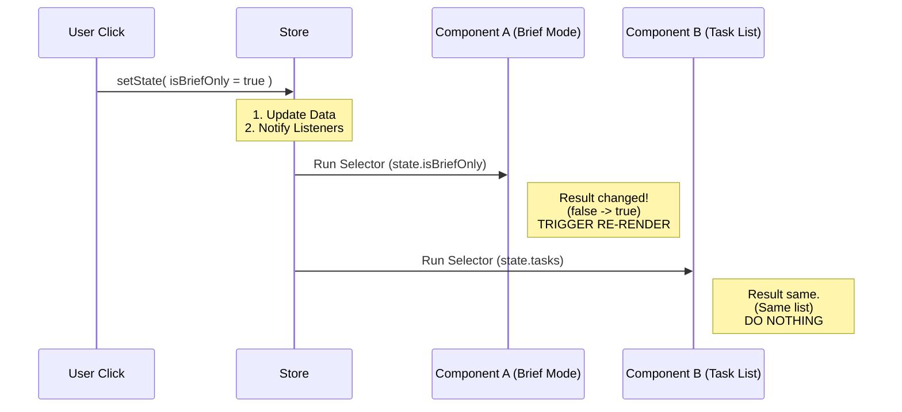

# Chapter 4: React Integration Layer

In the previous chapter, [Teammate View Logic (Domain Actions)](03_teammate_view_logic__domain_actions_.md), we built the logic to safely update our data using Domain Actions.

We now have a working Store (the Brain), Selectors (the Eyes), and Actions (the Muscles). But we are missing the Face. We need to connect all of this to **React** so users can actually see and interact with the application.

This connection is handled by the **React Integration Layer**.

### The Motivation: The Smart Subscription

Connecting a global store to React is tricky.

**The Naive Approach:**
Imagine if every component in your app re-rendered every time *anything* in the store changed.
*   The background clock ticks -> **The whole screen flashes.**
*   A chat message arrives -> **The settings menu flickers.**

This makes the app slow and laggy.

**The Solution:**
We need a "Smart Subscription."
*   The **Header** only subscribes to "User Name."
*   The **Footer** only subscribes to "Status."

If "Status" changes, the Footer updates, but the Header stays asleep. This is exactly what our React Integration Layer does.

---

### Key Concept: The Provider (`AppStateProvider`)

First, we need to plug the app into the power grid. We wrap our entire application in a component called `AppStateProvider`.

This component creates the Store instance once and passes it down to the rest of the app using React Context.

```tsx
// main.tsx (Simplified)
import { AppStateProvider } from './state/AppState';

function App() {
  return (
    <AppStateProvider>
      <MyGreatUI />
    </AppStateProvider>
  );
}
```
*Explanation:* Now, every component inside `<MyGreatUI />` has access to the store, without us having to pass variables down manually through props (prop drilling).

---

### Key Concept: Reading Data (`useAppState`)

To read data, we use a custom hook called `useAppState`.

This hook takes a **Selector** (from Chapter 2) as an argument. It runs that selector and returns the result. Most importantly, **it only triggers a re-render if that specific result changes.**

#### Use Case: The "Brief Mode" Indicator

Let's say we want to show a text label only if "Brief Mode" is enabled.

```tsx
import { useAppState } from './state/AppState';

export function BriefModeLabel() {
  // We subscribe ONLY to 'isBriefOnly'
  const isBrief = useAppState(state => state.isBriefOnly);

  if (!isBrief) return null; // Don't show anything

  return <span>Brief Mode is ON</span>;
}
```
*Explanation:* If the `tasks` list updates or the `expandedView` changes, this component ignores it. It *only* wakes up if `isBriefOnly` flips.

---

### Key Concept: Writing Data (`useSetAppState`)

To change data, we need access to the `setState` function (or our Domain Actions). We use `useSetAppState`.

This hook is special because it **never causes a re-render**. It just gives you the function to trigger updates.

#### Use Case: The Toggle Button

```tsx
import { useSetAppState } from './state/AppState';

export function ToggleBriefModeButton() {
  // Get the writer function
  const setState = useSetAppState();

  const handleClick = () => {
    setState(prev => ({ ...prev, isBriefOnly: !prev.isBriefOnly }));
  };

  return <button onClick={handleClick}>Toggle Mode</button>;
}
```
*Explanation:* This component doesn't even read the data! It just sends a command. It will never re-render, making it very fast.

---

### Internal Implementation: How it Works

How does `useAppState` know when to re-render? It uses a modern React feature called `useSyncExternalStore`.

Here is the flow of events when data changes:



#### Code Walkthrough: `AppState.tsx`

Let's look at the actual code in `AppState.tsx` that makes this possible.

**1. The Hook Definition**
We wrap the standard React `useSyncExternalStore` hook. This ensures our external store plays nicely with React's rendering lifecycle (like Concurrent Mode).

```typescript
// AppState.tsx
export function useAppState<T>(selector: (state: AppState) => T): T {
  const store = useAppStore(); // Get the store instance

  // Create a stable 'get' function
  const getSnapshot = () => selector(store.getState());

  // React subscribes to the store and calls 'getSnapshot'
  return useSyncExternalStore(store.subscribe, getSnapshot);
}
```
*Explanation:* `useSyncExternalStore` does the heavy lifting. It listens to `store.subscribe`. When the store notifies it, it calls `getSnapshot`. If the result is different from last time, React re-renders the component.

**2. The Provider Setup**
The provider is responsible for creating the store exactly once.

```typescript
// AppState.tsx (Simplified)
export function AppStateProvider({ children, initialState }: Props) {
  // Create store ONLY if inputs change (rarely happens)
  const [store] = useState(() => 
    createStore(initialState ?? getDefaultAppState())
  );

  return (
    <AppStoreContext.Provider value={store}>
      {children}
    </AppStoreContext.Provider>
  );
}
```
*Explanation:* We use `useState` to hold the store instance. We put that instance into a Context Provider so the hooks below can find it.

### Putting it together: A Complete Component

Let's combine everything we've learned in Chapters 1 through 4 into one robust component.

**Goal:** A "Teammate Viewer" that shows the name of the active teammate.

1.  **Select** the active task (Chapter 2).
2.  **Display** the name (Chapter 4).
3.  **Clear** the view on click (Chapter 3).

```tsx
import { useAppState, useSetAppState } from './state/AppState';
import { getViewedTeammateTask } from './selectors'; // Chapter 2
import { exitTeammateView } from './teammateViewHelpers'; // Chapter 3

export function TeammateHeader() {
  // 1. SELECT: Get derived data
  const task = useAppState(getViewedTeammateTask);
  
  // 2. ACTION: Get the writer
  const setState = useSetAppState();

  // If no task is selected, render nothing
  if (!task) return null;

  return (
    <div className="header">
      {/* 3. DISPLAY */}
      <h1>Viewing: {task.label}</h1>
      
      {/* 4. INTERACT */}
      <button onClick={() => exitTeammateView(setState)}>
        Close
      </button>
    </div>
  );
}
```

### Conclusion

In this chapter, we learned:
1.  **AppStateProvider** is the bridge that plugs the Store into React.
2.  **useAppState** allows components to subscribe intelligently to small slices of data.
3.  **useSetAppState** allows components to trigger updates without re-rendering themselves.

We now have a fully functioning cycle: **Data -> Selector -> UI -> Action -> Data**.

However, our application doesn't live in a vacuum. Sometimes we need to save data to a file, play a sound, or talk to an API when state changes. We shouldn't put that logic inside our UI components. We need **Side Effects**.

[Next Chapter: State Synchronization (Side Effects)](05_state_synchronization__side_effects_.md)

---

Generated by [Code IQ](https://github.com/adityasoni99/Code-IQ)