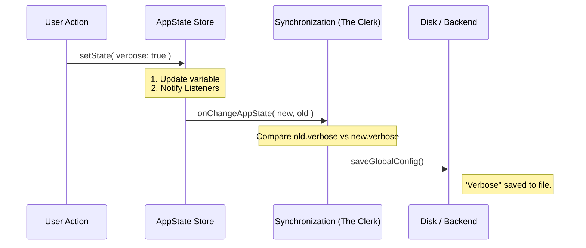

# Chapter 5: State Synchronization (Side Effects)

In the previous chapter, [React Integration Layer](04_react_integration_layer.md), we connected our Store to the UI. We learned how to make buttons update the state and how to make the screen re-render automatically.

However, a modern application doesn't live in a vacuum. It interacts with the outside world:
1.  **Disk:** Saving settings so they persist after a restart.
2.  **Network:** Telling the backend server that the user changed their status.
3.  **Security:** Clearing old passwords from memory when a user logs out.

If we put all this logic inside our React components, our code would become a messy web of duplicate logic. We need a better way.

We need **State Synchronization**.

### The Motivation: The Efficient Clerk

Let's go back to our analogy of the **Central Whiteboard** (the Store).

Imagine you write "Enable Night Mode" on the whiteboard. The team sees it and puts on sunglasses (the UI updates). But if the building loses power (the app closes), that information is lost.

We need a dedicated **Clerk**.
The Clerk stands next to the whiteboard and watches it like a hawk.
*   **The Job:** Every time the board changes, the Clerk plays a game of "Spot the Difference."
*   **The Action:** If the Clerk sees that "Night Mode" has changed, they immediately run to the filing cabinet and write it down in permanent marker (save to disk).

This Clerk is our **Side Effect Handler**. It ensures the "Inside World" (RAM) stays in sync with the "Outside World" (Disk/Server).

---

### Central Use Case: Saving "Verbose Mode"

Let's look at a real example. Our app has a `verbose` setting (detailed logging).

**The "Bad" Way (Doing it inside the button):**
```typescript
// Inside a React Component
function handleToggle() {
  // 1. Update the Store
  store.setState(prev => ({ ...prev, verbose: true }));
  
  // 2. Save to Disk (Side Effect)
  saveToDisk({ verbose: true }); 
}
```
*Problem:* What if `verbose` is turned on via a keyboard shortcut? Or a voice command? We would have to copy step #2 everywhere.

**The "Synchronization" Way:**
We simply watch the state. If `verbose` changes *for any reason*, we save it.

---

### Key Concept: The Diffing Function

To implement this, we use a single function called `onChangeAppState`. It runs automatically whenever the state changes.

It receives two arguments:
1.  **`oldState`**: What the board looked like a moment ago.
2.  **`newState`**: What the board looks like now.

We compare them to decide what to do.

#### Step 1: Spotting the Difference

We check if the specific value we care about is different.

```typescript
// onChangeAppState.ts
export function onChangeAppState({ newState, oldState }) {
  
  // Did the 'verbose' flag change?
  if (newState.verbose !== oldState.verbose) {
    console.log("Verbose mode just toggled!");
    // ... trigger side effect here ...
  }
}
```

#### Step 2: Triggering the Side Effect

If they are different, we execute the external action (like saving to configuration).

```typescript
  // ... inside the if statement ...
  
  // Save the new value to the global config file
  saveGlobalConfig(currentConfig => ({
    ...currentConfig,
    verbose: newState.verbose
  }))
```
*Explanation:* Now, it doesn't matter *how* the state changed. As long as the Store updates, the file on the disk updates.

---

### Internal Implementation: How it Works

This system acts as a middleware pipeline.



### Real World Examples

Our project `state` uses this pattern for critical infrastructure. Let's look at two complex examples from `onChangeAppState.ts`.

#### Example 1: Security Cache Clearing
When a user changes their Settings (like pasting a new API Key), we must immediately clear any cached authentication tokens. If we don't, the app might keep trying to use the old, broken key.

```typescript
// onChangeAppState.ts (Simplified)

// Check if the entire 'settings' object changed
if (newState.settings !== oldState.settings) {
  
  // 1. Clear AWS Credentials
  clearAwsCredentialsCache()
  
  // 2. Clear Google Cloud Credentials
  clearGcpCredentialsCache()
  
  // 3. Clear API Key Helpers
  clearApiKeyHelperCache()
}
```
*Beginner Note:* Notice we don't check *which* setting changed. If `settings` changed at all, we wipe the security caches just to be safe. This makes the system robust.

#### Example 2: Backend Notification (CCR)
In our app, we have different "Permission Modes" (e.g., "Plan Mode" vs "Code Mode"). When this changes, we need to tell our backend server (CCR) so it knows how to behave.

```typescript
// onChangeAppState.ts (Simplified)
const prevMode = oldState.toolPermissionContext.mode
const newMode = newState.toolPermissionContext.mode

// Did the mode change?
if (prevMode !== newMode) {
  
  // Notify the backend (CCR) immediately
  notifySessionMetadataChanged({
    permission_mode: newMode
  })
}
```
*Beginner Note:* This ensures that if the user changes the mode using a slash command (`/plan`), the backend is notified instantly, even though the command didn't explicitly call `notifySessionMetadataChanged`.

---

### Why is this better?

1.  **Reliability:** You can never "forget" to save. If the state changes, the effect happens.
2.  **Clean UI Code:** Your React components don't need to import file-system logic or API clients. They just update state.
3.  **Debuggability:** You have one file (`onChangeAppState.ts`) that defines all the side effects in the entire app.

### Conclusion

In this tutorial series, we have built a complete State Management architecture:

1.  **[The Store](01_core_state_definition__the_store_.md):** The Single Source of Truth.
2.  **[Selectors](02_state_selectors__derived_data_.md):** Reading data intelligently.
3.  **[Domain Actions](03_teammate_view_logic__domain_actions_.md):** Updating logic safely.
4.  **[React Integration](04_react_integration_layer.md):** Connecting to the UI.
5.  **Synchronization:** Keeping the outside world in sync.

By separating these concerns, we have created an application that is easy to read, easy to test, and easy to extend. You can now add new features by simply adding a property to `AppState`, creating a Selector, and adding a sync rule—without ever fighting with "spaghetti code."

**End of Tutorial.**

---

Generated by [Code IQ](https://github.com/adityasoni99/Code-IQ)