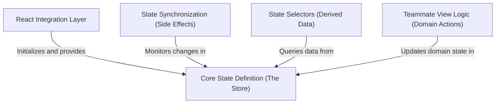

# Tutorial: state

This project manages the application's data using a **Single Source of Truth** approach, where the entire state (from settings to active tasks) lives in one central **Store**. A **React Integration Layer** connects this raw data to the UI, allowing components to "subscribe" only to the specific updates they need. Meanwhile, a background **Synchronization** module watches for changes to handle side effects like saving files or checking permissions, while dedicated **Selectors** and **View Logic** helpers keep the complex rules for retrieving and updating data organized and consistent.

## Chapters

1. [Core State Definition (The Store)](01_core_state_definition__the_store_.md)
2. [State Selectors (Derived Data)](02_state_selectors__derived_data_.md)
3. [Teammate View Logic (Domain Actions)](03_teammate_view_logic__domain_actions_.md)
4. [React Integration Layer](04_react_integration_layer.md)
5. [State Synchronization (Side Effects)](05_state_synchronization__side_effects_.md)

---

Generated by [Code IQ](https://github.com/adityasoni99/Code-IQ)