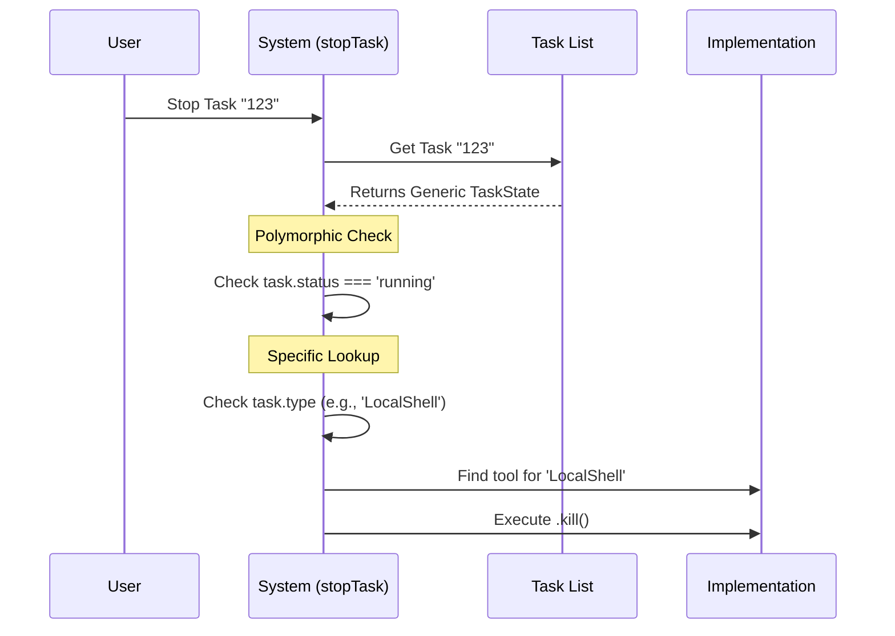

# Chapter 1: Task State Polymorphism

Welcome to the `tasks` project! In this first chapter, we are going to look at the foundation that makes everything else possible.

## The Problem: Comparing Apples and Oranges

Imagine you are building a dashboard. You want to show a list of everything the system is doing. Currently, the system might be doing three very different things:
1.  Running a simple command in the terminal (like `ls -la`).
2.  Running a complex AI Agent that is thinking and planning.
3.  Running a "Dream" process (a background simulation).

These three activities work very differently under the hood. However, your dashboard needs a simple way to answer one question for all of them: **"Is this task currently running?"**

If we didn't use **Task State Polymorphism**, we would have to write messy code like this:
*   "If it's a shell command, check the process ID."
*   "If it's an AI agent, check its thought loop."
*   "If it's a dream, check the simulation engine."

## The Solution: The Universal Adapter

**Task State Polymorphism** is our solution. Think of it like a universal travel adapter for power outlets.

Whether you plug in a hair dryer (Shell Command), a laptop (AI Agent), or a phone charger (Dream), the wall socket treats them all exactly the same. It simply provides power.

In our system, we treat every activity as a `TaskState`. This allows us to interact with any task using a shared interface, regardless of what that task actually does.

### Core Concept: The Union Type

At the code level, we define a "Task" not as one single thing, but as a collection of possibilities.

Here is the actual definition from our `types.ts` file. Notice how `TaskState` is just a list of other specific types joined by `|` (which means "OR").

```typescript
// From types.ts
// This tells the system: "A TaskState can be ANY of these things"
export type TaskState =
  | LocalShellTaskState
  | LocalAgentTaskState
  | RemoteAgentTaskState
  | InProcessTeammateTaskState
  // ... and others
```

Because of this definition, we can create functions that accept `TaskState` as an input. These functions don't need to know exactly which one it is to do basic things.

### Solving the Use Case: The "Stop" Button

Let's solve our main problem: **How do we stop any task without knowing what it is?**

Because every item in that list above shares common properties (like `status`), we can check them easily.

```typescript
// Example: Checking if ANY task is running
function isTaskActive(task: TaskState): boolean {
  // We don't care if it's a Shell or an Agent task.
  // They ALL have a 'status' property.
  return task.status === 'running' || task.status === 'pending';
}
```

**What happens here:**
1.  **Input:** You pass in a Shell Task or an Agent Task.
2.  **Processing:** TypeScript knows that both types have a field called `status`.
3.  **Output:** Returns `true` if it's active, `false` otherwise.

## Internal Implementation

Now let's see how the system actually handles stopping a task under the hood. We will look at `stopTask.ts`.

### Visual Walkthrough

When you ask the system to "Stop Task #123", it follows this flow. Notice how step 3 is generic (polymorphic), but Step 5 is specific.



### Code Deep Dive

Let's look at the real code in `stopTask.ts` to see this in action.

**Step 1: The Generic Check**
First, we retrieve the task and check its status. At this point, the code doesn't care *how* to stop the task, only *if* it should be stopped.

```typescript
// From stopTask.ts
// We get the task generically
const task = appState.tasks?.[taskId] as TaskStateBase | undefined

// Polymorphic check: works for ALL task types
if (task.status !== 'running') {
  throw new StopTaskError(
    `Task ${taskId} is not running`,
    'not_running',
  )
}
```

**Step 2: Switching to Specifics**
Once we know the task is running, we need to know *how* to kill it. A shell command is killed differently than an AI agent. We use the `type` property to find the specific "driver" (implementation) for that task.

```typescript
// From stopTask.ts
// Now we look up the specific logic based on the type string
const taskImpl = getTaskByType(task.type)

if (!taskImpl) {
  throw new StopTaskError(`Unsupported type`, 'unsupported_type')
}

// Execute the specific kill logic
await taskImpl.kill(taskId, setAppState)
```

**Explanation:**
*   `task.type`: Every task has a label, e.g., "LocalShell" or "LocalAgent".
*   `getTaskByType`: This factory function returns the specific code needed to control that task.
*   `taskImpl.kill()`: If it's a shell task, this sends a UNIX kill signal. If it's an Agent, it might cancel a network request.

## Summary

In this chapter, we learned:
1.  **Task State Polymorphism** allows us to treat different activities (Shell, Agent, Dream) as the same object type: `TaskState`.
2.  We can access shared properties like `.status` without knowing the specific task type.
3.  When we need to perform specific actions (like stopping a task), we use the `.type` property to find the correct implementation.

This foundation allows our system to be extensible. We can add new types of tasks later without rewriting our entire dashboard or control logic!

In the next chapter, we will look at the most common specific implementation of a task: running commands on your computer.

[Next Chapter: Local Shell Execution](02_local_shell_execution.md)

---

Generated by [Code IQ](https://github.com/adityasoni99/Code-IQ)