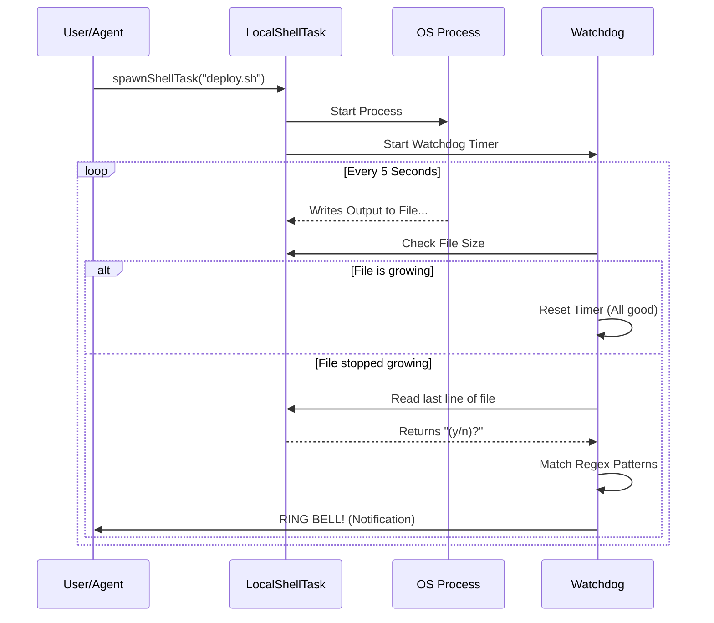

# Chapter 2: Local Shell Execution

In the [previous chapter](01_task_state_polymorphism.md), we learned how the system treats all tasks generically using **Task State Polymorphism**. We learned that the system looks at `task.type` to decide how to handle a specific task.

Now, we are going to look at the most common type of task in our system: **Local Shell Execution** (`local_bash`).

## The Problem: The Silent Typist

Running a command like `git push` or `npm install` seems simple. You type it, and it runs. But for an automated system, it's tricky.

Imagine you hire an **Invisible Typist** to work in a separate room. You slide a note under the door: *"Please run `npm install`."*

1.  **Output Visibility:** You can't see their screen. You need them to write everything down on a piece of paper (a log file) so you can read it later.
2.  **The "Stall" Problem:** What if the computer asks: `Do you want to continue? (y/n)`? The Typist is waiting for an answer. You are in the hallway waiting for them to finish. The process is now stuck forever.

We need a way to manage these invisible commands and know when they are crying out for help.

## The Solution: The Watchdog

Our `LocalShellTask` isn't just a "fire and forget" command runner. It includes a **Watchdog**.

The Watchdog is a timer that periodically checks the Typist's work:
1.  **Is the log file growing?** If yes, the Typist is busy working. Good.
2.  **Has the log stopped growing?** If yes, check the last line written.
3.  **Does the last line look like a question?** (e.g., `y/n`, `Password:`, `Press Enter`).

If the log stops growing *and* looks like a question, the Watchdog rings a bell to notify you.

## How to Use It

In our codebase, we don't just run `exec('cmd')`. We spawn a `LocalShellTask`.

### Spawning a Command

To start a command, we use `spawnShellTask`. This sets up the state and starts the process.

```typescript
// Example: Starting a build process
const taskHandle = await spawnShellTask({
  command: 'npm run build',
  description: 'Building project...',
  agentId: 'agent-123',
  shellCommand: myShellInstance // The actual process runner
}, context);
```

**What happens here:**
1.  A new `TaskState` is created with `type: 'local_bash'`.
2.  The task is added to the global application state (so the dashboard sees it).
3.  The **Stall Watchdog** is immediately started to monitor this specific task.

## Internal Implementation

Let's look at the lifecycle of a shell command, specifically focusing on how we detect if it gets stuck.

### Visual Walkthrough



### Code Deep Dive

The logic for this lives in `LocalShellTask.tsx`.

#### 1. The Regex Patterns
First, we define what a "question" looks like to a computer. These are regular expressions that match common terminal prompts.

```typescript
// From LocalShellTask.tsx
const PROMPT_PATTERNS = [
  /\(y\/n\)/i,      // Matches "(y/n)"
  /\[y\/n\]/i,      // Matches "[Y/n]"
  /Press (any key|Enter)/i,
  /Password:/i
];
```

#### 2. The Watchdog Loop
The `startStallWatchdog` function sets up an interval. It checks the output file size on disk.

```typescript
// From LocalShellTask.tsx
const timer = setInterval(() => {
  // Check if the file has grown since last check
  if (currentSize > lastSize) {
    lastSize = currentSize;
    lastGrowth = Date.now();
    return; // It's working, do nothing.
  }
  
  // ... proceed to check for stall
}, 5000); // Check every 5 seconds
```

#### 3. Analyzing the Stall
If the file size hasn't changed for a while (e.g., 45 seconds), we read the end of the file to see why.

```typescript
// From LocalShellTask.tsx
// If we haven't seen growth in 45 seconds...
if (Date.now() - lastGrowth > STALL_THRESHOLD_MS) {
  
  // Read the last few bytes of the file
  const content = await tailFile(outputPath, 1024);

  // Does it look like a prompt?
  if (looksLikePrompt(content)) {
    sendNotification("Task appears to be waiting for input");
  }
}
```

This simple logic prevents our automated agents from staring blankly at a screen that is waiting for them to press "Y".

### Cleanup

When a command finishes (or is killed), we must ensure the Watchdog stops barking.

```typescript
// From LocalShellTask.tsx
void shellCommand.result.then(async result => {
  // 1. Stop the timer
  cancelStallWatchdog();
  
  // 2. Update status to 'completed' or 'failed'
  updateTaskState(taskId, setAppState, task => ({
    ...task,
    status: result.code === 0 ? 'completed' : 'failed'
  }));
});
```

## Summary

In this chapter, we learned:
1.  **Local Shell Execution** manages raw OS processes.
2.  It uses a **Watchdog** to solve the "Invisible Typist" problem.
3.  The Watchdog monitors file growth and uses **Regex** to detect if a command is stalled at a user prompt (like `y/n`).

Now that we can run simple commands, what happens when we need to run a complex AI that thinks, plans, and spawns *other* commands?

[Next Chapter: Background Agent Execution](03_background_agent_execution.md)

---

Generated by [Code IQ](https://github.com/adityasoni99/Code-IQ)