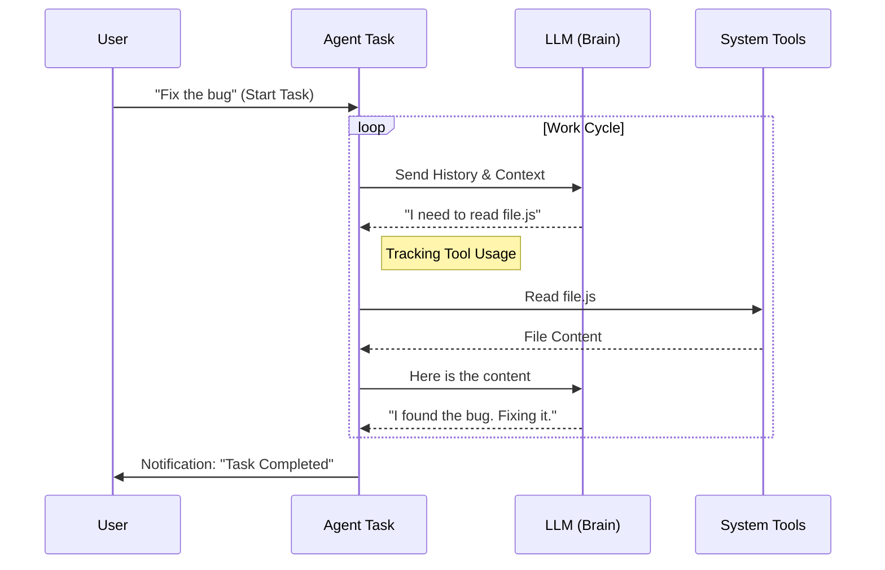

# Chapter 3: Background Agent Execution

In the [previous chapter](02_local_shell_execution.md), we learned how to run dumb, simple commands using **Local Shell Execution**. We solved the "Invisible Typist" problem using a Watchdog.

But what if the job is too complex for a single command? What if you need someone to read code, think about a bug, try a fix, run tests, and fix it again if it fails?

You don't need a Typist; you need a **Contractor**. This is where **Background Agent Execution** comes in.

## The Problem: The High-Maintenance Helper

Imagine you are working with a basic AI chatbot. You ask it to "Refactor this file."

1.  **It needs your attention:** It writes some code, then stops and waits for you to copy-paste it.
2.  **It has no memory:** If it makes a mistake, you have to explain the error manually.
3.  **It blocks you:** While it is thinking, you can't use the terminal for anything else.

We need a way to wrap an AI Agent so it can work **asynchronously** (independently) while you do other things.

## The Solution: The General Contractor

**Background Agent Execution** (`LocalAgentTask`) treats an AI Agent like an independent contractor.

1.  **The Job Description:** You give it a prompt (the goal).
2.  **The Job Site:** It runs in the background.
3.  **Expense Reporting:** It tracks its own "expenses" (token usage) and "tools used" (file reads, searches).
4.  **Reporting Back:** It only notifies you when the job is done or if it crashes.

## How to Use It

In our system, we don't just call the LLM directly. We wrap the LLM loop inside a `LocalAgentTask`.

### Registering a Contractor

To start an agent, we use `registerAsyncAgent`. This creates the task state and immediately puts it in the background.

```typescript
// From LocalAgentTask.tsx
const taskState = registerAsyncAgent({
  agentId: 'agent-123',
  description: 'Refactor login.ts',
  prompt: 'Analyze login.ts and improve error handling',
  selectedAgent: myCodingAgent, // The AI logic
  setAppState: appStateSetter
});
```

**What happens here:**
1.  A new Task ID is generated.
2.  The system creates a `LocalAgentTaskState`.
3.  The task status is set to `'running'`.
4.  The Agent starts its "Think -> Act -> Observe" loop in a separate process flow.

## Internal Implementation

How does the system manage this "Contractor" while it works?

### Visual Walkthrough

The Agent Loop is more complex than a Shell command because it goes back and forth between the AI and the Operating System (Tools).



### Code Deep Dive

Let's look at the specific mechanisms that make this work in `LocalAgentTask.tsx`.

#### 1. The Expense Report (State)
Unlike a shell command (which just has an output log), an Agent Task has rich data about what it is doing. We call this the `progress` object.

```typescript
// From LocalAgentTask.tsx
export type AgentProgress = {
  toolUseCount: number; // How many actions taken?
  tokenCount: number;   // How expensive is this?
  lastActivity?: ToolActivity; // What is it doing RIGHT NOW?
  summary?: string;     // A 1-sentence update
};
```

#### 2. Tracking Activity
As the agent runs, it constantly updates its progress. This allows the dashboard to show "Reading file..." instead of just "Running...".

```typescript
// From LocalAgentTask.tsx
export function updateAgentProgress(
  taskId: string, 
  progress: AgentProgress, 
  setAppState: SetAppState
): void {
  updateTaskState(taskId, setAppState, task => ({
    ...task,
    // Merge new progress with existing state
    progress: { ...task.progress, ...progress }
  }));
}
```

#### 3. Handling Completion
When the agent decides it is finished, we must wrap up the project. We calculate the final stats and send a notification.

```typescript
// From LocalAgentTask.tsx
export function completeAgentTask(
  result: AgentToolResult, 
  setAppState: SetAppState
): void {
  // 1. Mark as completed
  updateTaskState(result.agentId, setAppState, task => ({
    ...task,
    status: 'completed',
    result: result, // Store the final answer
    endTime: Date.now()
  }));

  // 2. Clean up memory output
  void evictTaskOutput(result.agentId);
}
```

### Special Case: The Main Session
Sometimes, you are chatting with the AI in the main window, and you realize: *"This is going to take a long time."*

We handle this with `LocalMainSessionTask`. It converts the current active chat into a background task.

```typescript
// From LocalMainSessionTask.ts
// Marks the task as "backgrounded" so the UI can clear
// and you can start a new topic while this one finishes.
export function backgroundAgentTask(taskId: string, ...): boolean {
  setAppState(prev => ({
    ...prev,
    tasks: {
      ...prev.tasks,
      [taskId]: { ...prev.tasks[taskId], isBackgrounded: true }
    }
  }));
  return true;
}
```

## Summary

In this chapter, we learned:
1.  **Background Agent Execution** wraps an AI loop into a managed Task.
2.  It acts like a **Contractor**, tracking its own tools (`toolUseCount`) and expenses (`tokenCount`).
3.  It provides rich feedback (`lastActivity`) so the user knows if the agent is "Reading" or "Writing," unlike a silent shell command.

Now we have a "Contractor" working in the background. But what if that contractor needs to hire *their own* subcontractors?

In the next chapter, we will explore how agents can spawn other agents using **In-Process Teammates**.

[Next Chapter: In-Process Teammates](04_in_process_teammates.md)

---

Generated by [Code IQ](https://github.com/adityasoni99/Code-IQ)