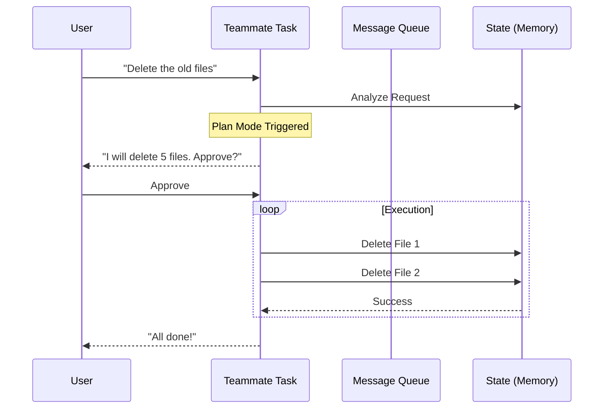

# Chapter 4: In-Process Teammates

In the [previous chapter](03_background_agent_execution.md), we learned how to hire "Contractors" (Background Agents) to go away, do a job, and come back with a receipt.

But sometimes, you don't want a contractor. You want a **Co-pilot**. You want someone sitting right next to you, looking at the same instruments, who asks for permission before pushing the big red button.

In this chapter, we explore **In-Process Teammates**.

## The Problem: The "Runaway" Agent

Imagine you ask an AI to "Clean up the database."

If you use a **Background Agent** (from Chapter 3), it might:
1.  Go into a tunnel (background process).
2.  Delete all your data thinking it's "cleaning."
3.  Come back 5 minutes later saying "Success! Space saved."

You couldn't stop it because you weren't watching it in real-time. You needed a way to review its plan *before* it executed the dangerous commands.

## The Solution: The Co-Pilot

**In-Process Teammates** are specialized tasks that live inside the main application loop (hence "In-Process").

Unlike generic tasks, they have:
1.  **Persistent Identity:** They have names (e.g., "Coder", "Researcher") and roles.
2.  **Shared Context:** They run alongside you, making interaction instant.
3.  **Plan Mode:** They can pause execution to ask: *"I am about to delete table 'users'. Is this okay?"*

### Analogy: The Cockpit

*   **Local Shell (Ch 2):** The engines. You pull a lever, they spin.
*   **Background Agent (Ch 3):** Ground Control. You radio them a request, they radio back eventually.
*   **Teammate (Ch 4):** The Co-pilot sitting next to you. You can see their hands on the controls. You can say "Stop" instantly.

## How to Use It

Teammates are unique because you can have a back-and-forth conversation with them *while* they work.

### The "Plan Mode" Workflow

The most powerful feature of a Teammate is **Plan Mode**. Instead of just acting, the Teammate proposes a set of steps.

1.  **You:** "Refactor the login page."
2.  **Teammate:** "I plan to: 1. Edit `login.ts`, 2. Delete `old_login.ts`."
3.  **System:** PAUSES. (Status: `awaitingPlanApproval`)
4.  **You:** Click "Approve".
5.  **Teammate:** Executes the plan.

## Internal Implementation

How does the system handle these interactive, persistent agents?

### Visual Walkthrough

Unlike a fire-and-forget command, a Teammate has a conversational loop.



### Code Deep Dive

Let's look at `InProcessTeammateTask/types.ts` to see how we define this special identity.

#### 1. Identity & Plan Mode
A Teammate isn't just a generic task. It has an `identity` object. This tells the UI who this agent is (e.g., "The Researcher").

```typescript
// From types.ts
export type InProcessTeammateTaskState = TaskStateBase & {
  type: 'in_process_teammate',
  
  // Who is this?
  identity: {
    agentName: string,   // e.g. "coder"
    teamName: string,    // e.g. "engineering"
    planModeRequired: boolean // Must they ask for permission?
  },

  // Are we waiting for the user to say "Yes"?
  awaitingPlanApproval: boolean
}
```

**Why this matters:** The `planModeRequired` flag fundamentally changes the agent's behavior. If true, the agent *cannot* execute tools until `awaitingPlanApproval` is cleared by the user.

#### 2. Talking to the Teammate
Since the teammate is running in a loop, we can't just overwrite its prompt. We need to "inject" messages into its consciousness.

We use `injectUserMessageToTeammate` in `InProcessTeammateTask.tsx`.

```typescript
// From InProcessTeammateTask.tsx
export function injectUserMessageToTeammate(
  taskId: string, 
  message: string, 
  setAppState: SetAppState
): void {
  updateTaskState(taskId, setAppState, task => ({
    ...task,
    // 1. Queue message for the Agent to process
    pendingUserMessages: [...task.pendingUserMessages, message],
    
    // 2. Add to UI history immediately so the user sees it
    messages: appendCappedMessage(task.messages, createUserMessage({
      content: message
    }))
  }));
}
```

**What happens here:**
1.  **Input:** You type "Stop! Use the new API."
2.  **Queueing:** The message goes into `pendingUserMessages`. The agent checks this queue before taking its next step.
3.  **Display:** We manually add the message to the local history so the chat UI updates instantly.

#### 3. Managing Memory (The "Goldfish" Optimization)
Teammates might run for days. If we kept every single log message in the main AppState, the browser would crash.

We use a "Capped Message" strategy. We only keep the last 50 messages in the UI state (`TEAMMATE_MESSAGES_UI_CAP`), even if the agent remembers more internally.

```typescript
// From types.ts
export const TEAMMATE_MESSAGES_UI_CAP = 50

export function appendCappedMessage<T>(prev: T[], item: T): T[] {
  // If we have too many messages...
  if (prev.length >= TEAMMATE_MESSAGES_UI_CAP) {
    // ...slice off the old ones and add the new one
    const next = prev.slice(-(TEAMMATE_MESSAGES_UI_CAP - 1))
    next.push(item)
    return next
  }
  return [...prev, item]
}
```

This ensures that even if you have a 500-turn conversation with your Co-pilot, the UI remains snappy.

### Finding Your Teammate
Since Teammates have names, we often look them up by `agentId` rather than the random Task ID.

```typescript
// From InProcessTeammateTask.tsx
export function findTeammateTaskByAgentId(
  agentId: string, 
  tasks: Record<string, TaskStateBase>
): InProcessTeammateTaskState | undefined {
  // Look through all tasks...
  for (const task of Object.values(tasks)) {
    if (isInProcessTeammateTask(task) && task.identity.agentId === agentId) {
      // Return the one that is currently running!
      if (task.status === 'running') return task;
    }
  }
}
```

## Summary

In this chapter, we learned:
1.  **In-Process Teammates** are specialized agents that act as Co-pilots.
2.  They support **Plan Mode**, allowing users to approve actions before they happen.
3.  We interact with them by **Injecting Messages** into their active loop.
4.  We optimize performance by **Capping Messages** in the UI state.

We now have three very different ways to run code:
1.  **Shell Tasks:** Raw commands.
2.  **Agent Tasks:** Background contractors.
3.  **Teammates:** Interactive co-pilots.

As our system grows, we will have dozens of these tasks running at once. How do we keep track of them all without getting overwhelmed?

[Next Chapter: Task Visibility & Summarization](05_task_visibility___summarization.md)

---

Generated by [Code IQ](https://github.com/adityasoni99/Code-IQ)