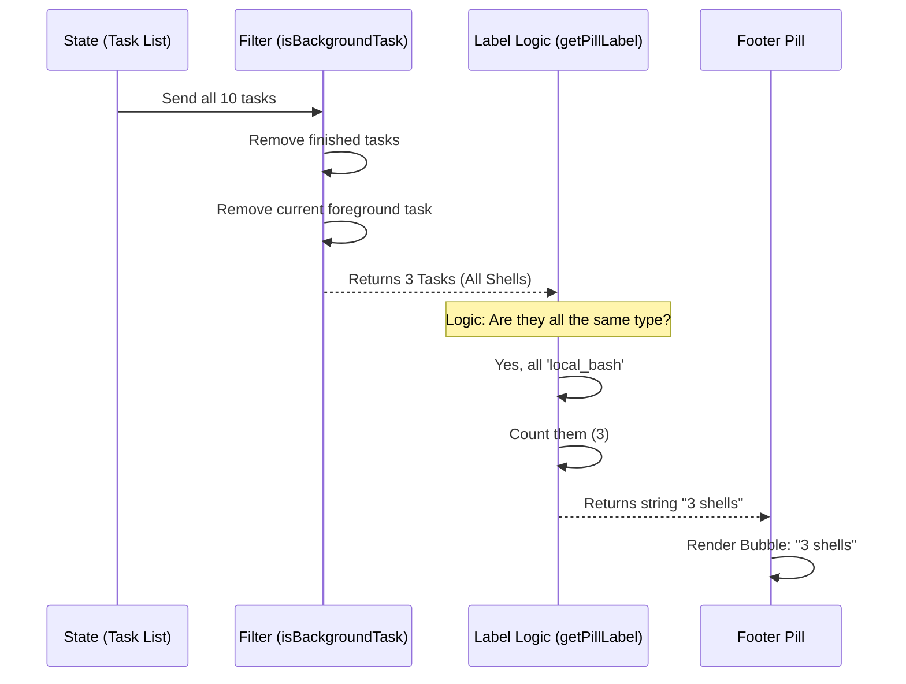

# Chapter 5: Task Visibility & Summarization

In the [previous chapter](04_in_process_teammates.md), we learned how to spawn complex **In-Process Teammates** that act as co-pilots.

By now, your system might have:
1.  Three shell commands compiling code.
2.  One background agent writing tests.
3.  Two teammates discussing a plan.

**The Problem:** If we showed a full window for every single one of these tasks, your screen would be unusable. You would be drowning in information.

**The Solution:** We need a **Dashboard**.

Just like a car, your system has an "engine" with hundreds of moving parts. But as the driver, you don't look at the pistons firing. You look at a simple dashboard light that says "Cruise Control: ON" or "Check Engine."

In this chapter, we will build that dashboard. We call it the **Pill**.

## The Concept: Aggregation

**Task Visibility & Summarization** is the logic that turns a complex list of objects into a simple, human-readable sentence like:
> *"3 shells, 1 team"*

It involves two steps:
1.  **Filtering:** Deciding which tasks are actually "in the background."
2.  **Summarizing:** Compressing that list into a short label.

## Step 1: The Filter (What is a Background Task?)

Not every task belongs in the footer dashboard.
*   **Stopped tasks?** No. We don't care about history here.
*   **The Active Tab?** No. If you are looking at it right now, it is "foreground," not "background."

We use a helper function called `isBackgroundTask` to decide who gets into the club.

### The Code

We check the `status` and a special flag called `isBackgrounded`.

```typescript
// From types.ts
export function isBackgroundTask(task: TaskState): boolean {
  // 1. Must be active (running or pending)
  if (task.status !== 'running' && task.status !== 'pending') {
    return false;
  }
  
  // 2. Must be explicitly marked as backgrounded
  // (If you are chatting with it now, isBackgrounded is false)
  if ('isBackgrounded' in task && task.isBackgrounded === false) {
    return false;
  }
  
  return true;
}
```

**How to use it:**
The UI component loops through *all* tasks and runs this check.

```typescript
// Example: Filter the list for the UI
const allTasks = Object.values(appState.tasks);
const backgroundTasks = allTasks.filter(isBackgroundTask);

// Result: Only the invisible, running tasks remain.
```

## Step 2: The Summarizer (The Pill Label)

Now that we have a list of, say, 5 background tasks, we need to label them.

If we just printed their IDs, it would look like: `task-123, task-456, task-789`. That is ugly.
We want to say: `3 shells`.

We use a function called `getPillLabel`. It looks at the **Types** of the tasks (remember [Chapter 1: Task State Polymorphism](01_task_state_polymorphism.md)?) and groups them.

### Visual Walkthrough

Here is how the system converts raw data into a readable string.



### Deep Dive: Inside `pillLabel.ts`

Let's look at how `getPillLabel` handles different scenarios. It switches behavior based on what is running.

#### Scenario A: A Bunch of Shells
If all tasks are shell commands, we count them. We even distinguish between "Monitors" (watchdogs) and regular Shells.

```typescript
// From pillLabel.ts
case 'local_bash': {
  // Count how many are monitors vs regular shells
  const monitors = count(tasks, t => t.kind === 'monitor')
  const shells = tasks.length - monitors
  
  // Build the string, e.g., "2 shells, 1 monitor"
  const parts: string[] = []
  if (shells > 0) parts.push(`${shells} shells`)
  if (monitors > 0) parts.push(`${monitors} monitors`)
  
  return parts.join(', ')
}
```

#### Scenario B: Remote Agents (The Diamond)
For Remote Agents (Cloud AI), we use symbols to indicate status.
*   `◇` (Open Diamond): Running normally.
*   `◆` (Filled Diamond): Waiting for *your* permission (Plan Ready).

```typescript
// From pillLabel.ts
case 'remote_agent': {
  const first = tasks[0]
  
  // If the plan is ready for review, show filled diamond
  if (first.ultraplanPhase === 'plan_ready') {
     return `${DIAMOND_FILLED} ultraplan ready`
  }
  
  // Otherwise, show open diamond (working)
  return `${DIAMOND_OPEN} 1 cloud session`
}
```

#### Scenario C: Mixed Bag
What if you have 1 Shell and 1 Agent running? The logic falls back to a generic count.

```typescript
// From pillLabel.ts at the very bottom
// If types are mixed, keep it simple.
return `${n} background ${n === 1 ? 'task' : 'tasks'}`
```

## The "Call to Action"

Sometimes, the dashboard isn't just for looking. It needs to scream for attention.

If an agent has a plan ready (`plan_ready`) or needs input (`needs_input`), we want the Pill to pulse or show a "Press ↓ to view" hint.

We use `pillNeedsCta` (Call to Action) for this.

```typescript
// From pillLabel.ts
export function pillNeedsCta(tasks: BackgroundTaskState[]): boolean {
  if (tasks.length !== 1) return false
  const t = tasks[0]
  
  // Only show CTA if it's a Remote Agent in a specific phase
  return (
    t.type === 'remote_agent' && 
    t.ultraplanPhase !== undefined
  )
}
```

## Summary

In this chapter, we learned:
1.  **Task Visibility** prevents the user from being overwhelmed by too many open windows.
2.  **`isBackgroundTask`** filters out tasks that are stopped or currently visible.
3.  **`getPillLabel`** summarizes the remaining tasks into a readable string (e.g., "3 shells").
4.  We use **Icons** (like `◇`) and **Conditional Logic** to give the user a quick "dashboard" view of the system's health.

Now that we know how to start tasks (Chapters 2, 3, 4) and how to view them (Chapter 5), there is one final piece of the puzzle. How do we clean up the mess when we are done?

[Next Chapter: Lifecycle & Termination](06_lifecycle___termination.md)

---

Generated by [Code IQ](https://github.com/adityasoni99/Code-IQ)