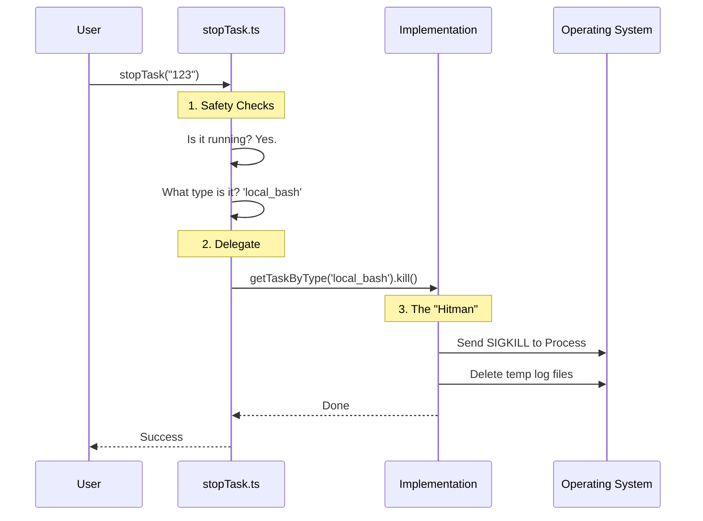

# Chapter 6: Lifecycle & Termination

In the [previous chapter](05_task_visibility___summarization.md), we built a dashboard to see all our running tasks. We learned how to filter them and summarize them into a neat little "Pill" in the footer.

But looking at tasks is easy. The hard part is **ending** them.

## The Problem: The "Zombie" Tenant

Imagine you start a task that runs a server: `npm start`. It listens on port 3000.
Then, you delete that task from your dashboard list.

If you didn't do it right, the dashboard list is empty, but your computer is **still running the server** in the background. If you try to start a new one, it crashes because "Port 3000 is already in use."

This is a **Zombie Task**. It's dead in your application's memory, but alive in the Operating System.

We need a standardized way to ensure that when we say "Stop," we mean "Stop, Kill, and Clean Up."

## The Solution: The Facility Manager

Think of our Lifecycle & Termination system as a **Facility Manager** for an apartment building.

When a tenant (Task) gets evicted (Stopped):
1.  **Eviction:** The Manager forces them to leave (Kills the process).
2.  **Utilities:** The Manager turns off the lights and water (Stops timers/watchdogs).
3.  **Cleanup:** The Manager clears out the furniture left behind (Deletes temporary log files).

This ensures the "room" (System Resources) is ready for the next tenant.

## How to Use It: One Function to Rule Them All

As a developer using this system, you don't need to know *how* a specific task works to stop it. You just need its ID.

We use a universal function called `stopTask`.

```typescript
// Example: The user clicked the "Stop" button in the UI
try {
  await stopTask('task-123', context);
  console.log("Task stopped successfully.");
} catch (error) {
  console.error("Could not stop task:", error.message);
}
```

**What happens here:**
1.  **Input:** You provide the ID `task-123`.
2.  **Processing:** The system figures out if it's a Shell command, an AI Agent, or a Teammate.
3.  **Result:** The task stops running, and the UI updates to show it is stopped.

## Internal Implementation

How does `stopTask` handle the differences between an AI Agent (which is just a network request) and a Shell Command (which is an OS process)?

### Visual Walkthrough

It uses the **Polymorphism** we learned in [Chapter 1](01_task_state_polymorphism.md).



### Code Deep Dive

Let's look at the actual code that orchestrates this.

#### Step 1: The Universal Stop Logic
In `stopTask.ts`, we perform checks that apply to *every* task, regardless of type.

```typescript
// From stopTask.ts
export async function stopTask(taskId: string, context: ...): Promise<Result> {
  const task = appState.tasks[taskId]

  // Check 1: Does it exist?
  if (!task) throw new StopTaskError('Task not found', 'not_found')

  // Check 2: Is it actually running?
  if (task.status !== 'running') {
    throw new StopTaskError('Task is not running', 'not_running')
  }

  // Check 3: Find the specific "driver" for this task type
  const taskImpl = getTaskByType(task.type)
  
  // Delegate the actual killing to the implementation
  await taskImpl.kill(taskId, setAppState)
}
```

#### Step 2: The Specific Kill Logic (Shell)
Now, let's look at what `taskImpl.kill` actually does for a **Local Shell Task** (from [Chapter 2](02_local_shell_execution.md)). This code lives in `LocalShellTask/killShellTasks.ts`.

It has to do three things: Kill the process, Stop the Watchdog, and Update the State.

```typescript
// From LocalShellTask/killShellTasks.ts
export function killTask(taskId: string, setAppState: SetAppStateFn): void {
  updateTaskState(taskId, setAppState, task => {
    // 1. Kill the OS Process (The "Eviction")
    task.shellCommand?.kill() 
    
    // 2. Stop the Watchdog Timer (Turn off utilities)
    if (task.cleanupTimeoutId) {
      clearTimeout(task.cleanupTimeoutId)
    }

    // 3. Mark as dead in the UI
    return { ...task, status: 'killed', endTime: Date.now() }
  })
  
  // 4. Clean up the hard drive (Remove furniture)
  void evictTaskOutput(taskId)
}
```

**Explanation:**
*   `shellCommand?.kill()`: Sends the signal to the Operating System to stop the command immediately.
*   `clearTimeout`: Stops the "Stall Watchdog" (from Chapter 2) so it doesn't try to alert us about a dead task.
*   `evictTaskOutput`: Deletes the temporary text file where logs were stored.

## Advanced Concept: Cascading Termination

There is one more complex scenario: **Sub-contractors**.

In [Chapter 3](03_background_agent_execution.md), we learned that an Agent can run shell commands.
If you fire the Agent (stop the main task), you must also fire the commands it started.

If you don't, the Agent stops "thinking," but the `npm install` it started keeps running forever.

We handle this with `killShellTasksForAgent`.

```typescript
// From LocalShellTask/killShellTasks.ts
export function killShellTasksForAgent(agentId: string, ...): void {
  // Loop through ALL tasks
  for (const [taskId, task] of Object.entries(tasks)) {
    
    // If it's a shell task AND it belongs to this agent...
    if (isLocalShellTask(task) && task.agentId === agentId) {
      
      // ...kill it too!
      killTask(taskId, setAppState)
    }
  }
}
```

This ensures that when the "Boss" leaves, the entire department is shut down cleanly.

## Conclusion

In this final chapter, we learned:
1.  **Lifecycle Management** is critical to prevent "Zombie" processes.
2.  We use a **Facility Manager** approach: Evict (Kill), Turn off utilities (Timers), and Cleanup (Files).
3.  **`stopTask`** is the polymorphic entry point that handles safety checks.
4.  **Cascading Termination** ensures that sub-tasks are killed when their parent is stopped.

### Series Summary

Congratulations! You have completed the **Tasks** project tutorial. You now understand the full architecture:

1.  **[Polymorphism](01_task_state_polymorphism.md):** How we treat different things as "Tasks".
2.  **[Shell Execution](02_local_shell_execution.md):** Running raw commands with watchdogs.
3.  **[Agents](03_background_agent_execution.md):** Running async AI contractors.
4.  **[Teammates](04_in_process_teammates.md):** Interactive co-pilots with memory.
5.  **[Visibility](05_task_visibility___summarization.md):** Seeing what is running.
6.  **Lifecycle:** Cleaning up the mess.

You are now ready to build your own robust, multi-tasking AI applications!

---

Generated by [Code IQ](https://github.com/adityasoni99/Code-IQ)