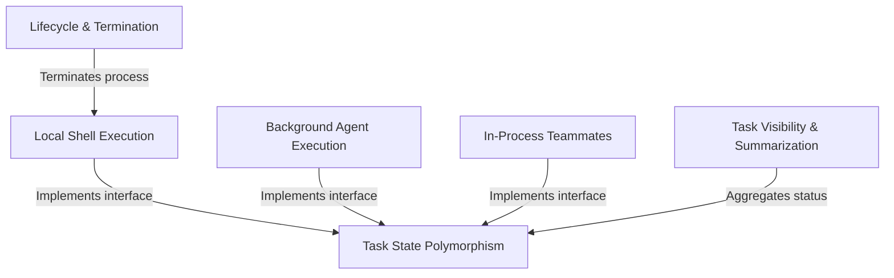

# Tutorial: tasks

This project functions as a unified **task management system** that orchestrates diverse background activities, from simple *shell commands* to complex, autonomous **AI agents**. It standardizes these different processes into a single **polymorphic state**, enabling centralized lifecycle control (stopping/killing tasks) and providing a concise **visual summary** of ongoing work to the user.

## Chapters

1. [Task State Polymorphism](01_task_state_polymorphism.md)
2. [Local Shell Execution](02_local_shell_execution.md)
3. [Background Agent Execution](03_background_agent_execution.md)
4. [In-Process Teammates](04_in_process_teammates.md)
5. [Task Visibility & Summarization](05_task_visibility___summarization.md)
6. [Lifecycle & Termination](06_lifecycle___termination.md)

---

Generated by [Code IQ](https://github.com/adityasoni99/Code-IQ)