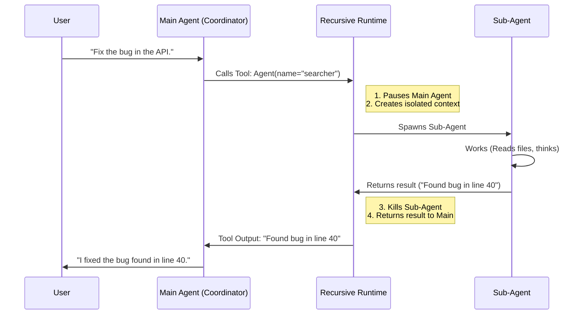

# Chapter 1: Recursive Agent Runtime

Welcome to the **Recursive Agent Runtime**. If you are building an AI tool that needs to handle complex tasks, you are in the right place.

This is the foundation of the entire system. Before we talk about how agents talk to each other or how they write code, we must understand how they are born and how they live.

## Why do we need this?

Imagine you are a Project Manager building a new mobile app. Do you write the code, design the logo, test the bugs, and write the marketing emails all by yourself, all at the same time?

Probably not. You **delegate**.
1. You hire a Designer for the logo.
2. You hire a Developer for the code.
3. You wait for their results and then combine them.

The **Recursive Agent Runtime** allows your AI to do exactly this. Instead of one single AI trying to keep thousands of lines of code and research notes in its head (context), it spawns specialized **Sub-Agents**.

### The Central Use Case: "The Deep Researcher"
Imagine a user asks: *"Why is the payment API failing?"*

Without this runtime, the AI scans 50 files, fills up its context window, gets confused, and forgets the original question.

**With Recursive Agent Runtime:**
1. The **Main Agent** sees the problem.
2. It spawns a **Sub-Agent** named "Investigator".
3. The Investigator is a fresh process with a clear brain. It digs through logs and files.
4. The Investigator returns a summary: *"I found a timeout error in `api.ts`."*
5. The Main Agent takes that summary and fixes it.

## Key Concepts

There are three main pillars to this runtime:

1.  **The Coordinator (Parent):** The main process running the show. It decides *when* to spawn help.
2.  **The Sub-Agent (Child):** A specialized worker. It has its own memory and tools. It lives, does a job, reports back, and then shuts down.
3.  **Context Inheritance:** When a child is born, does it know everything the parent knows (Fork), or does it start fresh (Specialist)?

## How to Use It

In this system, spawning an agent isn't magic—it's just a **Tool Call**. The system provides a tool called `Agent`.

When the AI wants help, it generates a structure like this:

```typescript
// The AI decides to call the 'Agent' tool
{
  name: "Agent",
  input: {
    // A name for us to track the worker
    name: "bug-investigator",
    // What specific job should it do?
    prompt: "Read api.ts and look for timeout configurations.",
    // (Optional) 'subagent_type' picks a specialist like "coder" or "researcher"
  }
}
```

The runtime sees this tool call and pauses the main agent to let the sub-agent run.

### Forking vs. Fresh Agents
The runtime supports two modes defined in `AgentTool/prompt.ts`:

1.  **Fresh Agent (`subagent_type` is set):** Like hiring a consultant. They don't know your history; you must brief them in the prompt.
2.  **Fork (`subagent_type` is omitted):** Like cloning yourself. The new agent inherits your entire conversation history but runs on a separate track.

## Under the Hood: The Lifecycle

What happens technically when an agent is spawned?



## Internal Implementation

The heart of this system lies in `AgentTool/runAgent.ts`. This file manages the birth and life of an agent. Let's look at simplified versions of the code to understand the logic.

### 1. The Entry Point: `runAgent`

This function is called when the `Agent` tool is used. It sets up the environment for the new worker.

```typescript
// From AgentTool/runAgent.ts (Simplified)
export async function* runAgent(params) {
  const { agentDefinition, promptMessages } = params;

  // 1. Create a unique ID for this new worker
  const agentId = createAgentId();

  // 2. Prepare the tools this agent is allowed to use
  // (e.g., a researcher might not be allowed to 'delete files')
  const resolvedTools = resolveAgentTools(agentDefinition, params.availableTools);

  // 3. Create a fresh context (memory space) for the agent
  // This ensures the sub-agent doesn't mess up the parent's state directly.
  const agentContext = createSubagentContext(params.toolUseContext, {
    agentId,
    tools: resolvedTools
  });
  
  // ... proceed to execution loop
}
```

*Explanation:* We generate an ID to track the agent (useful for debugging). We also figure out what tools it is allowed to have. We create a "Sandbox" (`createSubagentContext`) so that variables or state changes inside the agent are contained.

### 2. The Execution Loop

Once the context is ready, the agent enters a loop. It thinks, uses tools, and thinks again, until it solves the task.

```typescript
// From AgentTool/runAgent.ts (Simplified)

// 4. The main "Thinking" loop
// 'query' is the function that talks to the LLM
for await (const message of query({
  messages: initialMessages,   // The instructions (Prompt)
  systemPrompt: agentPrompt,   // The persona (e.g. "You are a researcher")
  toolUseContext: agentContext // The sandbox we created
})) {
  
  // 5. If the agent sends a message, we record it
  if (isRecordableMessage(message)) {
    // Save to a transcript so we can debug later
    await recordSidechainTranscript([message], agentId);
    
    // Yield the message up so the UI can show progress
    yield message;
  }
}
```

*Explanation:* The `query` function is the brain. It sends the history to the AI model. The loop continues receiving events (like "I am thinking", "I am reading a file") until the agent finishes. `yield` allows the main application to show these steps to the user in real-time.

### 3. Agent Memory

Agents sometimes need to write things down to remember them across different tasks. This is handled in `AgentTool/agentMemory.ts`.

```typescript
// From AgentTool/agentMemory.ts (Simplified)

export function getAgentMemoryDir(agentType: string, scope: 'project' | 'user') {
  // Determine where to save the memory files
  const dirName = sanitizeAgentTypeForPath(agentType);
  
  if (scope === 'project') {
    // Save inside the current project folder (.claude/agent-memory)
    return join(getCwd(), '.claude', 'agent-memory', dirName);
  }
  
  // Save in the user's home directory (global memory)
  return join(getMemoryBaseDir(), 'agent-memory', dirName);
}
```

*Explanation:* The runtime gives agents a specific folder on the hard drive. If the agent learns "How to run tests for this project," it saves it in `project` scope. If it learns "My user prefers Python," it saves it in `user` scope.

## Summary

The **Recursive Agent Runtime** is the engine that transforms a simple chatbot into a powerful workforce.
1.  **Delegation:** It allows the Main Agent to offload work.
2.  **Isolation:** Sub-agents run in their own context so they don't confuse the main conversation.
3.  **Lifecycle:** The runtime manages creating, running, and cleaning up these sub-agents.

Now that we have agents running, how do we make sure they actually do what we want and work well together?

[Next Chapter: Task & Team Coordination](02_task___team_coordination.md)

---

Generated by [Code IQ](https://github.com/adityasoni99/Code-IQ)