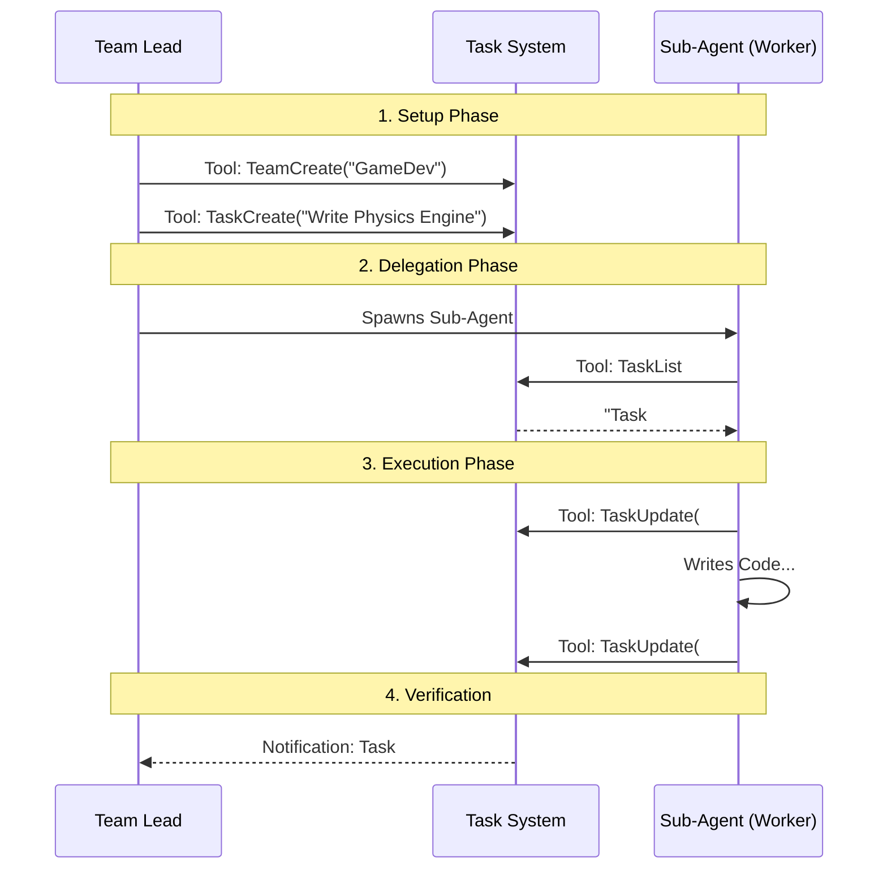

# Chapter 2: Task & Team Coordination

In the previous chapter, [Recursive Agent Runtime](01_recursive_agent_runtime.md), we learned how an AI can spawn "Sub-Agents" to help do work.

However, simply spawning agents isn't enough. If you hire three contractors to build a house but don't give them a blueprint or a schedule, you end up with three kitchens and no roof.

This chapter introduces the **Task & Team Coordination** layer. This is the shared "brain" that keeps all agents—parents and children—aligned on what needs to be done.

## The Problem: The "Lost Agent"

Imagine a scenario: You ask the AI to "Refactor the entire database layer."
1.  The Main Agent spawns a "Researcher" to check dependencies.
2.  The Main Agent spawns a "Coder" to write new SQL files.
3.  The Main Agent spawns a "Tester" to update unit tests.

Without a shared plan:
*   The **Coder** might change a file that the **Tester** is currently reading.
*   The **Tester** runs tests before the **Coder** is finished.
*   The **Main Agent** forgets which files have been touched.

## The Solution: The Shared "Whiteboard"

To solve this, the system uses a persistent **Task Board** (similar to Trello or Jira) and organizes agents into **Teams**.

1.  **The Team:** A group of agents working in a specific context (a project).
2.  **The Task:** A single unit of work (e.g., "Update user-schema.sql").
3.  **The State:** Tasks have statuses (`pending`, `in_progress`, `completed`) and dependencies (Task B blocks Task A).

## How It Works: The Workflow

When an AI starts a complex job, it doesn't just start coding. It follows this workflow:

1.  **Create a Team:** Establish a workspace.
2.  **Plan:** Break the goal into small Tasks.
3.  **Execute:** Agents pick up tasks, mark them `in_progress`, and complete them.
4.  **Update:** If a task is blocked, the agent marks it.

### Step 1: Creating a Team

The agent uses the `TeamCreate` tool. This sets up a "Headquarters" for the project.

```javascript
// Input to TeamCreate tool
{
  "team_name": "database-refactor",
  "description": "Migrating the user database to PostgreSQL",
  "agent_type": "tech-lead"
}
```

### Step 2: Creating Tasks

Once the team exists, the agent breaks the problem down using `TaskCreate`.

```javascript
// Input to TaskCreate tool
{
  "subject": "Create migration script",
  "description": "Write the SQL to alter the users table.",
  "activeForm": "Writing SQL", // What is the agent doing right now?
  "metadata": { "priority": "high" }
}
```

### Step 3: Seeing the Board

Any agent (Main or Sub) can look at the board using `TaskList`. This ensures everyone sees the same truth.

```text
# Output from TaskList tool
#1 [completed] Analyze current schema (Alice)
#2 [in_progress] Create migration script (Bob)
#3 [pending] Update unit tests [blocked by #2]
```

*Note how Task #3 is blocked. The system knows the Tester shouldn't start yet.*

## Internal Implementation

How does this work under the hood? It's not magic memory inside the AI model. It is a file-system based database.

### The Coordination Flow

Here is how agents interact with the system:



### 1. Creating the Team (`TeamCreateTool.ts`)

When `TeamCreate` is called, we write a JSON file to disk. This file acts as the roster.

```typescript
// Simplified from TeamCreateTool.ts
export const TeamCreateTool = buildTool({
  name: "TeamCreate",
  async call({ team_name, description, agent_type }, context) {
    
    // 1. Define the Team Leader
    const leadAgentId = formatAgentId("team-lead", team_name);
    
    // 2. Create the Team File object
    const teamFile = {
      name: team_name,
      description: description,
      leadAgentId: leadAgentId,
      members: [] // Other agents will be added here later
    };

    // 3. Save it to disk (The "Headquarters")
    await writeTeamFileAsync(team_name, teamFile);
    
    // 4. Initialize an empty Task List for this team
    await ensureTasksDir(sanitizeName(team_name));

    return { team_name, lead_agent_id: leadAgentId };
  }
});
```

*Explanation:* We simply create a structured file. This file persists even if the AI crashes or is restarted. `ensureTasksDir` creates a folder where the sticky notes (tasks) will live.

### 2. Creating a Task (`TaskCreateTool.ts`)

Creating a task is just adding a file to that directory.

```typescript
// Simplified from TaskCreateTool.ts
export const TaskCreateTool = buildTool({
  name: "TaskCreate",
  async call({ subject, description }, context) {
    
    // 1. Create the task object in the database
    // getTaskListId() figures out which Team we are currently in
    const taskId = await createTask(getTaskListId(), {
      subject,
      description,
      status: 'pending',
      blocks: [],     // Who does this task block?
      blockedBy: []   // Who blocks this task?
    });

    // 2. Return the ID so the agent can reference it
    return { 
      data: { task: { id: taskId, subject } } 
    };
  }
});
```

*Explanation:* The system handles the ID generation (e.g., "1", "2", "3"). It automatically links the task to the current active Team.

### 3. Updating and Completing (`TaskUpdateTool.ts`)

This is the most complex part. When a task is updated, we might need to notify people or unblock other tasks.

```typescript
// Simplified from TaskUpdateTool.ts
export const TaskUpdateTool = buildTool({
  name: "TaskUpdate",
  async call({ taskId, status, owner }, context) {
    
    // 1. Get current task data
    const existingTask = await getTask(getTaskListId(), taskId);

    // 2. Update status (e.g. pending -> completed)
    if (status && status !== existingTask.status) {
       await updateTask(getTaskListId(), taskId, { status });
       
       // 3. If assigned to a new owner, send them a "Mailbox" message
       if (owner) {
         await writeToMailbox(owner, {
           type: 'task_assignment',
           text: `You have been assigned task #${taskId}`
         });
       }
    }

    // 4. Check for logic gaps (The "Nudge")
    // If an agent closes 3 tasks but none were "Verification", 
    // the system warns them to double-check their work.
    let verificationNudgeNeeded = checkForVerificationGap(status);

    return { 
      success: true, 
      verificationNudgeNeeded 
    };
  }
});
```

*Explanation:*
1.  **State Change:** We update the JSON file for the task.
2.  **Notification:** If ownership changes, we use `writeToMailbox`. This concepts connects directly to the next chapter.
3.  **The Nudge:** Notice the `verificationNudgeNeeded`. This is a "safety rail." If an agent blindly marks tasks as done without verifying, the tool output basically says, *"Hey, you finished a lot of work but didn't run any tests. Are you sure?"*

## Summary

The **Task & Team Coordination** layer turns a chaotic group of AI agents into a disciplined workforce.

1.  **Teams** give agents a shared identity and workspace.
2.  **Tasks** provide a shared definition of "Done."
3.  **Status Updates** allow agents to react to each other's progress (e.g., unblocking a task).

Now that our agents have a plan and a team, they need a way to talk to each other about the work. How do they send those "Mailbox" messages we saw in the code?

[Next Chapter: Communication Channels](03_communication_channels.md)

---

Generated by [Code IQ](https://github.com/adityasoni99/Code-IQ)