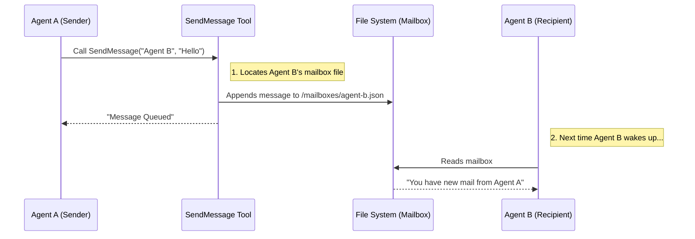

# Chapter 3: Communication Channels

In the previous chapter, [Task & Team Coordination](02_task___team_coordination.md), we learned how to organize agents into teams and track their work using a shared Task Board.

But a team that only moves cards on a board without ever speaking is inefficient. Agents need to ask for passwords, report "Mission Accomplished" to the user, or ask a teammate to review code.

This chapter introduces **Communication Channels**: the specific tools agents use to speak to the **User** and to **Each Other**.

## Why do we need this?

Imagine a "Backend Agent" is writing code and realizes the database credentials are missing.

Without a communication channel:
1. The agent guesses the password (fails).
2. The agent tries to hack the database (bad idea).
3. The agent crashes.

**With Communication Channels:**
1. The agent pauses.
2. It uses a tool to pop up a question for the User: *"Please provide the database password."*
3. The User types it in.
4. The agent continues working.

### The Central Use Case: "The Stuck Teammate"
Agents, like humans, get blocked.
1. **User Communication:** The agent asks the human for help.
2. **Peer Communication:** A "Coder" agent finishes a file and messages the "Tester" agent: *"I'm done, please run the tests."*

## Key Concepts

We divide communication into two distinct categories:

1.  **User-Facing Channels:** Tools designed to show information to the human or get their input.
2.  **Peer-Facing Channels:** Tools designed to send data between agents (the "Swarm").

## How to Use It

The runtime provides three specific tools for these scenarios.

### 1. Talking to the User (`Brief`)
When an agent wants to give a status update, it uses the `Brief` tool. This isn't for debug logs; it's for "polite conversation" with the user.

```javascript
// Input to Brief tool
{
  "message": "I have finished analyzing the logs. No errors found.",
  "status": "normal" // or "proactive" if interrupting the user
}
```

*Result:* The user sees a nicely formatted message in their console.

### 2. Asking the User (`AskUserQuestion`)
Sometimes the agent cannot proceed without human input. It uses this tool to render a blocking menu.

```javascript
// Input to AskUserQuestion tool
{
  "questions": [
    {
      "question": "Which environment should I deploy to?",
      "options": [
        { "label": "Staging", "description": "Internal test server" },
        { "label": "Production", "description": "Live user traffic" }
      ]
    }
  ]
}
```

*Result:* The agent pauses execution completely until the user selects an option.

### 3. Talking to Teammates (`SendMessage`)
This is the internal chat system (like Slack for AI). Agents can Direct Message (DM) specific peers or Broadcast to everyone.

```javascript
// Input to SendMessage tool
{
  "to": "qa-tester-bot",
  "message": "I updated api.ts. Please verify the build."
}
```

## Under the Hood: The Message Flow

How does a message get from Agent A to Agent B? It doesn't use complex networking. It uses the file system (Mailboxes), similar to how tasks work.



## Internal Implementation

Let's look at the code that powers these three tools.

### 1. The Output Channel: `BriefTool.ts`

This tool is simple. It takes a message and passes it through to the user interface.

```typescript
// Simplified from BriefTool.ts
export const BriefTool = buildTool({
  name: "Brief",
  
  // This function runs when the AI calls the tool
  async call({ message, attachments }, context) {
    
    // 1. Log analytics so we know the agent is talking
    logEvent('brief_send', { attachment_count: attachments?.length });

    // 2. Return the data. The UI layer (outside this file) 
    // observes this return value and renders it to the console.
    return {
      data: { 
        message, 
        sentAt: new Date().toISOString() 
      }
    };
  }
});
```

*Explanation:* The `Brief` tool doesn't "print" to the screen directly. It returns a structured object. The Recursive Agent Runtime (covered in [Chapter 1](01_recursive_agent_runtime.md)) catches this result and decides how to show it to the user.

### 2. The Blocking Channel: `AskUserQuestionTool.tsx`

This tool is unique because it uses **React** components (`tsx`) to render an interactive menu in the terminal.

```typescript
// Simplified from AskUserQuestionTool.tsx
export const AskUserQuestionTool = buildTool({
  name: "AskUserQuestion",
  
  // This flag tells the runtime: "Don't let the agent continue yet!"
  requiresUserInteraction() {
    return true;
  },

  // This renders the actual UI the user sees (The Menu)
  renderToolResultMessage({ answers }) {
    return <AskUserQuestionResult answers={answers} />;
  },

  async call({ questions }, context) {
    // The runtime pauses here until the user clicks an option.
    // The 'answers' are injected into the context once the user replies.
    return {
      data: { questions, answers: context.answers }
    };
  }
});
```

*Explanation:* The `requiresUserInteraction()` creates a "Break" in the agent's thought loop. The agent literally stops thinking. Once the user clicks "Staging", the runtime wakes the agent up with the result.

### 3. The Swarm Channel: `SendMessageTool.ts`

This tool manages the "Inbox" system. It allows agents to coordinate without a central brain controlling every move.

```typescript
// Simplified from SendMessageTool.ts
async function handleMessage(recipientName, content, context) {
  const senderName = getAgentName(); // Who am I?

  // We write to a specific file that the recipient watches
  await writeToMailbox(
    recipientName, 
    {
      from: senderName,
      text: content,
      timestamp: new Date().toISOString(),
    }
  );

  return {
    data: {
      success: true,
      message: `Message sent to ${recipientName}'s inbox`
    }
  }
}
```

*Explanation:*
1.  **Identity:** The tool automatically figures out who is sending the message (`getAgentName`).
2.  **Delivery:** `writeToMailbox` is a helper that appends a JSON object to a file.
3.  **Broadcasting:** If the user sends to `*` (wildcard), the tool loops through *all* teammates and writes to all their mailboxes.

## Summary

In this chapter, we gave our agents a voice.

1.  **Brief:** Allows the agent to politely inform the user of progress.
2.  **AskUserQuestion:** Allows the agent to stop and ask for help.
3.  **SendMessage:** Allows agents to coordinate internally via a file-based mailbox system.

Now that agents can talk and work together, how do they decide *what* to do next on a larger scale? They need a plan.

[Next Chapter: Planning Workflow](04_planning_workflow.md)

---

Generated by [Code IQ](https://github.com/adityasoni99/Code-IQ)