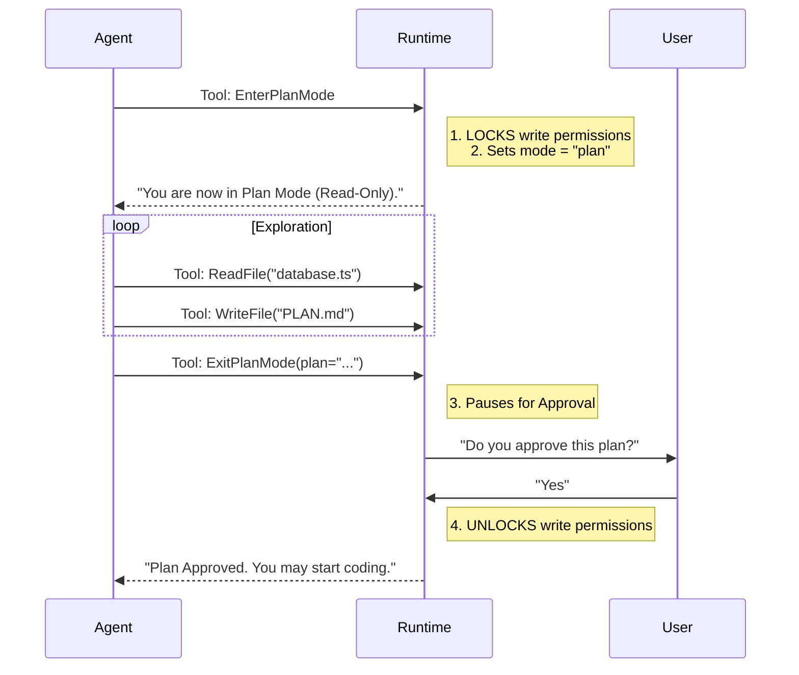

# Chapter 4: Planning Workflow

In the previous chapter, [Communication Channels](03_communication_channels.md), we gave our agents the ability to talk to users and teammates. They can now ask for help and report status.

But communicating isn't the same as **thinking**.

If you ask an AI to "Rebuild the entire payment system," you don't want it to immediately start deleting files and guessing code. You want it to pause, study the existing code, draft a plan, and ask for your approval *before* it touches anything sensitive.

This chapter introduces the **Planning Workflow**: a safety mechanism that forces agents to "Measure twice, cut once."

## Why do we need this?

Imagine you are a contractor building a house.
*   **The "Cowboy" Approach:** You arrive at the empty lot and immediately start pouring concrete. Halfway through, you realize the kitchen is in the wrong spot. You have to jackhammer the concrete and start over.
*   **The "Architect" Approach:** You arrive, look at the land, and draw a blueprint. You show the blueprint to the owner. Only when they sign it do you pick up a shovel.

The **Planning Workflow** enforces the "Architect" approach.

### The Central Use Case: "The Complex Refactor"
A user asks: *"Migrate our database from SQLite to PostgreSQL."*

1.  **Without Planning:** The agent installs PostgreSQL, breaks the app, and then realizes the data types don't match. The app is down.
2.  **With Planning:**
    *   The agent enters **Plan Mode**.
    *   It loses the ability to edit code (Read-Only).
    *   It reads the database schema.
    *   It writes a text file called `PLAN.md`.
    *   It asks the user: *"Here is my plan. Do you approve?"*
    *   Once approved, it gets its tools back and starts working.

## Key Concepts

There are three main components to this workflow:

1.  **Enter Plan Mode:** A tool that switches the agent's state.
2.  **The Straitjacket (Read-Only):** While in this mode, all "dangerous" tools (like `FileEdit` or `RunCommand`) are disabled.
3.  **The Exit Gate:** To leave Plan Mode, the agent must present a plan. The user (or a Team Lead) must approve it.

## How to Use It

The workflow consists of two specific tools: `EnterPlanMode` and `ExitPlanMode`.

### Step 1: Entering the Mode

When the agent realizes a task is complex, it calls `EnterPlanMode`.

```javascript
// The agent decides to stop and think
{
  name: "EnterPlanMode",
  input: {}
}
```

*Result:* The system locks the "Write" permissions. The agent can now only `Read` files and `Think`.

### Step 2: The Planning Phase

The agent explores the codebase. It creates a plan file (usually `CURRENT_PLAN.md`). It writes down:
1.  Which files need changing.
2.  What logic to update.
3.  Potential risks.

### Step 3: Exiting and Approval

When the agent is ready, it submits the plan for approval using `ExitPlanMode`.

```javascript
// The agent submits the plan
{
  name: "ExitPlanMode",
  input: {
    "plan": "1. Update schema.prisma\n2. Run migration..."
  }
}
```

*Result:* The user sees a prompt: **"Do you approve this plan?"** If yes, the agent unlocks `FileEdit` and starts coding.

## Under the Hood: The Workflow

How does the system enforce this safety latch?



## Internal Implementation

Let's look at the code that manages this state machine.

### 1. Locking the Doors: `EnterPlanModeTool.ts`

When this tool is called, we update the global state of the application.

```typescript
// From EnterPlanModeTool.ts (Simplified)

export const EnterPlanModeTool = buildTool({
  name: "EnterPlanMode",
  
  // This tool changes the state of the agent
  async call(_input, context) {
    
    // 1. Get current application state
    const appState = context.getAppState();

    // 2. Switch mode to 'plan'
    // This flag is checked by other tools to block write access
    context.setAppState(prev => ({
      ...prev,
      toolPermissionContext: { 
         ...prev.toolPermissionContext, 
         mode: 'plan' 
      }
    }));

    return { data: { message: "Entered plan mode." } };
  }
});
```

*Explanation:* This is the switch. By setting `mode: 'plan'`, the system knows to restrict behavior.

### 2. The Straitjacket: `planAgent.ts`

How do we actually stop the agent from writing code? We define a specialized "Plan Agent" that has a list of `disallowedTools`.

```typescript
// From AgentTool/built-in/planAgent.ts (Simplified)

export const PLAN_AGENT = {
  agentType: 'Plan',
  
  // The list of forbidden actions
  disallowedTools: [
    'Agent',        // Cannot spawn sub-agents
    'ExitPlanMode', // Cannot exit without the specific tool logic
    'FileEdit',     // CANNOT edit files
    'FileWrite',    // CANNOT write new files
  ],

  // The instructions given to the AI
  getSystemPrompt: () => `
    You are a software architect.
    CRITICAL: READ-ONLY MODE.
    You are STRICTLY PROHIBITED from modifying files.
    Your role is to explore and design.
  `
};
```

*Explanation:* Even if the AI *wanted* to write code, the `FileEdit` tool is physically removed from its toolbox while in this mode.

### 3. The Gatekeeper: `ExitPlanModeV2Tool.ts`

This is the most critical part: getting back to work. This tool requires user interaction.

```typescript
// From ExitPlanModeTool/ExitPlanModeV2Tool.ts (Simplified)

export const ExitPlanModeV2Tool = buildTool({
  name: "ExitPlanMode",

  // 1. Force the system to pause and ask the human
  requiresUserInteraction() {
    // If it's a sub-agent, the Team Lead approves.
    // If it's the main agent, the Human approves.
    return !isTeammate(); 
  },

  async call(input, context) {
    const plan = input.plan;

    // 2. Save the plan to disk so we don't lose it
    await writeFile('current_plan.md', plan);

    // 3. Switch mode back to normal
    context.setAppState(prev => ({
      ...prev,
      toolPermissionContext: { mode: 'default' }
    }));

    return { data: { message: "Plan approved. Start coding." } };
  }
});
```

*Explanation:*
1.  **Safety Check:** `requiresUserInteraction()` tells the runtime "Don't run this automatically."
2.  **Persistence:** We save the plan to a file. This acts as the project documentation.
3.  **Unlock:** We set the mode back to `default`, restoring the `FileEdit` tool.

## Summary

The **Planning Workflow** turns an impulsive AI into a thoughtful engineer.
1.  **Enter Plan Mode** locks the write permissions.
2.  **Plan Agent** definition ensures the AI knows it is an "Architect," not a "Builder."
3.  **Exit Plan Mode** requires a human (or Team Lead) signature on the blueprint before construction begins.

Now that we have a plan and permission to edit files, how do our agents actually touch the hard drive?

[Next Chapter: File System Manipulation](05_file_system_manipulation.md)

---

Generated by [Code IQ](https://github.com/adityasoni99/Code-IQ)