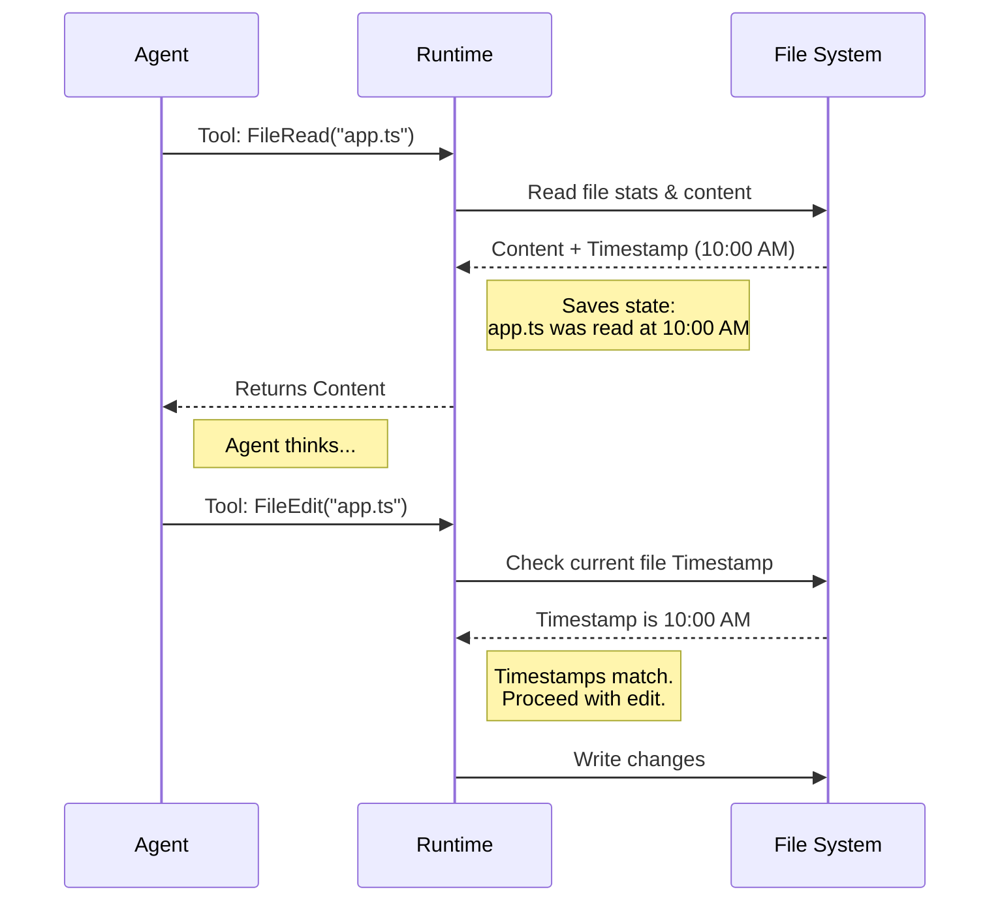

# Chapter 5: File System Manipulation

In the previous chapter, [Planning Workflow](04_planning_workflow.md), we learned how to make our AI pause, think, and create a blueprint before acting.

Now that the plan is approved, the agent needs to get to work. It needs to read code, create new scripts, and fix bugs.

This chapter introduces **File System Manipulation**: the set of tools that serve as the agent's "hands." Just like a developer uses a text editor (like VS Code), the agent uses these tools to interact with files on your hard drive.

## Why do we need this?

Imagine a "Brain in a Jar." It is incredibly smart and knows how to fix your code, but it has no hands. It can scream the solution, but it can't type it.

That is an AI without file system tools.

To be useful, an agent must be able to:
1.  **See:** Read files to understand the context.
2.  **Create:** Write new files from scratch.
3.  **Surgery:** Edit specific parts of existing files without rewriting the whole thing.

### The Central Use Case: "The Typo Fixer"
Imagine you have a 5,000-line file named `server.ts`. There is a typo on line 4,020.

*   **Bad Approach:** The AI rewrites the entire 5,000-line file just to fix one word. This is slow, expensive, and risky.
*   **Good Approach:** The AI uses a "Search and Replace" tool to surgically swap the bad word for the good word.

## Key Concepts

We categorize file interactions into three main actions:

1.  **Read:** Getting the content of a file (Text, PDF, Images, or Notebooks).
2.  **Write:** Creating a new file or completely overwriting a small one.
3.  **Edit:** Performing a "patch" (replacing text) on an existing file.

### The Safety Rule: "Read-Before-Write"
This is the most important concept in this chapter.

**The Rule:** An agent is *not allowed* to edit a file unless it has read it recently.

**Why?**
Imagine the agent reads a file at 9:00 AM. You (the user) manually change the file at 9:01 AM. If the agent tries to edit the file at 9:02 AM based on its 9:00 AM memory, it might accidentally undo your work.

The system tracks timestamps. If the file changed on disk *after* the agent last read it, the edit is rejected.

## How to Use It

The runtime provides three primary tools for these concepts.

### 1. Reading Files (`FileRead`)

This tool reads the content of a file. It handles text, but also converts PDFs and Images into a format the AI can understand.

```javascript
// Input to FileRead tool
{
  "file_path": "/src/components/Button.tsx"
}
```

*Result:* The agent receives the file content, line numbers, and metadata.

### 2. Creating Files (`FileWrite`)

This is used to create *new* files.

```javascript
// Input to FileWrite tool
{
  "file_path": "/src/utils/helpers.ts",
  "content": "export const add = (a, b) => a + b;"
}
```

*Result:* A new file is created on the disk.

### 3. Surgically Editing (`FileEdit`)

This is the most common tool for coding. Instead of line numbers (which change easily), it uses unique string matching.

```javascript
// Input to FileEdit tool
{
  "file_path": "/src/utils/helpers.ts",
  "old_string": "export const add = (a, b) => a + b;",
  "new_string": "export const add = (a, b) => a + b + 1; // fixed off-by-one",
  "replace_all": false
}
```

*Result:* The system looks for `old_string`. If it finds it exactly, it swaps it with `new_string`.

## Under the Hood: The Safety Dance

How does the system ensure the agent doesn't break things? It maintains a "State Map" of what the agent has seen.



## Internal Implementation

Let's look at the code that powers these tools.

### 1. Reading and Tracking (`FileReadTool.ts`)

When a file is read, we don't just return the text. We verify it's safe and record *when* we read it.

```typescript
// Simplified from FileReadTool.ts
async function callInner(filePath, context) {
  // 1. Read the file from disk
  const { content, mtimeMs } = await readFileInRange(filePath);

  // 2. Save the "Read State"
  // This is the proof that the agent knows what the file looks like right now.
  context.readFileState.set(filePath, {
    content: content,
    timestamp: mtimeMs, // The 'Last Modified' time
  });

  // 3. Return content to the AI
  return { data: { type: 'text', content } };
}
```

*Explanation:* The `context.readFileState` is the memory bank. It links a file path to a timestamp.

### 2. Verifying the Edit (`FileEditTool.ts`)

Before allowing an edit, we check that memory bank.

```typescript
// Simplified from FileEditTool.ts
async function validateInput(input, context) {
  const filePath = input.file_path;
  
  // 1. Retrieve the last time the agent read this file
  const lastRead = context.readFileState.get(filePath);

  // 2. Check: Has the agent NEVER read this file?
  if (!lastRead) {
    return { result: false, message: "Read the file first!" };
  }

  // 3. Check: Has the file changed on disk since the read?
  const currentDiskTime = getFileModificationTime(filePath);
  if (currentDiskTime > lastRead.timestamp) {
    return { result: false, message: "File changed externally. Read again." };
  }

  return { result: true };
}
```

*Explanation:* This logic prevents race conditions. If you edit the file while the AI is thinking, `currentDiskTime` will be higher than `lastRead.timestamp`, and the tool will fail safely.

### 3. Performing the Patch (`FileEditTool.ts`)

If validation passes, we perform the text replacement.

```typescript
// Simplified from FileEditTool.ts
async function call(input) {
  // 1. Read current content
  const content = fs.readFileSync(input.file_path);

  // 2. Use string replacement
  // We look for 'old_string' and replace with 'new_string'
  const newContent = content.replace(input.old_string, input.new_string);

  // 3. Write back to disk
  fs.writeFileSync(input.file_path, newContent);

  return { message: "File updated successfully." };
}
```

*Explanation:* We use strict string replacement. This ensures the AI knows *exactly* what context it is modifying. If `old_string` isn't found (maybe because the file changed slightly), the tool reports an error instead of guessing.

### Special Case: Notebooks (`NotebookEditTool.ts`)

Jupyter Notebooks (`.ipynb`) are complex JSON files. Editing them as raw text is very hard for AI. We provide a specialized tool.

```typescript
// Simplified from NotebookEditTool.ts
async function call({ cell_id, new_source, edit_mode }) {
  // 1. Parse the Notebook JSON
  const notebook = JSON.parse(readFileSync(path));

  // 2. Find the specific cell
  const cell = notebook.cells.find(c => c.id === cell_id);

  // 3. Update just that cell's code
  if (edit_mode === 'replace') {
    cell.source = new_source;
  }

  // 4. Save the JSON back to disk
  writeFileSync(path, JSON.stringify(notebook));
}
```

*Explanation:* This treats the notebook as a structured object, not just a string of text. This prevents the AI from accidentally breaking the JSON syntax of the notebook.

## Summary

The **File System Manipulation** layer gives the agent physical agency.

1.  **FileRead:** Gets data and sets a "safety timestamp."
2.  **FileWrite:** Creates new artifacts.
3.  **FileEdit:** Safely patches existing code using strict string matching and timestamp verification.
4.  **NotebookEdit:** specialized handling for data science workflows.

Now the agent can read and write code. But simply writing a file doesn't make it run. The agent needs to execute commands to install packages, run tests, or start servers.

[Next Chapter: Shell & System Execution](06_shell___system_execution.md)

---

Generated by [Code IQ](https://github.com/adityasoni99/Code-IQ)