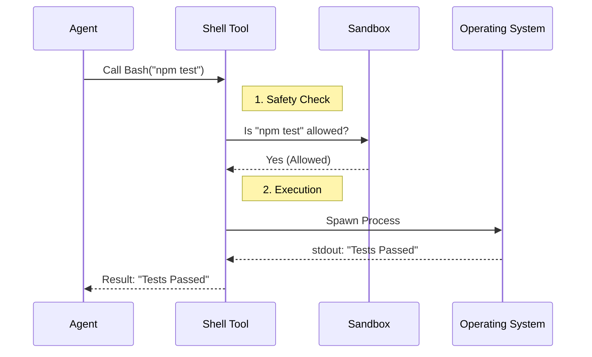

# Chapter 6: Shell & System Execution

In the previous chapter, [File System Manipulation](05_file_system_manipulation.md), we gave our agents "hands" to write code and edit files.

But writing code is only half the battle. You can write the most beautiful Python script in the world, but if you never run `python script.py`, you don't know if it actually works.

This chapter introduces **Shell & System Execution**. This is the interface that allows the agent to leave the text editor and interact with the Operating System (OS) to run commands, install packages, and configure the environment.

## Why do we need this?

Imagine a developer who can type code into a file but isn't allowed to open the Terminal window. They cannot:
1.  Run the app to see if it crashes.
2.  Install libraries (like `npm install`).
3.  Use Git to push changes.

This "Terminal Window" is exactly what the **Shell Tools** provide to the agent.

### The Central Use Case: "The Test Run"
Your agent just finished fixing a bug in `calculator.ts`.
*   **Without Shell:** The agent says, "I fixed the code. I hope it works."
*   **With Shell:**
    1.  The agent runs `npm test`.
    2.  The terminal outputs `Error: expected 4, got 5`.
    3.  The agent sees this, corrects the code, runs the test again.
    4.  The terminal outputs `PASS`.
    5.  The agent reports: "I fixed the bug and verified it with tests."

## Key Concepts

We categorize system execution into three specific tools depending on the OS and the goal:

1.  **Bash:** The standard command line for Linux and macOS.
2.  **PowerShell:** The command line for Windows.
3.  **Config:** A tool to change the settings of the agent runtime itself.

### The Sandbox (Safety First)
Giving an AI access to your terminal is risky. You don't want it to run `rm -rf /` (delete everything).

To prevent this, the system uses a **Sandbox**.
*   **Allowed:** Running build scripts, running tests, listing files.
*   **Blocked:** Accessing sensitive system files (like passwords), connecting to banned websites, or running dangerous system commands.

## How to Use It

The runtime provides tools that act like a "Remote Control" for your terminal.

### 1. Running Commands on Mac/Linux (`Bash`)

The agent uses the `Bash` tool to execute commands.

```javascript
// Input to Bash tool
{
  "command": "npm install lodash"
}
```

*Result:* The agent receives the console output: `added 1 package, and audited 2 packages in 3s`.

### 2. Running Commands on Windows (`PowerShell`)

If the agent detects it is on Windows, it swaps to `PowerShell`.

```javascript
// Input to PowerShell tool
{
  "command": "Get-ChildItem -Path .\\src"
}
```

*Result:* A list of files in the `src` directory is returned.

### 3. Tuning the Engine (`Config`)

Sometimes the agent needs to change how *it* behaves. For example, enabling a specific theme or checking a setting.

```javascript
// Input to Config tool (Setting a value)
{
  "setting": "theme",
  "value": "dark"
}
```

## Under the Hood: The Execution Flow

How does a text command from an AI turn into a real system process?



## Internal Implementation

The magic of these tools isn't just running the command; it's **teaching the AI how to use them safely**. Let's look at how the code handles this.

### 1. Teaching the AI Habits (`BashTool/prompt.ts`)

We don't just give the AI a blank terminal. We inject a "System Prompt" that acts as a user manual. It explicitly tells the AI *not* to use the shell for things that have better tools (like reading files).

```typescript
// Simplified from BashTool/prompt.ts
export function getSimplePrompt() {
  return `
    Executes a bash command.
    
    IMPORTANT: Avoid using this tool for file operations.
    - Read files: Use FileRead (NOT cat/head/tail)
    - Edit files: Use FileEdit (NOT sed/awk)
    
    Avoid unnecessary 'sleep' commands.
    If you need to run independent commands, send them in parallel.
  `;
}
```

*Explanation:* If we didn't do this, the AI might try to use `cat file.txt` to read a file. While that works, it's messy. We want it to use the specialized `FileRead` tool from [Chapter 5](05_file_system_manipulation.md) because that tool handles large files and line numbers better.

### 2. Handling Windows Weirdness (`PowerShellTool/prompt.ts`)

Windows PowerShell has different versions (Desktop vs. Core). They have different syntax rules. The tool automatically detects this to prevent the agent from writing broken scripts.

```typescript
// Simplified from PowerShellTool/prompt.ts
function getEditionSection(edition) {
  if (edition === 'desktop') {
    // Windows PowerShell 5.1 doesn't support && or ||
    return `Warning: You are on PowerShell 5.1. 
            Do NOT use '&&' or '||'. 
            Use '; if ($?) { ... }' instead.`;
  }
  
  // PowerShell 7+ supports modern syntax
  return `You are on PowerShell Core. You may use '&&' and '||'.`;
}
```

*Explanation:* This dynamic prompt saves the agent from getting frustrating "Syntax Error" messages just because it tried to use modern Linux-style operators on an old Windows machine.

### 3. Managing Settings (`ConfigTool.ts`)

The `Config` tool allows the agent to modify the environment. It includes strict validation to ensure the agent doesn't set a setting to an invalid value.

```typescript
// Simplified from ConfigTool/ConfigTool.ts
export const ConfigTool = buildTool({
  name: "Config",
  
  async call({ setting, value }, context) {
    // 1. Get the definition for this setting
    const config = getConfig(setting);
    
    // 2. Validate the input (e.g. is 'theme' allowed to be 'blue'?)
    const options = getOptionsForSetting(setting);
    if (options && !options.includes(value)) {
      return { error: `Invalid value. Options are: ${options.join(', ')}` };
    }

    // 3. Save the new config to disk
    saveGlobalConfig(prev => ({ ...prev, [setting]: value }));

    return { success: true, newValue: value };
  }
});
```

*Explanation:* This acts as a registry editor. It checks if the setting exists and if the value is valid before writing it to the global configuration file.

## Summary

The **Shell & System Execution** layer connects the AI's brain to the machine's engine.

1.  **Bash/PowerShell Tools:** Allow the agent to run tests, git commands, and build scripts.
2.  **Prompt Engineering:** We wrap the tools in instructions that prevent the agent from using "Bad Habits" (like using `cat` instead of `FileRead`).
3.  **Config Tool:** Allows the agent to self-manage its environment settings.

At this point, our agent can Plan, Communicate, Write Files, and Run Code. But to be truly effective in a large project, it needs to understand the *entire* codebase, not just one file at a time.

[Next Chapter: Codebase Intelligence](07_codebase_intelligence.md)

---

Generated by [Code IQ](https://github.com/adityasoni99/Code-IQ)