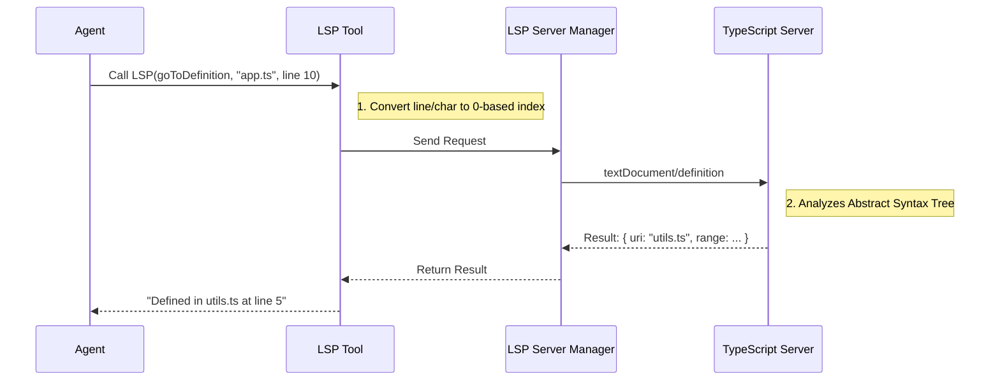

# Chapter 7: Codebase Intelligence

In the previous chapter, [Shell & System Execution](06_shell___system_execution.md), we gave our agent the ability to run commands and test its code.

But there is a missing piece. If you drop a developer into a massive codebase with 10,000 files and ask them to "Fix the login bug," they don't start reading file #1, then file #2, then file #3. That would take forever.

They use **Intelligence Tools**. They search for filenames, they grep for error messages, and they click "Go to Definition" in their IDE.

This chapter introduces **Codebase Intelligence**: the tools that act as the agent's eyes and map, allowing it to navigate massive projects instantly.

## Why do we need this?

Imagine you are in a library with one million books, but no card catalog and no signs on the shelves. You are looking for a specific quote about "Apples."

*   **Without Intelligence:** You pick up the first book, read it, put it down. You pick up the second... (This is inefficient and costs a lot of tokens).
*   **With Intelligence:**
    1.  **Glob:** You ask, "Show me all books with 'Fruit' in the title." (Filters down to 50 books).
    2.  **Grep:** You search those 50 books for the exact word "Apple." (Filters down to 5 pages).
    3.  **LSP:** You ask, "Who defined the word 'Apple'?" and get the exact page in the dictionary.

### The Central Use Case: "The Safe Refactor"
The user asks: *"Rename the `calculateTax` function to `computeTax` everywhere."*

1.  **Glob:** Find all `.ts` files.
2.  **LSP (Find References):** Find every single place `calculateTax` is actually *called*.
3.  **FileEdit:** Update only those specific lines.

## Key Concepts

We provide three specific tools that range from "Broad" to "Smart."

1.  **Glob (Pattern Matching):** Finds files based on their names (e.g., `*.test.ts`). It answers: *"Where are the files?"*
2.  **Grep (Text Search):** Finds specific text inside files (e.g., `TODO: Fix this`). It answers: *"Where is this string?"*
3.  **LSP (Language Server Protocol):** Understands the code structure (e.g., Definitions, References, Symbols). It answers: *"How is this code connected?"*

## How to Use It

### 1. Finding Files (`Glob`)
The agent wants to see the file structure or find specific file types.

```javascript
// Input to Glob tool
{
  "pattern": "src/**/*.test.ts" 
}
```

*Result:* The agent gets a list of file paths: `['src/auth.test.ts', 'src/utils.test.ts']`.

### 2. Finding Text (`Grep`)
The agent searches for a specific error string or variable name. We use `ripgrep` (rg) under the hood because it is incredibly fast.

```javascript
// Input to Grep tool
{
  "pattern": "payment_gateway_error",
  "path": "src/backend"
}
```

*Result:*
```text
src/backend/api.ts:45: const error = "payment_gateway_error";
src/backend/logs.ts:12: if (msg.includes("payment_gateway_error")) { ... }
```

### 3. Deep Understanding (`LSP`)
This is the most powerful tool. It connects to a Language Server (the same engine powering VS Code) to perform semantic queries.

**Example: Go To Definition**
The agent sees `processData()` but doesn't know what it does.

```javascript
// Input to LSP tool
{
  "operation": "goToDefinition",
  "filePath": "/src/main.ts",
  "line": 50,       // Where the agent saw the function call
  "character": 12
}
```

*Result:*
```text
/src/utils/processor.ts:10: export function processData(data: any) { ... }
```
*The agent now knows exactly which file to read to understand the logic.*

## Under the Hood: The Intelligence Flow

How does the agent "click" Go to Definition without a mouse?



## Internal Implementation

Let's look at how we build these tools to be fast and safe.

### 1. Glob: The File Finder (`GlobTool.ts`)

The `Glob` tool wraps standard filesystem matching but adds a safety limit to prevent the agent from getting overwhelmed by 50,000 matches in a `node_modules` folder.

```typescript
// Simplified from GlobTool.ts
async call(input, { globLimits }) {
  // 1. Set a safety limit (default 100 files)
  const limit = globLimits?.maxResults ?? 100;

  // 2. Run the glob search
  const { files, truncated } = await glob(
    input.pattern,
    GlobTool.getPath(input),
    { limit } // Pass the limit down
  );

  // 3. Convert absolute paths to relative (saves tokens!)
  const filenames = files.map(toRelativePath);

  return { data: { filenames, truncated } };
}
```

*Explanation:*
*   **Token Savings:** We convert `/Users/name/project/src/index.ts` to `src/index.ts`. This saves precious space in the AI's context window.
*   **Truncation:** If there are too many results, we tell the agent `truncated: true` so it knows to narrow its search.

### 2. Grep: The Fast Searcher (`GrepTool.ts`)

We use `ripgrep`, a Rust-based tool, because it's significantly faster than standard Node.js searching.

```typescript
// Simplified from GrepTool.ts
async call({ pattern, path, head_limit }) {
  const args = ['--hidden']; // Search hidden files too

  // 1. Add exclusion patterns (don't search .git folder)
  for (const dir of VCS_DIRECTORIES_TO_EXCLUDE) {
    args.push('--glob', `!${dir}`);
  }

  // 2. Execute the ripgrep binary
  const results = await ripGrep(args, absolutePath);

  // 3. Apply a limit to the output lines ("Head Limit")
  const { items, appliedLimit } = applyHeadLimit(
    results, 
    head_limit
  );

  return { data: { mode: 'files_with_matches', filenames: items } };
}
```

*Explanation:*
*   **Exclusions:** We automatically ignore `.git` and `.svn` to avoid noise.
*   **Head Limit:** Just like Glob, if Grep finds 5,000 lines, we only show the first 250 (by default) to prevent the agent from crashing. The agent can request more if needed.

### 3. LSP: The Brain (`LSPTool.ts`)

This tool interacts with a background process that keeps track of the project's symbols.

```typescript
// Simplified from LSPTool.ts
async call(input) {
  // 1. Get the background server manager
  const manager = getLspServerManager();

  // 2. Ensure the file is "Open" in the server's virtual memory
  if (!manager.isFileOpen(input.filePath)) {
     await manager.openFile(input.filePath, fileContent);
  }

  // 3. Send the specific request
  // We map "goToDefinition" to the protocol method "textDocument/definition"
  const { method, params } = getMethodAndParams(input);
  const result = await manager.sendRequest(input.filePath, method, params);

  // 4. Format the result for the AI
  // (Translates complex JSON objects into a readable string)
  const formatted = formatResult(input.operation, result);

  return { data: { result: formatted } };
}
```

*Explanation:*
*   **Virtual Open:** LSP servers expect an editor to "open" a file before querying it. We simulate this by reading the file and sending an `openFile` notification behind the scenes.
*   **Protocol Mapping:** The agent speaks in high-level terms ("Find References"), and the code translates that to technical LSP spec (`textDocument/references`).

## Conclusion

Congratulations! You have completed the **Recursive Agent Runtime** tutorial.

We have built a system where an AI can:
1.  **Exist** as a persistent process ([Chapter 1](01_recursive_agent_runtime.md)).
2.  **Collaborate** in teams and track tasks ([Chapter 2](02_task___team_coordination.md)).
3.  **Communicate** with users and peers ([Chapter 3](03_communication_channels.md)).
4.  **Plan** before acting ([Chapter 4](04_planning_workflow.md)).
5.  **Manipulate** the file system safely ([Chapter 5](05_file_system_manipulation.md)).
6.  **Execute** system commands ([Chapter 6](06_shell___system_execution.md)).
7.  **Navigate** using deep codebase intelligence ([Chapter 7](07_codebase_intelligence.md)).

You now have all the building blocks for a truly autonomous software engineering agent. Go build something amazing!

---

Generated by [Code IQ](https://github.com/adityasoni99/Code-IQ)