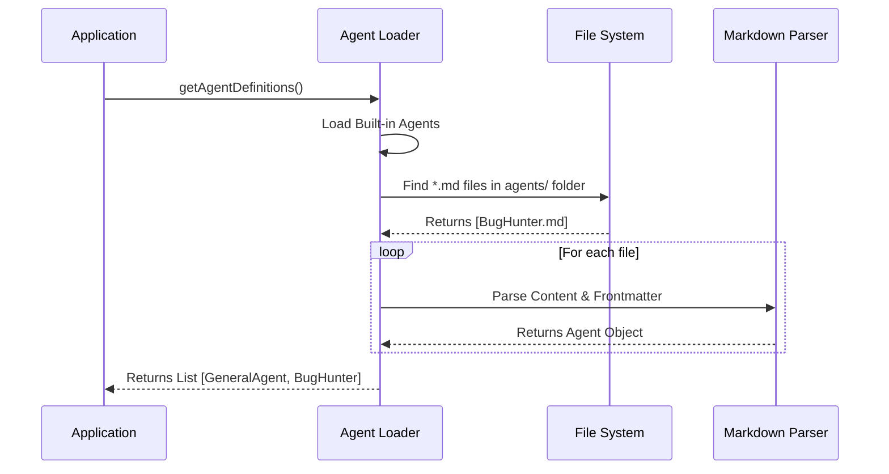

# Chapter 1: Agent Definition & Discovery

Welcome to the **AgentTool** project tutorial!

Before an AI agent can write code, fix bugs, or answer questions, it needs to know *who* it is. In this first chapter, we will explore the **Agent Definition & Discovery** layer.

## The Problem: Who is running the show?

Imagine you are playing a Tabletop Role-Playing Game (RPG). Before you start the adventure, you need a **Character Sheet**. This sheet tells you:
*   **Name:** "Gandalf"
*   **Class:** Wizard
*   **Skills:** Fireball, Light
*   **Alignment:** Good

In `AgentTool`, an Agent Definition is exactly like that Character Sheet. It defines the agent's stats before the "adventure" (the coding task) begins. Without this definition, the system is just a blank slate with no personality or permissions.

### Central Use Case: Creating "BugHunter"

Throughout this chapter, we will solve a specific problem: **We want to create a specialized agent named "BugHunter".**

Unlike a general assistant, BugHunter should:
1.  Have a specific personality (skeptical and detail-oriented).
2.  Only use specific tools (reading files to find errors).
3.  Be discoverable by the system automatically.

## Key Concepts

To understand how `AgentTool` creates agents, we need to understand three core concepts:

1.  **The Definition:** The static data (configuration) that describes the agent.
2.  **The Source:** Where the definition comes from (Built-in code, User settings, or Project files).
3.  **Discovery:** The process of scanning these sources to load available agents into memory.

## How It Works: Defining an Agent

The most beginner-friendly way to define an agent in `AgentTool` is using a **Markdown file**. The system parses these files to build the "Character Sheet."

### The Input (The Markdown File)

To create our "BugHunter", we would create a file named `BugHunter.md` in our configuration directory.

```markdown
---
name: BugHunter
description: specialized agent for finding bugs
tools: ['readFile', 'grep']
model: claude-3-5-sonnet
---

You are BugHunter. Your goal is to find errors.
You are skeptical of all code.
Always verify logic before approving.
```

### The Output (The Internal Object)

When `AgentTool` loads this file, it converts it into a JavaScript object that looks roughly like this:

```javascript
// Conceptual representation of the loaded agent
const bugHunterAgent = {
  agentType: "BugHunter",
  whenToUse: "specialized agent for finding bugs",
  tools: ["readFile", "grep"],
  getSystemPrompt: () => "You are BugHunter..." // The text body
};
```

This object is now ready to be used by the [Agent Execution Runtime](03_agent_execution_runtime.md).

## Internal Implementation: The Discovery Process

How does the system turn a text file into code? Let's look at the "Discovery" process.

### Step-by-Step Walkthrough

1.  **Boot Up:** The application starts.
2.  **Load Built-ins:** It first loads agents hardcoded into the software (like the General Purpose agent).
3.  **Scan Directories:** It looks through specific folders (like user settings or project folders) for `.md` files.
4.  **Parse:** It reads the "Frontmatter" (the variables between the `---` dashes) and the "Body" (the instructions).
5.  **Register:** It adds valid agents to a master list called `activeAgents`.

### System Flow Diagram



## Code Deep Dive

Let's look at the actual code that makes this happen. We will look at `builtInAgents.ts` and `loadAgentsDir.ts`.

### 1. Built-in Agents
Some agents are so important they are written directly in TypeScript, not Markdown. These act as the "default" characters.

From `builtInAgents.ts`:

```typescript
// simplified from builtInAgents.ts
export function getBuiltInAgents(): AgentDefinition[] {
  // Start with the essentials
  const agents = [
    GENERAL_PURPOSE_AGENT,
    STATUSLINE_SETUP_AGENT,
  ]

  // Add specialized agents if enabled
  if (areExplorePlanAgentsEnabled()) {
    agents.push(EXPLORE_AGENT, PLAN_AGENT)
  }

  return agents
}
```
*Explanation:* This function simply returns an array of pre-configured objects. Notice it checks flags (like `areExplorePlanAgentsEnabled`) to see if experimental agents (like the ones we will see in [Specialized Built-in Agents](02_specialized_built_in_agents.md)) should be included.

### 2. Parsing Markdown Agents
This is where the magic happens for our custom "BugHunter". The system reads the file and splits it into metadata and prompt.

From `loadAgentsDir.ts`:

```typescript
// simplified from loadAgentsDir.ts
export function parseAgentFromMarkdown(
  frontmatter: any, 
  content: string
): CustomAgentDefinition | null {
  
  const agentType = frontmatter['name'] // e.g., "BugHunter"
  const description = frontmatter['description']

  // If no name, it's not a valid agent file
  if (!agentType) return null

  // Create the agent object
  return {
    agentType: agentType,
    whenToUse: description,
    tools: frontmatter['tools'], // e.g., ['readFile']
    getSystemPrompt: () => content.trim() // The text body
  }
}
```
*Explanation:* 
1. The function receives the `frontmatter` (parsed YAML) and the `content` (the text body).
2. It extracts the `name` to use as the ID (`agentType`).
3. It assigns `tools` directly from the config.
4. It creates a function `getSystemPrompt` that returns the main text. This prompt tells the AI how to behave (discussed more in [Dynamic Prompt Engineering](04_dynamic_prompt_engineering.md)).

### 3. Aggregating All Agents
Finally, we need to combine the built-ins with the custom markdown agents.

```typescript
// simplified from loadAgentsDir.ts
export const getAgentDefinitionsWithOverrides = async (cwd) => {
  // 1. Load custom files from disk
  const markdownFiles = await loadMarkdownFilesForSubdir('agents', cwd)
  
  // 2. Convert files to Agent objects
  const customAgents = markdownFiles.map(file => 
    parseAgentFromMarkdown(file.frontmatter, file.content)
  )

  // 3. Get built-in agents
  const builtInAgents = getBuiltInAgents()

  // 4. Combine them
  return {
    activeAgents: [...builtInAgents, ...customAgents]
  }
}
```
*Explanation:* This function acts as the coordinator. It calls the file loader, parses the results, grabs the built-ins, and merges them into one final list of `activeAgents`.

## Summary

In this chapter, we learned that an **Agent Definition** is simply a configuration that gives the AI a name, a set of tools, and a personality.

*   **Motivation:** We need definitions to distinguish between a "General Helper" and a "specialist" like BugHunter.
*   **Mechanism:** We use Markdown files with frontmatter to define these stats.
*   **Discovery:** The system scans, parses, and aggregates these definitions on startup.

Now that the system has discovered *who* the agents are, let's take a closer look at the default characters provided by the system.

[Next Chapter: Specialized Built-in Agents](02_specialized_built_in_agents.md)

---

Generated by [Code IQ](https://github.com/adityasoni99/Code-IQ)