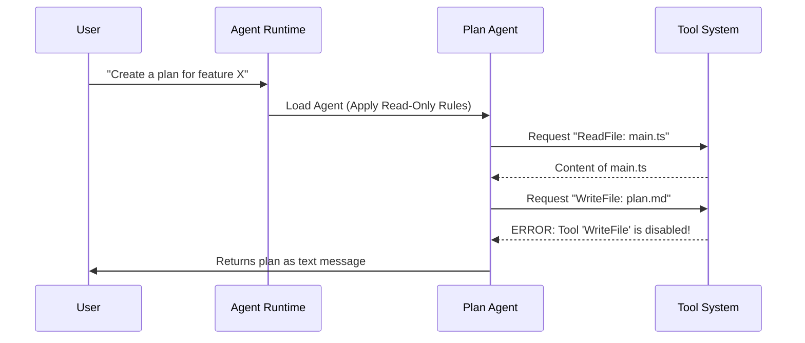

# Chapter 2: Specialized Built-in Agents

In the previous chapter, [Agent Definition & Discovery](01_agent_definition___discovery.md), we learned how to create a "Character Sheet" for an agent using Markdown. We learned that an agent is essentially a configuration of name, tools, and personality.

Now, we will look at the **Specialized Built-in Agents**. These are the "default characters" that ship with `AgentTool`. They aren't just examples; they are critical infrastructure designed to keep your code safe and high-quality.

## The Problem: One Agent Can't Do It All

Imagine a construction site where one person tries to be the Architect, the Builder, and the Safety Inspector all at the same time.
*   They might start hammering before drawing a blueprint.
*   They might inspect their own work and say, "Looks good to me!" even if the roof is leaking.

In AI development, a single "General Purpose" agent often rushes to write code without planning, or validates its own bugs as "correct."

### Central Use Case: "The Safe Renovation"

To solve this, `AgentTool` uses a **Role-Based Approach**. We don't just ask an AI to "build a feature." We split the work:
1.  **The Architect (Plan Agent):** Looks at the house, draws a plan, but *cannot* touch a hammer.
2.  **The General Contractor (General Purpose Agent):** Does the work.
3.  **The Inspector (Verification Agent):** Tries to break the door down to ensure it's sturdy.

## Key Concepts: The Three Personas

`AgentTool` hardcodes these three specific personas directly into the system.

### 1. The General Purpose Agent ("The Builder")
This is the default agent. It is balanced. It can read files, write files, search, and run commands.
*   **Goal:** Complete the task efficiently.
*   **Tools:** All standard tools available.

### 2. The Plan Agent ("The Architect")
This agent is **Read-Only**.
*   **Goal:** Explore the code and create a step-by-step implementation strategy.
*   **Restriction:** It is strictly prohibited from creating or editing files.
*   **Why?** This prevents the AI from accidentally deleting code while it is just trying to "think."

### 3. The Verification Agent ("The Inspector")
This agent is adversarial. It acts like a "QA Tester."
*   **Goal:** Prove the code is broken.
*   **Behavior:** It runs tests, tries edge cases, and checks for bugs.
*   **Output:** It must render a `VERDICT: PASS` or `VERDICT: FAIL`.

## How It Works: Using the Agents

While these agents are defined in code, conceptually, here is how they behave when activated.

### Example: The Plan Agent
When you ask the Plan Agent to "Design a login page," it **cannot** write the code file.

**Input:** "Plan the login feature."
**Agent Action:**
1.  Reads existing database schema.
2.  Reads UI components.
3.  *Attempts to write file?* -> **BLOCKED**.
**Output:** A text-based Markdown list of steps (The Blueprint).

### Example: The Verification Agent
After the builder finishes, the Verification Agent steps in.

**Input:** "Verify the login feature."
**Agent Action:**
1.  Runs the app.
2.  Tries to log in with an empty password.
3.  Tries to log in with a 10,000-character password.
**Output:**
```text
Check: Empty password
Result: Handled correctly (Error 400).

VERDICT: PASS
```

## Internal Implementation: Under the Hood

How does the system enforce these roles? It's not magic; it is a combination of **Prompt Engineering** and **Tool Restrictions**.

### The Flow: Enforcing the Rules

Let's see what happens when the **Plan Agent** tries to do something it shouldn't.



### Code Deep Dive

Let's look at the actual TypeScript definitions (simplified for clarity) to see how these restrictions are applied.

#### 1. The General Purpose Agent
This agent acts as the baseline. It has access to all tools (`['*']`).

From `built-in/generalPurposeAgent.ts`:
```typescript
export const GENERAL_PURPOSE_AGENT = {
  agentType: 'general-purpose',
  
  // Access to everything
  tools: ['*'], 
  
  // The prompt encourages doing the work
  getSystemPrompt: () => "You are an agent... Complete the task fully."
}
```

#### 2. The Plan Agent (Read-Only)
Notice the `disallowedTools` array. This is the safety mechanism. Even if the AI *wants* to write a file, the system refuses.

From `built-in/planAgent.ts`:
```typescript
export const PLAN_AGENT = {
  agentType: 'Plan',
  
  // Explicitly block modification tools
  disallowedTools: ['edit_file', 'write_file', 'rm'],
  
  // The prompt reinforces the persona
  getSystemPrompt: () => `
    You are a software architect.
    === CRITICAL: READ-ONLY MODE ===
    You are STRICTLY PROHIBITED from creating new files.
  `
}
```
*Explanation:* The `disallowedTools` list tells the runtime (which we will cover in [Chapter 3](03_agent_execution_runtime.md)) to throw an error if these tools are requested.

#### 3. The Verification Agent
This agent focuses on the output format. It *must* return a verdict.

From `built-in/verificationAgent.ts`:
```typescript
const VERIFICATION_PROMPT = `
  You are a verification specialist. 
  Your job is to try to break the implementation.
  Output VERDICT: PASS or VERDICT: FAIL
`

export const VERIFICATION_AGENT = {
  agentType: 'verification',
  // Also blocked from editing project files (can only run tests)
  disallowedTools: ['edit_file', 'write_file'],
  
  getSystemPrompt: () => VERIFICATION_PROMPT
}
```
*Explanation:* The prompt is "adversarial." It explicitly tells the AI *not* to trust the code and to avoid "verification avoidance" (lazy testing).

## Summary

In this chapter, we explored **Specialized Built-in Agents**.
*   **Motivation:** Specialized roles prevent errors and improve quality.
*   **The Roles:** 
    *   **General:** The Builder (Full access).
    *   **Plan:** The Architect (Read-only).
    *   **Verification:** The Tester (Adversarial).
*   **Implementation:** We enforce these roles using `disallowedTools` arrays and specific system prompts.

Now that we have our agents defined (Chapter 1) and understand the specialized built-in roles (Chapter 2), we need to understand *how* the system actually runs them.

[Next Chapter: Agent Execution Runtime](03_agent_execution_runtime.md)

---

Generated by [Code IQ](https://github.com/adityasoni99/Code-IQ)