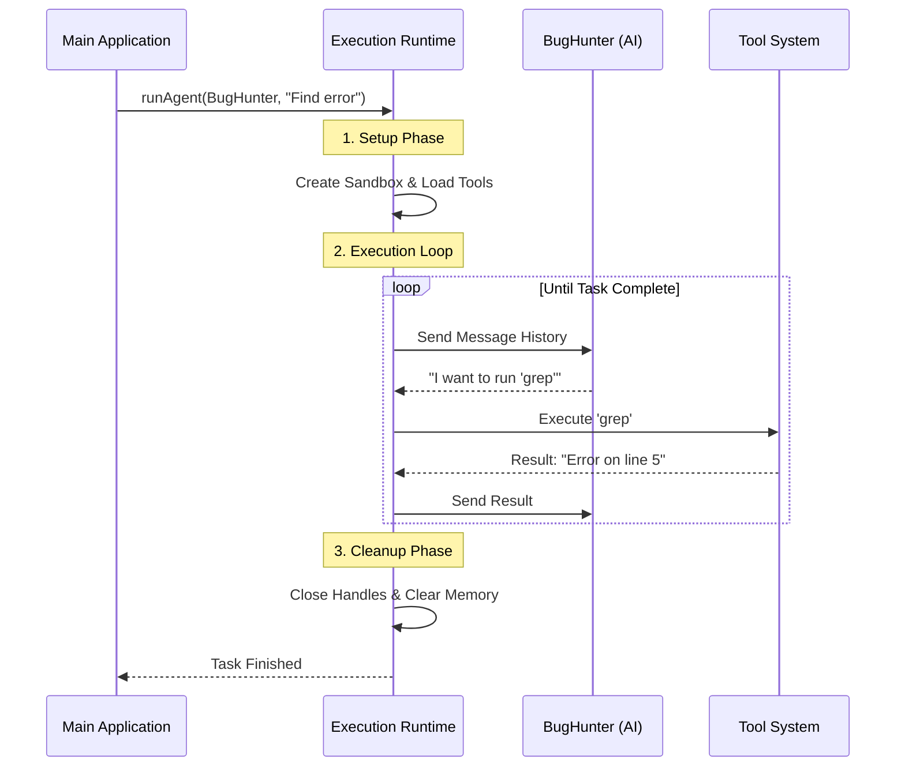

# Chapter 3: Agent Execution Runtime

Welcome back! In [Chapter 1](01_agent_definition___discovery.md), we defined *who* our agent is (the "Character Sheet"). In [Chapter 2](02_specialized_built_in_agents.md), we learned about specialized roles like the Plan Agent.

But right now, our "BugHunter" agent is just a static Javascript object sitting in memory. It can't think, it can't type, and it certainly can't fix bugs.

In this chapter, we will explore the **Agent Execution Runtime**.

## The Problem: Bringing the Static to Life

Imagine you have a video game cartridge. Holding it in your hand is like having an **Agent Definition**. It contains all the data, logic, and art, but it does nothing on its own.

To play the game, you need a **Console** (system) to:
1.  **Boot** the cartridge (Load resources).
2.  **Connect** the controller (Input/Output).
3.  **Run** the game loop (Update screen, check physics).
4.  **Shut down** safely (Save game, turn off).

In `AgentTool`, the **Runtime** is that console. It manages the lifecycle of the AI agent process.

### Central Use Case: "Launching the Mission"

We want to take our "BugHunter" agent and tell it: *"Find the error in `main.ts`."*

The Runtime must:
1.  Create a "sandbox" for BugHunter so it doesn't crash the main application.
2.  Give BugHunter access to the `readFile` tool.
3.  Run the conversation loop until BugHunter says "I found it!" or "I give up."
4.  Clean up memory when done.

## Key Concepts

The Runtime handles three critical jobs:

1.  **Context Isolation (The Sandbox):**
    When an agent starts, it gets its own "Subagent Context." This ensures that if BugHunter gets confused, it doesn't corrupt the memory of the main user session.

2.  **The Query Loop (The Heartbeat):**
    This is the cycle of *User Message -> AI Thought -> Tool Execution -> Tool Result -> AI Thought*. The runtime keeps this loop spinning.

3.  **Resource Management (Setup & Cleanup):**
    The runtime connects to external servers (MCP) and prepares tools before the agent starts, and strictly cleans them up afterwards.

## How It Works: The Flow

Before looking at code, let's visualize the "Life of an Agent" using the Runtime.



## Internal Implementation: `runAgent.ts`

The core of this chapter lives in `runAgent.ts`. This single function is the "Engine Room." Let's break it down into its four main phases.

### Phase 1: Preparation & Setup

Before the AI speaks, the runtime must prepare the environment. It resolves which model to use and connects to any required Model Context Protocol (MCP) servers.

```typescript
// simplified from runAgent.ts
export async function* runAgent({ agentDefinition, availableTools, ...params }) {
  
  // 1. Determine which AI Model to use (e.g., Claude 3.5 Sonnet)
  const resolvedModel = getAgentModel(
    agentDefinition.model, 
    params.model
  )

  // 2. Initialize MCP Servers (Connect to external data sources)
  // This returns a cleanup function we MUST call later
  const { cleanup: mcpCleanup } = await initializeAgentMcpServers(
    agentDefinition, 
    params.mcpClients
  )
  
  // ... continued below
```
*Explanation:* We calculate the model (allowing for overrides) and spin up any specific servers the agent needs. We save `mcpCleanup` for the end.

### Phase 2: Creating the Sandbox

We don't want the agent modifying the global application state directly. We create a `subagentContext`.

```typescript
// simplified from runAgent.ts
  
  // 3. Create a unique ID for this specific run
  const agentId = createAgentId()

  // 4. Create the sandbox (Subagent Context)
  // This isolates the agent's file reading cache and abort signals
  const agentToolUseContext = createSubagentContext(parentContext, {
    agentId,
    agentType: agentDefinition.agentType,
    messages: initialMessages,
    // Sync agents share parent controller, Async agents get their own
    abortController: isAsync ? new AbortController() : parentContext.abortController
  })
```
*Explanation:* `createSubagentContext` clones the necessary parts of the environment. If this agent crashes or is cancelled, the parent session remains safe.

### Phase 3: The Execution Loop

This is the main event. We use a `try...finally` block to ensure that even if the agent crashes, we still clean up. We call `query()`, which handles the back-and-forth with the LLM.

```typescript
// simplified from runAgent.ts

  try {
    // 5. Start the conversation loop
    // query() handles sending messages to the LLM and executing tools
    for await (const message of query({
      messages: initialMessages,
      systemPrompt: agentSystemPrompt,
      toolUseContext: agentToolUseContext,
      // ... other params
    })) {
      
      // 6. Yield messages back to the UI as they happen
      yield message
    }
    
  } catch (error) {
    // Handle crashes or aborts
    if (params.abortController.signal.aborted) {
      throw new AbortError()
    }
  }
```
*Explanation:* The `query` function (which acts as the iterator) does the heavy lifting of talking to the AI. The Runtime mostly just watches this stream and passes messages up to the user.

### Phase 4: The Cleanup

This is arguably the most important job of an Operating System: Reclaiming resources.

```typescript
// simplified from runAgent.ts
  finally {
    // 7. Disconnect MCP servers
    await mcpCleanup()

    // 8. clear hooks specific to this agent
    clearSessionHooks(rootSetAppState, agentId)

    // 9. Kill any background shell tasks the agent left running
    killShellTasksForAgent(agentId, ...)

    // 10. Clear memory caches
    agentToolUseContext.readFileState.clear()
  }
} // End of runAgent
```
*Explanation:* 
*   **Why is this critical?** If an agent opens a background process (like a server) and finishes its task, that server would stay running forever without `killShellTasksForAgent`.
*   The `finally` block guarantees this runs, even if the user Rage Quits (aborts) the agent.

## Advanced Concept: Resumption

Sometimes, an agent runs in the background. If you close the app and reopen it, the system needs to "Resume" that agent.

In `resumeAgent.ts`, the system reconstructs the runtime state:

```typescript
// simplified from resumeAgent.ts
export async function resumeAgentBackground({ agentId, toolUseContext }) {
  // 1. Load the chat history from disk
  const transcript = await getAgentTranscript(agentId)
  
  // 2. Load the metadata (Who was this agent?)
  const meta = await readAgentMetadata(agentId)

  // 3. Restart the lifecycle
  // We call runAgent again, but pre-fill the history
  runWithAgentContext(context, () => 
    runAgent({
      agentDefinition: meta.agentType,
      promptMessages: transcript.messages, // RESTORE MEMORY
      // ...
    })
  )
}
```
*Explanation:* Resumption is just calling `runAgent` again, but injecting the "Saved Game" (the transcript) so the agent remembers what it was doing.

## Summary

In this chapter, we learned that the **Agent Execution Runtime**:

1.  **Acts like an OS:** It spawns, manages, and kills agent processes.
2.  **Isolates Context:** It uses `subagentContext` to sandbox the agent.
3.  **Guarantees Cleanup:** It uses `try...finally` to ensure tools and background tasks are shut down.

We have the Agent (Chapter 1), the Role (Chapter 2), and the Runtime (Chapter 3). But what actually determines *what* the agent is told to do? How do we dynamically change instructions based on the environment?

[Next Chapter: Dynamic Prompt Engineering](04_dynamic_prompt_engineering.md)

---

Generated by [Code IQ](https://github.com/adityasoni99/Code-IQ)