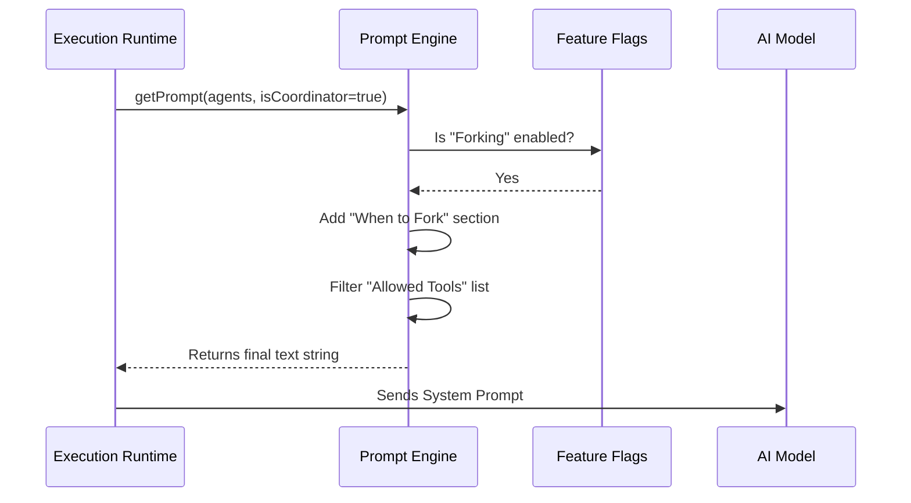

# Chapter 4: Dynamic Prompt Engineering

Welcome to **Chapter 4**!

In [Chapter 3: Agent Execution Runtime](03_agent_execution_runtime.md), we built the "Game Console" that runs our agents. We learned how the system creates a sandbox and manages the lifecycle of an AI task.

However, booting up the system isn't enough. We need to tell the AI exactly what to do. In this chapter, we will explore **Dynamic Prompt Engineering**.

## The Problem: One Script Doesn't Fit All

Imagine you are a spy agency handling a "Secret Agent."
*   **Mission A:** Infiltrate a gala. (Needs: Tuxedo, Charm).
*   **Mission B:** Defuse a bomb. (Needs: Wire cutters, Manual).

If you give the agent the instructions for Mission A while they are holding wire cutters for Mission B, disaster strikes!

In `AgentTool`, we have different agents (General Purpose, Plan, Verification) running in different environments (Coordinator, Sub-agent, Teammate). A single static text file like `"You are a helpful assistant"` is not enough.

### Central Use Case: The "Mission Briefing"

We want to generate a **System Prompt** (the hidden instructions sent to the LLM) that changes automatically based on the situation.

If we enable a feature called "Context Forking," the prompt should say: *"You can fork yourself to run parallel tasks."*
If we disable that feature, that sentence must vanish so the AI doesn't try to use a tool that doesn't exist.

## Key Concepts

Dynamic Prompt Engineering in `AgentTool` relies on three building blocks:

1.  **Capability filtering:** Checking what tools are actually allowed (allowlists vs. denylists) and writing that into the text.
2.  **Feature Flags:** Checking environment variables (like `isForkSubagentEnabled`) to inject specific rules.
3.  **Role Awareness:** Checking if the agent is a "Coordinator" (the boss) or a "Worker" (the sub-agent) to adjust the tone and strictness of the prompt.

## How It Works: The Assembly Line

Instead of reading a static `.txt` file, `AgentTool` runs a function called `getPrompt()`. This function acts like a sandwich artist, assembling the final text layer by layer.

1.  **Base Layer:** The core personality ("You are an autonomous agent...").
2.  **Tool Layer:** It loops through available tools and lists them.
3.  **Logic Layer:** It adds rules based on enabled features (like Forking).
4.  **Example Layer:** It adds examples relevant to the current mode.

### System Flow Diagram



## Internal Implementation: `prompt.ts`

Let's look at how the code constructs this "Mission Briefing" in `prompt.ts`.

### 1. Describing the Tools dynamically
First, the system needs to tell the AI what tools it holds. It doesn't hardcode this; it calculates it based on the agent's definition.

```typescript
// simplified from prompt.ts
function getToolsDescription(agent: AgentDefinition): string {
  const { tools, disallowedTools } = agent

  // If we have a "Denylist" (e.g., Plan Agent cannot write files)
  if (disallowedTools && disallowedTools.length > 0) {
    return `All tools except ${disallowedTools.join(', ')}`
  }

  // Otherwise, list specific allowed tools
  return tools ? tools.join(', ') : 'All tools'
}
```
*Explanation:* This function checks the agent's definition. If the agent is restricted (like the Read-Only Plan Agent from [Chapter 2](02_specialized_built_in_agents.md)), the prompt explicitly says: "All tools except write_file." This prevents the AI from hallucinating that it can write code.

### 2. Formatting the Agent List
The AI needs to know about *other* agents it can call for help.

```typescript
// simplified from prompt.ts
export function formatAgentLine(agent: AgentDefinition): string {
  // Get the tool description we calculated above
  const toolsDesc = getToolsDescription(agent)
  
  // Format: "- Name: Description (Tools: ...)"
  return `- ${agent.agentType}: ${agent.whenToUse} (Tools: ${toolsDesc})`
}
```
*Explanation:* This creates a neat list like:
*   `- Plan: software architect (Tools: All tools except edit_file)`
*   `- BugHunter: finds bugs (Tools: readFile, grep)`

### 3. The Master Assembly Function
This is the heart of the dynamic system. It stitches everything together.

```typescript
// simplified from prompt.ts
export async function getPrompt(
  agentDefinitions, 
  isCoordinator
) {
  // Check if "Forking" feature is turned on
  const forkEnabled = isForkSubagentEnabled()

  // Conditionally create the "When to Fork" text block
  const whenToForkSection = forkEnabled 
    ? `## When to fork\nFork yourself when...` 
    : '' // Empty string if disabled!

  // ... (continues below)
```
*Explanation:* We check `isForkSubagentEnabled`. If false, `whenToForkSection` becomes an empty string. This ensures we never confuse the AI with instructions for disabled features.

### 4. Injecting Context-Specific Examples
The prompt also changes its examples based on the mode.

```typescript
// simplified from prompt.ts
  const forkExamples = `
    <example>
      user: "Research this."
      assistant: Forking for research...
    </example>
  `

  const standardExamples = `
    <example>
      user: "Write code."
      assistant: Writing code...
    </example>
  `
  
  // Choose which examples to show
  const activeExamples = forkEnabled ? forkExamples : standardExamples
```
*Explanation:* If Forking is on, we show examples of how to fork. If off, we show standard coding examples. This is crucial for **In-Context Learning**—the AI mimics the examples it sees.

### 5. Returning the Final String
Finally, we return the massive string.

```typescript
// simplified from prompt.ts
  return `
    Launch a new agent to handle complex tasks.
    
    ${agentListSection}

    ${whenToForkSection}

    ${activeExamples}
  `
}
```
*Explanation:* The final prompt is a concatenation of all the conditional sections. The Runtime receives this string and sends it to the LLM as the "System Message."

## Summary

In this chapter, we learned that **Dynamic Prompt Engineering** is the art of assembling instructions on the fly.

*   **Motivation:** We need to tailor instructions to the specific agent and environment (e.g., Read-Only vs. Full Access).
*   **Mechanism:** We use a `getPrompt` function that concatenates strings based on feature flags and agent definitions.
*   **Result:** The AI receives a "Mission Briefing" that is perfectly accurate for its current constraints, reducing errors and hallucinations.

Now that the agent knows *who* it is (Chapter 1), *what* role it plays (Chapter 2), *how* to run (Chapter 3), and *what* its mission is (Chapter 4), it needs to be able to remember what it has done.

[Next Chapter: Persistent Agent Memory](05_persistent_agent_memory.md)

---

Generated by [Code IQ](https://github.com/adityasoni99/Code-IQ)