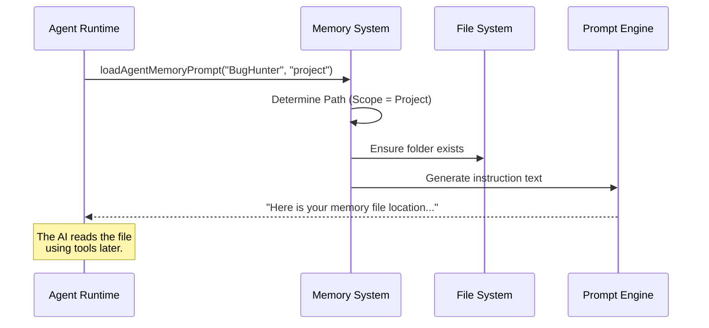

# Chapter 5: Persistent Agent Memory

Welcome to **Chapter 5**!

In [Chapter 4: Dynamic Prompt Engineering](04_dynamic_prompt_engineering.md), we learned how to assemble a "Mission Briefing" for our agent. We gave it instructions based on its role and tools.

However, there was a hidden flaw in that system: **Amnesia**. Every time you closed `AgentTool` and opened it again, the agent forgot everything you taught it.

In this chapter, we will explore **Persistent Agent Memory**.

## The Problem: The "Groundhog Day" Effect

Imagine hiring a contractor to renovate your kitchen. On Monday, you tell them: *"Please take your shoes off before entering."* They comply.

On Tuesday, they come back, but they have forgotten everything. You have to tell them again: *"Please take your shoes off."* You have to do this every single day. This is inefficient and frustrating.

In AI development, we often teach agents lessons like:
*   "We use 2-space indentation."
*   "Don't use this specific deprecated library."
*   "My API key is located in `.env`."

Without **Persistent Memory**, the agent is a blank slate every time a new session starts.

### Central Use Case: "The Style Guide"

We want our "BugHunter" agent (from [Chapter 1](01_agent_definition___discovery.md)) to remember a specific rule: *"Always add comments to fixed code."*

We want this rule to stick, whether we run the agent today, tomorrow, or whether a teammate runs it on their computer.

## Key Concepts: The Three Notebooks

To solve this, `AgentTool` gives agents a virtual "Physical Notebook." But since different information belongs in different places, we have three types of notebooks (Scopes):

### 1. User Scope (`~/.claude/agent-memory/`)
**Analogy:** A personal diary.
*   **Purpose:** Memories that apply to *you* across *all* your projects.
*   **Example:** "I always prefer code explanations to be brief."
*   **Storage:** Stored in your computer's home directory.

### 2. Project Scope (`.claude/agent-memory/`)
**Analogy:** The job site logbook.
*   **Purpose:** Memories specific to *this* project.
*   **Example:** "This project uses `Jest` for testing."
*   **Storage:** Stored inside the project folder. **This is committed to Git**, so your teammates get these memories too!

### 3. Local Scope (`.claude/agent-memory-local/`)
**Analogy:** Sticky notes on your monitor.
*   **Purpose:** Memories for this project, but *private* to your machine.
*   **Example:** "My local database password is `root`."
*   **Storage:** Stored in the project folder but ignored by Git.

## How It Works: The `MEMORY.md` File

So, how does the agent actually "remember"? It's surprisingly simple.

1.  The system creates a folder for the agent (e.g., `BugHunter`).
2.  It creates a file called `MEMORY.md`.
3.  When the agent runs, the contents of `MEMORY.md` are read and injected into the System Prompt (from [Chapter 4](04_dynamic_prompt_engineering.md)).
4.  If the agent learns something new, it updates this file.

### Example Input/Output

**Input:**
You tell the agent: *"Remember that we strictly use TypeScript interfaces, not types."*

**System Action:**
The agent writes to `.claude/agent-memory/BugHunter/MEMORY.md`:

```markdown
# Learned Memories
- User prefers TypeScript interfaces over type aliases.
```

**Next Session:**
When you run BugHunter again, the Runtime reads this file and whispers to the AI: *"By the way, the user prefers interfaces."*

## Internal Implementation: Loading Memory

Let's visualize how the system fetches these memories before the agent starts working.

### System Flow Diagram



## Code Deep Dive

Let's look at the code that manages these files. We will examine `agentMemory.ts` and `agentMemorySnapshot.ts`.

### 1. Finding the Right Notebook (Scope)

First, we need to know *where* on the hard drive to look. This depends entirely on the `scope` variable.

From `agentMemory.ts`:

```typescript
// simplified from agentMemory.ts
export function getAgentMemoryDir(agentType: string, scope: AgentMemoryScope): string {
  const dirName = sanitizeAgentTypeForPath(agentType)

  switch (scope) {
    case 'project':
      // Shared with team (in Git)
      return join(getCwd(), '.claude', 'agent-memory', dirName)
    case 'user':
      // Global user settings (Home dir)
      return join(getMemoryBaseDir(), 'agent-memory', dirName)
    case 'local':
      // Project specific, but private
      return getLocalAgentMemoryDir(dirName)
  }
}
```
*Explanation:* This function acts as a traffic director. If you ask for 'project' memory, it points to the current working directory (`getCwd`). If you ask for 'user' memory, it points to the global system folder.

### 2. Preparing the Prompt

We don't just dump the text file into the chat. We give the agent instructions on *how* to use the memory.

From `agentMemory.ts`:

```typescript
// simplified from agentMemory.ts
export function loadAgentMemoryPrompt(agentType, scope) {
  const memoryDir = getAgentMemoryDir(agentType, scope)

  // 1. Make sure the folder exists so the agent doesn't crash trying to write
  ensureMemoryDirExists(memoryDir)

  // 2. Return a text block telling the AI where its memory is
  return buildMemoryPrompt({
    displayName: 'Persistent Agent Memory',
    memoryDir: memoryDir,
    // Add guidelines like "Keep learnings general" for User scope
  })
}
```
*Explanation:* This function ensures the "Notebook" exists (creating the folder if needed) and then generates a prompt telling the AI: *"You have a memory file located at [path]. Read it to recall context."*

### 3. Synchronization (Snapshots)

This is the most complex part. Since **Project Memory** is shared via Git, what happens if your teammate updates the memory and you pull their changes?

We use a "Snapshot" system to detect updates.

From `agentMemorySnapshot.ts`:

```typescript
// simplified from agentMemorySnapshot.ts
export async function checkAgentMemorySnapshot(agentType, scope) {
  // 1. Read the "Snapshot" (The state from Git)
  const snapshotMeta = await readJsonFile(getSnapshotJsonPath(agentType))
  
  // 2. Read our local sync state
  const syncedMeta = await readJsonFile(getSyncedJsonPath(agentType, scope))

  // 3. Compare timestamps
  if (snapshotMeta.updatedAt > syncedMeta.syncedFrom) {
    // The project memory is newer than what we have!
    return { action: 'prompt-update' }
  }

  return { action: 'none' }
}
```
*Explanation:*
1.  When a teammate commits memory, they update a `snapshot.json`.
2.  When you run the agent, this code compares your local state to that snapshot.
3.  If the snapshot is newer, it triggers a `prompt-update`, asking you if you want to import the new team memories.

## Summary

In this chapter, we learned about **Persistent Agent Memory**.

*   **Motivation:** Agents need to remember context across sessions to avoid repetitive instruction.
*   **Scopes:**
    *   **User:** Global, private (Diary).
    *   **Project:** Shared, team-wide (Logbook).
    *   **Local:** Project-specific, private (Sticky notes).
*   **Mechanism:** Simple Markdown files (`MEMORY.md`) injected into the prompt.
*   **Sync:** A snapshot system ensures team members stay in sync.

Now our agent knows *who* it is, *what* to do, and *remembers* past lessons. But what happens if the task is too big for one agent? It might need to split the work into parallel timelines.

[Next Chapter: Context Forking Mechanism](06_context_forking_mechanism.md)

---

Generated by [Code IQ](https://github.com/adityasoni99/Code-IQ)