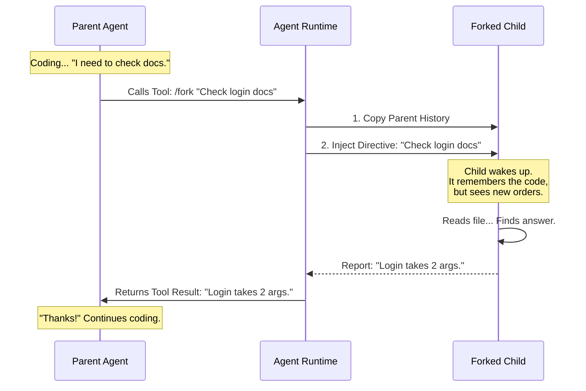

# Chapter 6: Context Forking Mechanism

Welcome to **Chapter 6**!

In the previous chapter, [Persistent Agent Memory](05_persistent_agent_memory.md), we taught our agents how to remember important details across different sessions using a "notebook" system.

Now, we face a different problem: **Multitasking**.

Humans are bad at multitasking, and surprisingly, AI agents can get confused by it too. If an agent tries to fix a bug, update documentation, and run tests all in one long stream of thought, it often loses track of the original goal.

In this chapter, we will explore the **Context Forking Mechanism**.

## The Problem: The Distracted Agent

Imagine you are writing a complex essay. Suddenly, you need to fact-check a date.
1.  You stop writing.
2.  You open a browser.
3.  You browse Wikipedia for 20 minutes.
4.  You come back to your essay and think: *"Wait, what was I writing about?"*

This happens to AI agents. If the context (chat history) gets too cluttered with side-tasks, the AI forgets the main objective.

### Central Use Case: "The Research Detour"

We want our **BugHunter** agent to fix a bug in a file. However, it doesn't know how a specific library function works.

*   **Bad Way:** The agent stops fixing, reads 50 pages of documentation into the main chat, and then tries to scroll back up to fix the code.
*   **Forking Way:** The agent creates a temporary "clone" of itself. The clone goes off, reads the docs, summarizes the **one specific fact** needed, reports back, and vanishes. The main agent never lost its place.

## Key Concepts

The Forking Mechanism is based on three core ideas:

1.  **Inheritance (The Clone):**
    When an agent "forks," the child process starts with an **exact copy** of the parent's memory (history). It knows everything the parent knows up to that moment.

2.  **Divergence (The Side Mission):**
    Once created, the child is given a specific **Directive** (e.g., "Find the API signature for `user.login`"). It does *not* continue the parent's conversation; it executes this specific order.

3.  **Isolation (The Safety Glass):**
    The child runs in the background. If the child gets confused or creates a mess of text, it doesn't clutter the parent's chat history. Only the final answer returns.

## How It Works: The Flow

Let's visualize how a parent agent spawns a child to do work.

### System Flow Diagram



## Internal Implementation: Under the Hood

How do we implement this "Cloning" process in code? It involves manipulating the message history before starting the new agent.

We will look at `forkSubagent.ts`.

### 1. Defining the Forked Agent
First, we need a definition for this temporary worker. Unlike the agents in [Chapter 1](01_agent_definition___discovery.md) which have custom personalities, the Forked Agent is a chameleon.

```typescript
// simplified from forkSubagent.ts
export const FORK_AGENT = {
  agentType: 'fork',
  
  // Inherit the exact AI model the parent is using
  model: 'inherit', 
  
  // Give it all tools so it can do whatever the parent could do
  tools: ['*'],
  
  // No custom system prompt here; it inherits context
  getSystemPrompt: () => '',
}
```
*Explanation:* This object tells the [Agent Execution Runtime](03_agent_execution_runtime.md) to create an agent that uses the same brain (model) and hands (tools) as the parent.

### 2. Preventing Infinite Loops
What if a child tries to fork another child, who forks another child? We need to stop this recursion.

```typescript
// simplified from forkSubagent.ts
export function isInForkChild(messages): boolean {
  // Check history for the specific "I am a fork" tag
  return messages.some(m => 
    m.content.includes('<FORK_BOILERPLATE_TAG>')
  )
}
```
*Explanation:* Before allowing a fork, the system checks the history. If it sees the "Fork Tag" (which we will see in a moment), it knows: *"I am already a child, I cannot fork further."*

### 3. Constructing the "Clone" Memory
This is the most critical part. We need to give the child the parent's memories, but we need to insert the new command.

```typescript
// simplified from forkSubagent.ts
export function buildForkedMessages(directive, parentLastMessage) {
  // 1. Clone the parent's last thought
  const assistantMessage = { ...parentLastMessage }

  // 2. Create a fake "User" message that acts as the trigger
  const triggerMessage = createUserMessage({
    content: [
      { type: 'text', text: buildChildMessage(directive) }
    ]
  })

  // 3. Return the combo: Parent Context + New Trigger
  return [assistantMessage, triggerMessage]
}
```
*Explanation:*
1.  We take the parent's history.
2.  We append a new message from the "User" (the system).
3.  This new message contains the **Directive**.

### 4. The Directive (The Hypnotic Command)
We don't just say "Do this task." We have to override the AI's natural tendency to chat. We inject a strict prompt.

```typescript
// simplified from forkSubagent.ts
export function buildChildMessage(directive: string): string {
  return `
<FORK_BOILERPLATE_TAG>
STOP. READ THIS FIRST.

You are a forked worker process.
1. Do NOT converse.
2. USE your tools directly.
3. Your response MUST begin with "Scope:".

Task: ${directive}
</FORK_BOILERPLATE_TAG>`
}
```
*Explanation:* This block acts like a system override.
*   **"STOP. READ THIS FIRST"**: Grabs the AI's attention.
*   **"Do NOT converse"**: Prevents it from saying "Sure, I can help with that!"
*   **"USE your tools directly"**: Forces it to immediately start working (e.g., running `grep`).

## Usage Example

Let's see what happens in the actual console when this runs.

**Parent Agent Input:**
> "I'm fixing `auth.ts`, but I'm not sure how `isValid()` works. Forking to check."

**Internal Action:**
The system calls `runAgent` (from Chapter 3) using the `FORK_AGENT` definition. It passes the history + the `buildChildMessage` prompt.

**Child Agent (Background):**
*   *Thinking:* "I see the history of `auth.ts`. I see my new order: Check `isValid`. I will run `grep`."
*   *Action:* `grep "function isValid" src/utils.ts`
*   *Result:* "Found on line 50."
*   *Output:*
    ```text
    Scope: Check isValid function.
    Result: It takes a string and returns a boolean.
    ```

**Parent Agent Receives:**
> "Scope: Check isValid function. Result: It takes a string and returns a boolean."

**Parent Agent Action:**
> "Great, I will now write the code..."

## Summary

In this chapter, we learned about the **Context Forking Mechanism**.

*   **Motivation:** Agents need to perform sub-tasks without losing the main thread of conversation (context).
*   **Mechanism:**
    1.  **Clone:** Copy the parent's message history.
    2.  **Inject:** Append a strict `buildChildMessage` directive.
    3.  **Execute:** Run the child agent to completion.
    4.  **Merge:** Return only the final result to the parent.
*   **Benefit:** Keeps the main "thought process" clean and focused while allowing for complex side-tasks.

We have covered the definition, the runtime, the memory, and now the forking mechanism. But how do we actually show all this activity to the human user without overwhelming them?

[Next Chapter: Agent Presentation Layer](07_agent_presentation_layer.md)

---

Generated by [Code IQ](https://github.com/adityasoni99/Code-IQ)