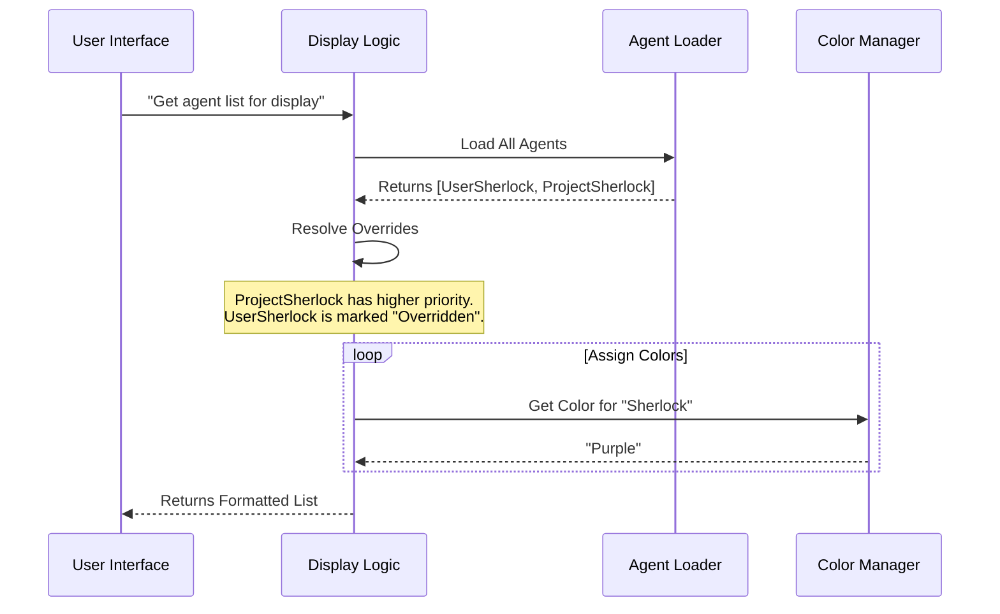

# Chapter 7: Agent Presentation Layer

Welcome to **Chapter 7**, the final chapter of our beginner's guide!

In [Chapter 6: Context Forking Mechanism](06_context_forking_mechanism.md), we learned how agents can clone themselves to multitask. In previous chapters, we learned how to define agents in [Chapter 1](01_agent_definition___discovery.md) and store their memories in [Chapter 5](05_persistent_agent_memory.md).

By now, your system might be swarming with agents: built-in ones, custom ones you wrote, and ones your team committed to the project repo.

This creates a new problem: **Clutter and Confusion**.

In this chapter, we will explore the **Agent Presentation Layer**.

## The Problem: "Will the real Slim Shady please stand up?"

Imagine you have a contact named "Mom" in your phone.
1.  You have her saved in your **SIM card**.
2.  You have her saved in your **Google Account**.
3.  You have her saved in your **Phone Storage**.

When "Mom" calls, you don't want to see three identical entries. You want your phone to merge them into one coherent profile and perhaps give it a special ringtone.

In `AgentTool`, you might have a generic "Sherlock" agent in your global user settings, but your current project has a specialized "Sherlock" agent designed for this specific codebase.

When you type `@Sherlock`, which one answers? How do you know?

### Central Use Case: "The Project Override"

We want to achieve two things in the User Interface (CLI):
1.  **Resolution:** If the Project defines a "Sherlock" agent, it should hide (override) the global "Sherlock" agent.
2.  **Visuals:** We want "Sherlock" to always appear **Purple** so we can instantly recognize him in a stream of text.

## Key Concepts

The Presentation Layer acts like the "Contacts App" on your phone. It handles three jobs:

1.  **Source Grouping:**
    It organizes agents based on where they live (User Settings vs. Project Settings vs. Built-in).

2.  **Conflict Resolution (The "Shadowing" Rule):**
    It enforces a hierarchy. A "Project Agent" usually beats a "User Agent." If both exist with the same name, the lower-priority one is marked as `overridden`.

3.  **Visual Identity:**
    It assigns consistent colors (like Red for specific sub-agents or Blue for the main assistant) so the chat log is readable.

## How It Works: The Roster

When you run the command `claude agents` or list them in the UI, the system doesn't just dump a raw list. It processes them.

### Input vs. Output

**The Input (Raw Data):**
*   Global Agent: `Sherlock` (Source: User)
*   Project Agent: `Sherlock` (Source: Project)
*   Built-in Agent: `Plan` (Source: Built-in)

**The Presentation Layer Logic:**
1.  Sorts by priority.
2.  Detects that `Project Sherlock` shadows `User Sherlock`.
3.  Assigns colors.

**The Output (What you see):**

```text
PROJECT AGENTS
  ● Sherlock (Purple) - Specialized Investigator

USER AGENTS
  ○ Sherlock (Greyed out) - Overridden by Project Settings

BUILT-IN AGENTS
  ● Plan (Green) - The Architect
```

## Internal Implementation: The Logic Flow

How does the code decide who wins? Let's look at the flow.

### System Flow Diagram



## Code Deep Dive

Let's look at the actual code that powers this logic. We will look at `agentDisplay.ts` and `agentColorManager.ts`.

### 1. The Hierarchy (Source Groups)

First, we need to know the "Rank" of our sources. This list defines the order in which agents are displayed.

From `agentDisplay.ts`:

```typescript
// simplified from agentDisplay.ts
export const AGENT_SOURCE_GROUPS = [
  { label: 'User agents', source: 'userSettings' },
  { label: 'Project agents', source: 'projectSettings' },
  { label: 'Local agents', source: 'localSettings' },
  // ...
  { label: 'Built-in agents', source: 'built-in' },
]
```
*Explanation:* This array acts as the table of contents. When rendering the list, the UI loops through these groups. "User agents" appear at the top, "Built-in agents" at the bottom.

### 2. The Conflict Resolver

This is the most critical function. It compares the "All Agents" list against the "Active Agents" list to see who didn't make the cut.

From `agentDisplay.ts`:

```typescript
// simplified from agentDisplay.ts
export function resolveAgentOverrides(
  allAgents: AgentDefinition[],
  activeAgents: AgentDefinition[],
): ResolvedAgent[] {
  // 1. Create a map of the winners (Active agents)
  const activeMap = new Map(activeAgents.map(a => [a.agentType, a]))
  const resolved = []

  // 2. Check every available agent
  for (const agent of allAgents) {
    const active = activeMap.get(agent.agentType)
    
    // 3. If active source is different, this agent is overridden
    const overriddenBy = (active && active.source !== agent.source) 
      ? active.source 
      : undefined

    resolved.push({ ...agent, overriddenBy })
  }
  return resolved
}
```
*Explanation:*
1.  We have a list of `activeAgents` (the ones that the Runtime will actually use).
2.  We iterate through `allAgents` (every file found on disk).
3.  If we find a `Sherlock` in `allAgents` (User source), but the active `Sherlock` is from the `Project` source, we flag the User one as `overriddenBy: 'project'`.
4.  The UI sees this flag and knows to grey out that line.

### 3. Visual Identity (Colors)

Finally, to make the chat readable, we map agent names to specific colors.

From `agentColorManager.ts`:

```typescript
// simplified from agentColorManager.ts
export const AGENT_COLORS = [
  'red', 'blue', 'green', 'yellow', 'purple', ...
] as const

export function getAgentColor(agentType: string) {
  // 1. General Purpose agent is usually uncolored (default text)
  if (agentType === 'general-purpose') return undefined

  // 2. Check the in-memory map for assigned colors
  const agentColorMap = getAgentColorMap()
  const existingColor = agentColorMap.get(agentType)

  // 3. Convert simple color name to Theme color
  if (existingColor) {
    return AGENT_COLOR_TO_THEME_COLOR[existingColor]
  }
}
```
*Explanation:*
*   We exclude the "General Purpose" agent because it is the default; painting everything blue would be distracting.
*   For other agents, we check a mapping (e.g., `Sherlock -> Purple`).
*   This ensures that every time "Sherlock" speaks, their name tag appears in Purple.

## Summary

In this final chapter, we learned about the **Agent Presentation Layer**.

*   **Motivation:** We need to organize the chaos of multiple agent sources and definitions.
*   **Grouping:** We categorize agents by their source (User, Project, Built-in).
*   **Resolution:** We implement logic to detect when a Project agent overrides a User agent, preventing duplicate names.
*   **Visualization:** We assign colors to help the user visually parse the conversation.

### Tutorial Conclusion

Congratulations! You have completed the **AgentTool** architecture tutorial. You now understand the full lifecycle of an AI Agent:

1.  **Definition:** How it is born from Markdown ([Chapter 1](01_agent_definition___discovery.md)).
2.  **Specialization:** How roles like "Plan" and "Verify" are hardcoded ([Chapter 2](02_specialized_built_in_agents.md)).
3.  **Runtime:** How it is executed in a sandbox ([Chapter 3](03_agent_execution_runtime.md)).
4.  **Prompting:** How it receives dynamic instructions ([Chapter 4](04_dynamic_prompt_engineering.md)).
5.  **Memory:** How it remembers lessons ([Chapter 5](05_persistent_agent_memory.md)).
6.  **Forking:** How it multitasks ([Chapter 6](06_context_forking_mechanism.md)).
7.  **Presentation:** How it is displayed to you (Chapter 7).

You are now ready to dig into the codebase and build your own custom agents! Happy coding!

---

Generated by [Code IQ](https://github.com/adityasoni99/Code-IQ)