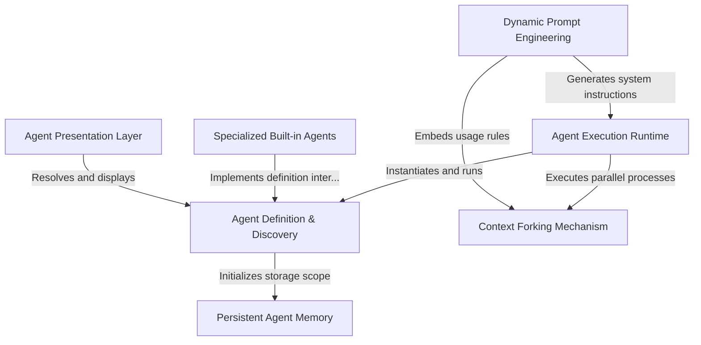

# Tutorial: AgentTool

This project implements a robust **Agent Execution Runtime** that manages the full lifecycle of autonomous AI assistants. It creates a flexible environment where agents—defined by specific **configurations** and **tools**—can persist knowledge through *memory*, perform complex tasks via *context forking*, and interact with users through a unified presentation layer.

## Chapters

1. [Agent Definition & Discovery](01_agent_definition___discovery.md)
2. [Specialized Built-in Agents](02_specialized_built_in_agents.md)
3. [Agent Execution Runtime](03_agent_execution_runtime.md)
4. [Dynamic Prompt Engineering](04_dynamic_prompt_engineering.md)
5. [Persistent Agent Memory](05_persistent_agent_memory.md)
6. [Context Forking Mechanism](06_context_forking_mechanism.md)
7. [Agent Presentation Layer](07_agent_presentation_layer.md)

---

Generated by [Code IQ](https://github.com/adityasoni99/Code-IQ)