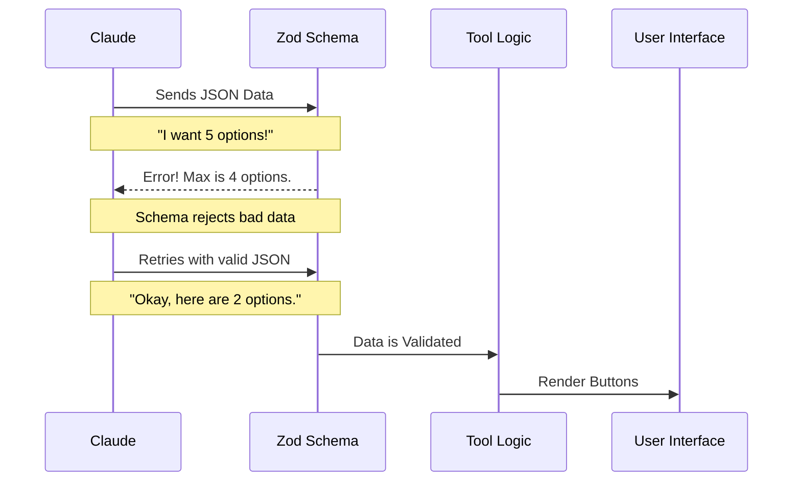

# Chapter 1: Data Schemas

Welcome to the **AskUserQuestionTool** tutorial! In this series, we will build a tool that allows an AI (like Claude) to stop and ask *you* multiple-choice questions via a rich interactive interface.

## The Problem: Taming the AI
Imagine you are a chef. If a customer yells, "I want food!", you don't know what to cook. You need a structured order form: *Dish Name*, *Sides*, *Allergies*.

AI models are the same. By default, they generate free-flowing text. But to render a nice UI with clickable buttons, our code needs structured data (JSON). We can't render a paragraph of text as a button; we need a specific `label` and `description`.

**Data Schemas** are our "order forms." They act as strict gatekeepers, forcing the AI to provide data exactly how our UI needs it.

---

## 1. The Building Block: Options
The smallest unit of our tool is a single **Option** (a choice the user can pick).

We use a library called **Zod** to define these rules. Think of Zod as a spell-checker for data structures.

Here is the schema for a single option:

```typescript
// Define what a single "choice" looks like
const questionOptionSchema = z.object({
  // The text on the button (keep it short!)
  label: z.string().describe('Concise display text (1-5 words)'),
  
  // A longer explanation of this choice
  description: z.string().describe('Explanation of implications'),
  
  // Optional: A visual code snippet or preview
  preview: z.string().optional()
});
```

**Why this matters:**
*   **`label`**: The AI knows it *must* provide a short string here.
*   **`description`**: This ensures the user has enough context to decide.

---

## 2. The Question Structure
Now that we have options, we need to group them into a **Question**.

This is where we enforce specific constraints to ensure the UI looks good. We don't want a question with 100 options (too messy) or 0 options (impossible to answer).

```typescript
const questionSchema = z.object({
  // The actual question text
  question: z.string().describe('The question to ask the user'),
  
  // A tiny tag displayed next to the question
  header: z.string().describe('Short label (max 10 chars)'),

  // The list of choices defined in the previous step
  options: z.array(questionOptionSchema).min(2).max(4)
});
```

**Key Constraints:**
*   **`.min(2).max(4)`**: This is the "Goldilocks" rule. The AI is forced to generate between 2 and 4 options. This ensures the UI is never overcrowded or empty.
*   **`header`**: Restricts the chip width so distinct tags fit on the screen.

---

## 3. The Gatekeeper: Input Schema
Finally, we wrap everything in the **Input Schema**. This is the master blueprint the AI receives. It tells the AI: "If you want to use this tool, you must send data matching this shape."

We also add a custom rule: **Uniqueness**. It makes no sense to have two buttons with the exact same label.

```typescript
const inputSchema = z.strictObject({
  // The AI can ask 1 to 4 questions at once
  questions: z.array(questionSchema).min(1).max(4)
}).refine((data) => {
  // Custom logic: Ensure all questions and options are unique
  return checkUniqueness(data);
}, {
  message: 'Question texts and option labels must be unique'
});
```

This acts as a strict filter. If the AI tries to generate duplicate options, this schema rejects it before it ever reaches the UI.

---

## Use Case Example
Let's say the AI wants to ask you how to proceed with a deployment.

**What the AI *wants* to say (Text):**
"Should we deploy to Dev or Prod?"

**What the Schema *forces* it to generate (JSON):**
```json
{
  "questions": [
    {
      "question": "Where should we deploy?",
      "header": "Environment",
      "options": [
        { "label": "Development", "description": "Safe for testing" },
        { "label": "Production", "description": "Live user traffic" }
      ]
    }
  ]
}
```

Because of our schema, the UI receives perfect JSON and draws two beautiful buttons.

---

## Internal Implementation
How does this actually work inside the system? Here is the flow when the AI tries to use the tool.



### Under the Hood: `lazySchema`
In the actual code (`AskUserQuestionTool.tsx`), we wrap these definitions in a helper called `lazySchema`.

```typescript
// From AskUserQuestionTool.tsx
import { lazySchema } from '../../utils/lazySchema.js';

// We delay creating the schema until the tool is actually used
const inputSchema = lazySchema(() => z.strictObject({
  questions: z.array(questionSchema()).min(1).max(4),
  // ... common fields like metadata
}));
```

**Why Lazy?**
Some schemas might depend on other parts of the system loading first. `lazySchema` creates the Zod object only when it is requested, saving memory and preventing startup errors.

### The Uniqueness Check
The code includes a specific validator to prevent confusing the user.

```typescript
const UNIQUENESS_REFINE = {
  check: (data) => {
    // Check if question texts are unique
    const questions = data.questions.map(q => q.question);
    // Sets automatically remove duplicates
    return questions.length === new Set(questions).size;
  },
  message: 'Question texts must be unique'
};
```

If `check` returns `false`, the tool throws an error back to the AI, asking it to correct its mistake.

---

## Conclusion
You have defined the rules of engagement! By creating strict **Data Schemas**, you ensure that:
1.  The AI provides structured JSON, not text.
2.  The UI receives exactly 2-4 options per question.
3.  There are no duplicate confusing options.

Now that the structure is defined, we need to package this into a tool the AI can actually see and call.

[Next Chapter: Tool Definition](02_tool_definition.md)

---

Generated by [Code IQ](https://github.com/adityasoni99/Code-IQ)