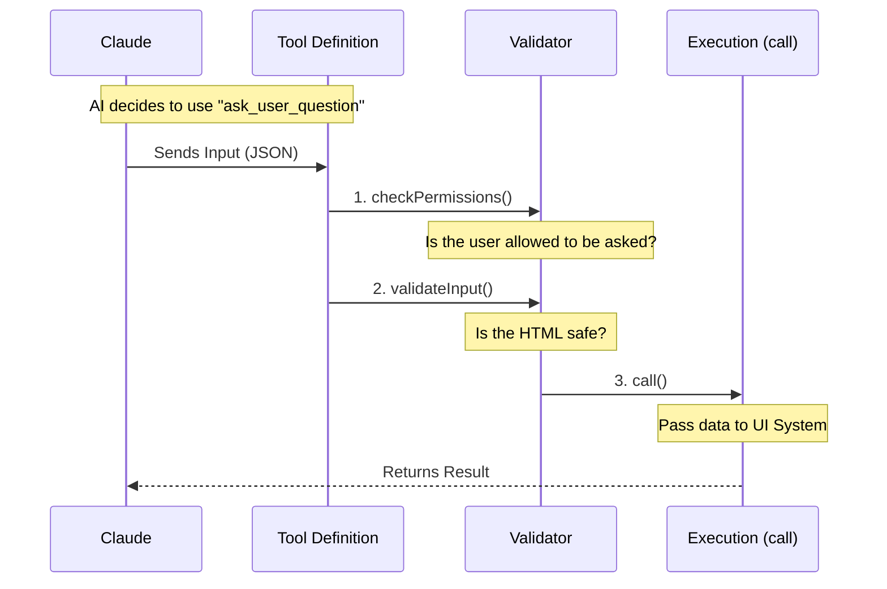

# Chapter 2: Tool Definition

In the previous [Chapter 1: Data Schemas](01_data_schemas.md), we created the strict "order forms" (Zod schemas) that force the AI to speak in structured JSON.

But a form sitting on a desk doesn't do anything by itself. We need a mechanism to hand that form to the AI, accept the filled-out result, and trigger the actual user interface.

In this chapter, we will build the **Tool Definition**.

## The Problem: The Missing Link
You have your schemas (the "rules"), but the AI doesn't know they exist yet. The AI needs a registered "function" it can call.

Think of the **Tool Definition** as a bridge:
1.  **One side connects to the AI:** It tells the AI "I am a tool named `ask_user_question` and here is how you use me."
2.  **The other side connects to the System:** It tells our code "When the AI calls this, run this specific function."

---

## 1. The Wrapper: `buildTool`
We use a helper function called `buildTool`. This creates the main object that manages the entire lifecycle of the interaction.

At its simplest, a tool looks like this:

```typescript
import { buildTool } from '../../Tool.js';

export const AskUserQuestionTool = buildTool({
  name: 'ask_user_question',
  description: 'Use this to ask the user a question...',
  // ... configuration goes here
});
```

**Why this matters:**
*   **`name`**: The unique ID the AI uses to call this tool.
*   **`description`**: A short pitch convincing the AI *when* to use this tool.

---

## 2. Connecting the Schemas
Remember the Zod schemas we built in Chapter 1? This is where we plug them in.

We attach the **Input Schema** (what the AI sends us) and the **Output Schema** (what we send back to the AI after the user answers).

```typescript
// Importing the schemas from Chapter 1
import { inputSchema, outputSchema } from './schemas.js';

export const AskUserQuestionTool = buildTool({
  name: 'ask_user_question',
  
  // The "Gatekeepers"
  get inputSchema() { return inputSchema(); },
  get outputSchema() { return outputSchema(); }
  
  // ... other settings
});
```

By linking these here, the system automatically validates data before our code even runs. If the AI sends bad data, `buildTool` rejects it automatically.

---

## 3. The Execution Logic: `call`
When the AI successfully fills out the form, the `call` method is triggered. This is the heart of the tool.

For `AskUserQuestionTool`, our job is simple: take the questions the AI generated and pass them to the UI system.

```typescript
async call(input, _context) {
  // 'input' contains the valid JSON questions from the AI
  return {
    data: {
      questions: input.questions,
      answers: input.answers || {}, 
      annotations: input.annotations
    }
  };
}
```

**What happens here?**
*   We receive `input` (guaranteed to be valid by Zod).
*   We return a `data` object.
*   The system takes this data and uses it to render the interactive React component (which we will discuss in [Result Rendering](05_result_rendering.md)).

---

## 4. Safety Checks: `validateInput`
Sometimes, valid JSON isn't enough. We need to check the *content* inside the JSON.

In our project, we allow the AI to generate HTML previews for options. However, we don't want the AI to generate dangerous HTML (like `<script>` tags). We add a custom validation step.

```typescript
async validateInput({ questions }) {
  // Loop through every question and option
  for (const q of questions) {
    for (const opt of q.options) {
      // Custom helper to check for bad HTML
      const error = validateHtmlPreview(opt.preview);
      
      if (error) {
        return { result: false, message: error };
      }
    }
  }
  return { result: true };
}
```

If this returns `false`, the tool rejects the request, and the AI is told to try again with safer HTML.

---

## Internal Implementation
Let's look at the flow of data when the tool is defined and invoked.



### The Permission Check
We also define a `checkPermissions` method. Since this tool interrupts the user, we might want to ask permission before showing a huge dialog box, or auto-approve it in certain modes.

```typescript
async checkPermissions(input) {
  return {
    behavior: 'ask', // Ask the user: "Allow this tool?"
    message: 'Answer questions?',
    updatedInput: input
  };
}
```

### Configuration Flags
Finally, we set a few boolean flags to tell the system how this tool behaves.

```typescript
export const AskUserQuestionTool = buildTool({
  // ... previous settings ...

  // Yes, this tool stops the world and waits for a human
  requiresUserInteraction() { return true; },

  // Yes, multiple parts of the system can use this safely
  isConcurrencySafe() { return true; },

  // No, this tool doesn't modify files or delete data
  isReadOnly() { return true; }
});
```

*   **`requiresUserInteraction`**: This is critical. It tells the system "Don't expect an instant reply. The human needs time to click buttons."

---

## Conclusion
You have now successfully packaged your schemas into a functional unit!

1.  **Identity**: You gave the tool a name (`ask_user_question`).
2.  **Logic**: You defined how to handle the input via `call`.
3.  **Safety**: You added extra validation checks for HTML.

However, simply having a tool definition isn't enough. The AI needs to know *exactly* how to behave when using it. It needs instructions on tone, style, and formatting.

[Next Chapter: Prompt Configuration](03_prompt_configuration.md)

---

Generated by [Code IQ](https://github.com/adityasoni99/Code-IQ)