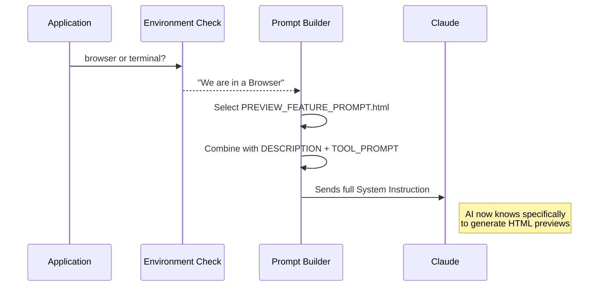

# Chapter 3: Prompt Configuration

Welcome back! In [Chapter 2: Tool Definition](02_tool_definition.md), we built the machinery—the functions and permissions that allow the tool to run.

But having a machine isn't enough; you need an **Instruction Manual**.

If we handed a chainsaw to an alien, they might try to use it to slice bread. Similarly, if we give the AI our tool without instructions, it might use it at the wrong time or in the wrong way.

**Prompt Configuration** consists of text constants (strings) that tell the AI specifically **how**, **when**, and **why** to use the tool we just built.

---

## The Problem: The "Socially Awkward" AI
Imagine this scenario:
1.  The AI creates a complex 10-step plan to update your database.
2.  It wants to ask you: "Does this plan look good?"
3.  It decides to use `AskUserQuestionTool` to ask that.

**This is a disaster.** Why? Because `AskUserQuestionTool` just shows a popup with buttons. It **cannot** show the user the detailed plan file. The user would see a button saying "Yes" without knowing what they are agreeing to.

We need to program the AI with a rule: *"Only use this tool for preferences. Do NOT use it for approving plans."*

---

## 1. The Elevator Pitch
The first piece of configuration is the **Description**. This is a one-sentence summary that helps the AI filter its toolbox.

When the AI wonders, "Which tool should I pick?", it scans these descriptions.

```typescript
export const DESCRIPTION =
  'Asks the user multiple choice questions to gather information, clarify ambiguity, understand preferences, make decisions or offer them choices.'
```

**Why this works:**
*   It uses keywords like **"gather information"** and **"preferences"**.
*   It tells the AI that the format is **"multiple choice"**.

---

## 2. The User Manual (Main Prompt)
Once the AI considers using the tool, it reads the detailed instructions. This is where we establish the "Rules of Engagement."

We define this in a constant called `ASK_USER_QUESTION_TOOL_PROMPT`.

### Part A: Capabilities
First, we sell the features. We remind the AI about the schema capabilities we built in [Chapter 1: Data Schemas](01_data_schemas.md), like `multiSelect`.

```typescript
export const ASK_USER_QUESTION_TOOL_PROMPT = `
Use this tool to:
1. Gather user preferences
2. Clarify ambiguous instructions
3. Offer choices on implementation direction

Usage notes:
- Users can always select "Other" for custom text
- Use multiSelect: true for multiple answers
- Put recommended options first
...
`
```

### Part B: The "Plan Mode" Warning
This is the most critical part. We must strictly forbid the AI from using this tool for plan approvals.

```typescript
/* ... continued from above ... */
`
Plan mode note: 
Do NOT use this tool to ask "Is my plan ready?".
Use ${EXIT_PLAN_MODE_TOOL_NAME} for plan approval.

IMPORTANT: The user cannot see the plan in this UI.
`
```

**The Logic:**
*   We reference a *different* tool (`EXIT_PLAN_MODE_TOOL_NAME`).
*   We explain the *consequence*: "The user cannot see the plan."
*   This prevents the "Socially Awkward" scenario described at the start.

---

## 3. The Dynamic Preview Instructions
Here is where things get clever. The `AskUserQuestionTool` supports a "preview" feature (showing a snippet of code or a UI mockup next to the options).

However, our tool might run in two different places:
1.  **A Web Browser:** Can render fancy HTML buttons and layouts.
2.  **A Terminal (Command Line):** Can only render text.

We cannot give the AI one single instruction. If we tell it "Write HTML," the Terminal user will see raw `<div>` tags. Messy!

We solve this by creating **Conditional Prompts**.

```typescript
export const PREVIEW_FEATURE_PROMPT = {
  // If we are in a Terminal
  markdown: `
    Preview feature:
    Use the 'preview' field for ASCII mockups or Code snippets.
    Preview content is rendered as markdown.
  `,

  // If we are in a Web Browser
  html: `
    Preview feature:
    Use the 'preview' field for HTML mockups.
    Preview content must be a self-contained HTML fragment.
    No <script> tags allowed.
  `,
}
```

When the application starts, it checks "Where am I running?" and feeds *only* the correct paragraph to the AI.

---

## Internal Implementation
How does the system actually apply these text strings? It doesn't happen inside the tool itself; it happens when the System Prompt is being constructed.

### The Flow


### The Code Logic
In the main application code (outside the tool definition), we inject these strings.

```typescript
// Pseudo-code of how the app serves the prompt
import { PREVIEW_FEATURE_PROMPT } from './prompt.js';

function getSystemPrompt(isBrowser: boolean) {
  // 1. Choose the right preview instruction
  const previewRules = isBrowser 
    ? PREVIEW_FEATURE_PROMPT.html 
    : PREVIEW_FEATURE_PROMPT.markdown;

  // 2. Combine with the main rules
  return `
    ${ASK_USER_QUESTION_TOOL_PROMPT}
    ${previewRules}
  `;
}
```

This ensures the AI never hallucinates HTML features when talking to a command-line user.

---

## Conclusion
You have now given the AI its "brain" regarding this tool.
1.  **Description:** Helps it find the tool.
2.  **Main Prompt:** Teaches it etiquette (don't use for plan approval!).
3.  **Conditional Prompt:** Ensures it formats previews correctly for the specific screen (Markdown vs. HTML).

Now the AI knows *what* to ask and *how* to format the request. But what happens when it actually decides to use that "Preview" feature? How do we ensure the HTML or Markdown it generates is valid and safe?

[Next Chapter: Preview Feature Logic](04_preview_feature_logic.md)

---

Generated by [Code IQ](https://github.com/adityasoni99/Code-IQ)