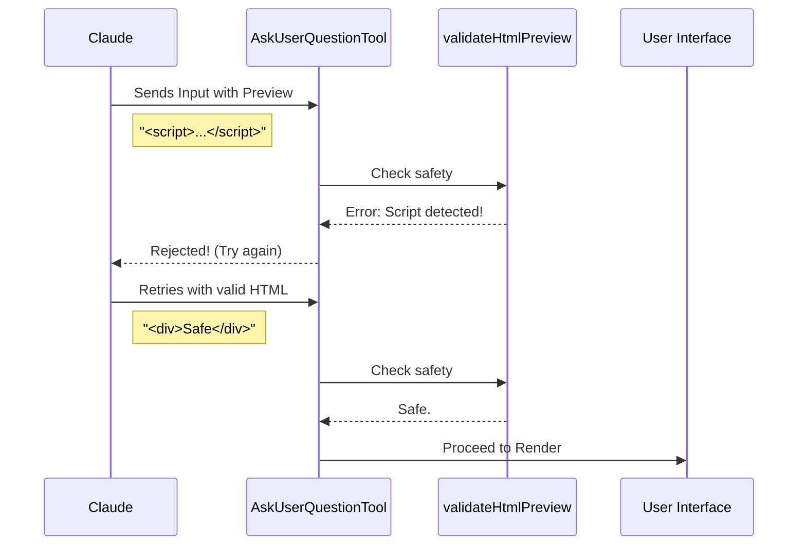

# Chapter 4: Preview Feature Logic

In [Chapter 3: Prompt Configuration](03_prompt_configuration.md), we taught the AI how to behave and gave it instructions on how to format previews.

But instructions aren't enough. Even if you tell a contractor "only paint the wall," they might accidentally paint the window too. We need a safety inspector.

In this chapter, we will build the **Preview Feature Logic**. This is the code that accepts the visual content (HTML or Markdown) from the AI, inspects it for safety, and prepares it for the user.

---

## The Problem: The "Blind" Choice
Imagine you are asking the AI to design a button for your website.

**Without Previews:**
The AI asks: "Which button do you want?"
1.  `"Blue with rounded corners"`
2.  `"Red with square corners"`

You have to imagine what these look like. It requires mental effort.

**With Previews:**
You see the actual rendered HTML button right next to the choice. You don't have to read; you just look and click.

However, rendering HTML from an AI is dangerous. What if the AI includes a `<script>` tag that deletes your files? Or a `<body>` tag that breaks your entire application layout?

---

## 1. The Use Case: Safe HTML Fragments
Our goal is to allow the AI to send us a snippet of HTML, but strictly enforce that it is **safe** and **contained**.

**The AI sends this (Good):**
```html
<button style="background: blue; border-radius: 5px;">
  Click Me
</button>
```

**The AI sends this (Bad - Security Risk):**
```html
<script>stealUserPasswords()</script>
<button>Click Me</button>
```

**The AI sends this (Bad - Layout Breaker):**
```html
<html>
  <body>My Button</body>
</html>
```

We need logic to accept the Good and reject the Bad.

---

## 2. The Logic: `validateHtmlPreview`
To solve this, we create a helper function called `validateHtmlPreview`. It acts as a "Bouncer" at the door of our rendering engine.

It uses **Regular Expressions (Regex)** to scan the text string for forbidden patterns.

### Step A: No Full Documents
We only want a *fragment* (like a single brick), not a whole house.

```typescript
function validateHtmlPreview(preview) {
  // 1. Check for "whole document" tags
  if (/<\s*(html|body|!doctype)\b/i.test(preview)) {
    return 'Error: Must be a fragment, not a full document.';
  }
  // ... continue checks
}
```

**Why:** If we render a `<body>` tag inside our existing application, it creates a "Russian Doll" situation that ruins the UI layout.

### Step B: No Scripts or Styles
We want visual previews, not executable code or global styling rules.

```typescript
  // 2. Check for executable or global style tags
  if (/<\s*(script|style)\b/i.test(preview)) {
    return 'Error: No <script> or <style> tags allowed.';
  }
```

**Why:**
*   `<script>`: Security risk (XSS attacks).
*   `<style>`: Could accidentally change the color of the *entire* application, not just the preview.

### Step C: Must be HTML
Finally, if we are expecting HTML, we must ensure it actually looks like HTML (contains tags).

```typescript
  // 3. Ensure there is at least one tag
  if (!/<[a-z][^>]*>/i.test(preview)) {
    return 'Error: Content must contain HTML tags (e.g., <div>).';
  }
  
  return null; // No errors found!
}
```

---

## 3. Integrating the Logic
Now that we have our validator, we hook it into the Tool Definition we built in [Chapter 2: Tool Definition](02_tool_definition.md).

We use the `validateInput` method. This runs automatically *after* the Zod schema check but *before* the tool actually runs.

```typescript
async validateInput({ questions }) {
  // Only check if we are in HTML mode
  if (getQuestionPreviewFormat() !== 'html') return { result: true };

  for (const q of questions) {
    for (const opt of q.options) {
      // Run our Bouncer function
      const err = validateHtmlPreview(opt.preview);
      
      if (err) return { result: false, message: err };
    }
  }
  return { result: true };
}
```

If `validateInput` returns `false`, the AI receives an error message explaining exactly what it did wrong (e.g., "No <script> tags allowed"), so it can self-correct and try again.

---

## Internal Implementation
Let's visualize the flow when an AI tries to use a preview.

### The Flow


### Why simple Regex?
You might wonder why we use simple text matching (Regex) instead of a full HTML parser.

1.  **Speed:** Text matching is incredibly fast.
2.  **Intent:** HTML parsers are designed to be "forgiving" (they try to fix broken code). We don't want to fix the AI's bad code; we want to reject it so the AI learns to follow the rules.

---

## Conclusion
You have implemented the safety layer!

1.  **Motivation:** Previews help users make better choices.
2.  **Safety:** We use `validateHtmlPreview` to ensure no scripts or full documents break the UI.
3.  **Feedback:** The AI gets specific error messages if it breaks the rules.

Now that we have **Structured Data** (Chapter 1), a **Defined Tool** (Chapter 2), **Instructions** (Chapter 3), and **Safe Content** (Chapter 4), we are finally ready to draw pixels on the screen.

[Next Chapter: Result Rendering](05_result_rendering.md)

---

Generated by [Code IQ](https://github.com/adityasoni99/Code-IQ)