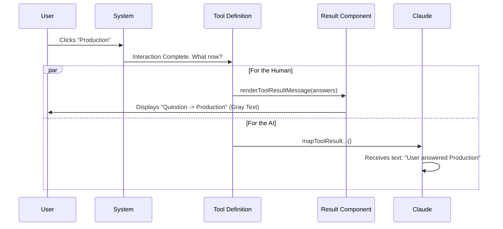

# Chapter 5: Result Rendering

Welcome to the final chapter! 

In [Chapter 4: Preview Feature Logic](04_preview_feature_logic.md), we ensured that the interactive popups were safe and secure. 

But what happens **after** the user clicks a button? The popup closes and disappears. If we don't leave a trace, the chat history will look like a conversation with missing pages. The user might scroll back and wonder, *"Wait, what did I agree to five minutes ago?"*

In this chapter, we will build **Result Rendering**. This acts as the "receipt" of the transaction, leaving a permanent, read-only record in the chat history.

## The Problem: The Disappearing Act
Interactive tools (like popups/modals) are **ephemeral**. They exist only while the user is making a decision.

1.  **The Interaction:** The AI asks, "Deploy to Prod?" and shows a popup.
2.  **The Action:** You click "Yes".
3.  **The Aftermath:** The popup vanishes to clear the screen.

Without **Result Rendering**, the chat log looks like this:
> **AI:** I need to check something.
> *(Blank Space where the popup used to be)*
> **AI:** Okay, deploying now.

We need to fill that blank space with a static summary so the history makes sense.

---

## 1. The Component: `AskUserQuestionResultMessage`
We need a standard React component that takes the user's answers and displays them neatly.

This component is **read-only**. It has no buttons or logic. It simply prints data.

### Step A: The Setup
The component receives `answers` as a property (prop). This is a simple list of keys (questions) and values (selected answers).

```tsx
// A simple functional component
function AskUserQuestionResultMessage({ answers }) {
  // 'answers' looks like: { "Environment": "Production" }
  
  return (
    <Box flexDirection="column" marginTop={1}>
       {/* content goes here */}
    </Box>
  );
}
```

### Step B: The Header
First, we render a small header to indicate that this block represents a completed action. We use a standard icon (`BLACK_CIRCLE`) to match the system's design language.

```tsx
<Box flexDirection="row">
  <Text color="green">
    {BLACK_CIRCLE} 
  </Text>
  <Text>User answered Claude's questions:</Text>
</Box>
```

**Why this matters:** It visually separates the AI's question from the user's answer in the scrolling log.

### Step C: The List
Next, we loop through the answers and print them. We use `Object.entries` to turn the data into a list we can iterate over.

```tsx
<MessageResponse>
  <Box flexDirection="column">
    {Object.entries(answers).map(([question, answer]) => (
      <Text key={question} color="inactive">
        · {question} → {answer}
      </Text>
    ))}
  </Box>
</MessageResponse>
```

**Note:** We use `color="inactive"` (usually gray) because this is history. It shouldn't scream for attention like an active error message.

---

## 2. Connecting to the Tool
Now that we have the component, how do we tell the system to use it?

We go back to our main file, `AskUserQuestionTool.tsx`, specifically inside the `buildTool` definition we started in [Chapter 2: Tool Definition](02_tool_definition.md).

We need to implement a specific method called `renderToolResultMessage`.

```tsx
export const AskUserQuestionTool = buildTool({
  name: ASK_USER_QUESTION_TOOL_NAME,
  
  // ... other configurations ...

  // The system calls this after the tool finishes
  renderToolResultMessage({ answers }, _toolUseID) {
    // We return our specific React component
    return <AskUserQuestionResultMessage answers={answers} />;
  },
});
```

When the tool finishes successfully, the system automatically swaps the "Active Popup" with this "Result Message."

---

## 3. The AI's Memory (Text Result)
There is a subtle distinction here. 
1.  **The Component** is for the **Human** (visual).
2.  **The Text** is for the **AI** (memory).

The AI cannot "see" the React component. We must also convert the answers into a text string so the AI knows what happened. We do this with `mapToolResultToToolResultBlockParam`.

```typescript
mapToolResultToToolResultBlockParam({ answers }, toolUseID) {
  // Convert object to string: "Env"="Prod", "Debug"="False"
  const text = Object.entries(answers)
    .map(([q, a]) => `"${q}"="${a}"`)
    .join(', ');

  return {
    type: 'tool_result',
    content: `User has answered: ${text}`,
    tool_use_id: toolUseID
  };
}
```

This ensures that in the next turn of conversation, the AI remembers: "Ah, the user selected Production."

---

## Internal Implementation
Let's trace the lifecycle of a completed interaction.



### Under the Hood: The React Component
In the actual source code, the component is wrapped in compiler optimizations (`_c`), but the logic is exactly as we described.

```tsx
// From AskUserQuestionTool.tsx
function AskUserQuestionResultMessage({ answers }) {
  // ... optimization checks ...
  return (
    <Box flexDirection="column" marginTop={1}>
      <Box flexDirection="row">
         {/* Header */}
         <Text>User answered Claude's questions:</Text>
      </Box>
      <MessageResponse>
         {/* The Loop */}
         {Object.entries(answers).map(([q, a]) => (
           <Text key={q} color="inactive">· {q} → {a}</Text>
         ))}
      </MessageResponse>
    </Box>
  );
}
```

### Handling Rejection
What if the user clicks "Cancel"? We don't want to show the answers component. Instead, we use `renderToolUseRejectedMessage`.

```tsx
renderToolUseRejectedMessage() {
  return (
    <Box flexDirection="row" marginTop={1}>
      <Text>User declined to answer questions</Text>
    </Box>
  );
}
```

This creates a clear record that the operation was aborted, preventing confusion later.

---

## Conclusion
Congratulations! You have completed the **AskUserQuestionTool** tutorial.

You have built a sophisticated full-stack AI tool:
1.  **[Data Schemas](01_data_schemas.md):** You defined strict rules for the data (JSON).
2.  **[Tool Definition](02_tool_definition.md):** You registered the function and validation logic.
3.  **[Prompt Configuration](03_prompt_configuration.md):** You taught the AI how and when to use the tool.
4.  **[Preview Feature Logic](04_preview_feature_logic.md):** You added a safety layer for visual content.
5.  **Result Rendering:** You ensured the history remains clean and informative.

By mastering these five concepts, you can now create any kind of interactive tool—from file pickers to confirmation dialogs—allowing the AI to work *with* the user, not just *for* them.

**End of Tutorial.**

---

Generated by [Code IQ](https://github.com/adityasoni99/Code-IQ)