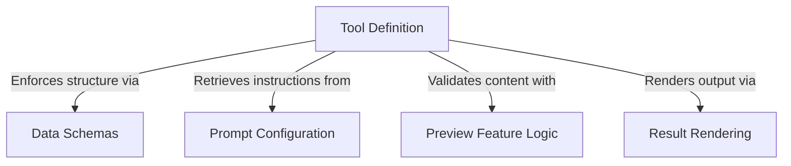

# Tutorial: AskUserQuestionTool

This project enables an AI agent to proactively **ask the user** multiple-choice questions to gather requirements or offer choices. It acts as a bridge between the AI and the interface by enforcing strict *data schemas*, handling rich content like **HTML previews** for options, and rendering the user's answers as a permanent record in the chat.

## Chapters

1. [Data Schemas](01_data_schemas.md)
2. [Tool Definition](02_tool_definition.md)
3. [Prompt Configuration](03_prompt_configuration.md)
4. [Preview Feature Logic](04_preview_feature_logic.md)
5. [Result Rendering](05_result_rendering.md)

---

Generated by [Code IQ](https://github.com/adityasoni99/Code-IQ)