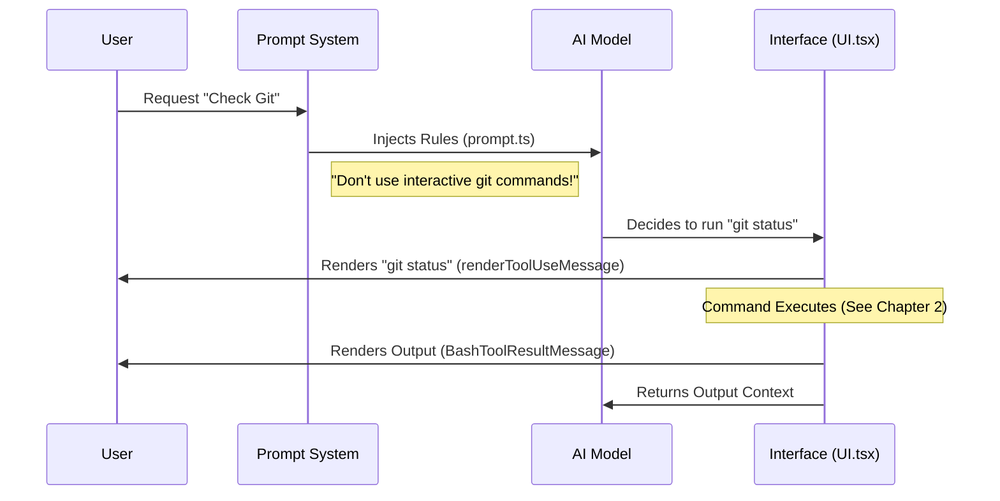

# Chapter 1: Tool Interface & Feedback

Welcome to the **BashTool** project! 

Imagine you are building a robot that can type into your computer's terminal. Before you let it loose, two things are critical:
1.  **The Manual:** The robot needs to know what it is allowed to do (e.g., "Don't delete my photos!").
2.  **The Dashboard:** You (the human) need to see exactly what the robot is typing and reading.

In the **BashTool** architecture, this is the **Tool Interface & Feedback** layer. It bridges the gap between the raw logic of the AI, the safety rules of the system, and the eyes of the user.

## The Motivation: Why do we need this?

If we just gave an AI a raw connection to a shell like `bash`, it might try to open a text editor like `vim` (which requires keyboard interaction and would hang the system) or delete files without asking.

**The Use Case:** 
The user asks: *"Check the git status of my project."*

Without this layer:
*   The AI might try to run `git commit` immediately without checking rules.
*   The terminal output might be hidden from the user until the process finishes.

**With this layer:**
1.  The AI reads the **System Prompt** and knows it must use `git status` first.
2.  The **UI** shows the user the command `git status` is running.
3.  The **Feedback** system formats the output clearly so both the AI and the user can read it.

---

## Part 1: The AI's Instruction Manual (System Prompt)

The first part of the interface is the **System Prompt**. This is defined in `prompt.ts`. It acts as a set of rules injected into the AI's context before it even begins.

### Defining "Rules of Engagement"
The prompt tells the AI which commands are "illegal" because they don't work well in an automated environment (like interactive editors).

```typescript
// From file: prompt.ts
const toolPreferenceItems = [
  `Read files: Use ${FILE_READ_TOOL_NAME} (NOT cat/head/tail)`,
  `Edit files: Use ${FILE_EDIT_TOOL_NAME} (NOT sed/awk)`,
  'Communication: Output text directly (NOT echo/printf)',
]
```

**Explanation:**
Here, we explicitly tell the AI **not** to use `cat` or `sed`. Why? because we have dedicated, safer tools for reading and editing files. This guides the AI to behave correctly.

### Handling Git Safely
One of the most dangerous things an AI can do is mess up your version control. The prompt includes specific "Git Safety Protocols."

```typescript
// From file: prompt.ts
const gitSubitems = [
  'Prefer to create a new commit rather than amending an existing commit.',
  'Never skip hooks (--no-verify) unless the user has explicitly asked.',
  'If a hook fails, investigate and fix the underlying issue.',
]
```

**Explanation:**
These instructions prevent the AI from "force pushing" or destroying your commit history. It forces the AI to "think" like a careful developer.

---

## Part 2: The User's Dashboard (The UI)

While the Prompt is for the AI, the **UI** (User Interface) is for *you*. This is handled primarily in `UI.tsx` and `BashToolResultMessage.tsx`.

### Visualizing the Command
When the AI decides to run a command, we don't just want it to happen silently. We want to see it.

```typescript
// From file: UI.tsx
export function renderToolUseMessage(input: Partial<BashToolInput>, options) {
  const { command } = input;
  if (!command) return null;

  // If the command is too long, we truncate it visually
  if (command.length > MAX_COMMAND_DISPLAY_CHARS) {
     return <Text>{command.slice(0, 160).trim()}…</Text>;
  }
  return command;
}
```

**Explanation:**
This component takes the raw command string. If the AI tries to run a massive script, the UI truncates it (adds `...`) so your screen isn't flooded, while still letting you know something is happening.

### Displaying Output (Stdout vs Stderr)
When the command finishes, we get a result. This might be success text (`stdout`) or error text (`stderr`). We need to color-code this so the user spots errors instantly.

```tsx
// From file: BashToolResultMessage.tsx
// (Simplified logic)
return (
  <Box flexDirection="column">
    {/* Render Standard Output in default color */}
    {stdout !== "" ? <OutputLine content={stdout} verbose={verbose} /> : null}
    
    {/* Render Errors in Red (isError=true) */}
    {stderr.trim() !== "" ? 
      <OutputLine content={stderr} verbose={verbose} isError={true} /> 
    : null}
  </Box>
);
```

**Explanation:**
This React component receives the tool's output. It checks if there is `stderr` (error output). If so, it passes `isError={true}` to the `OutputLine` component, which likely turns the text red in the terminal.

---

## Part 3: Internal Flow

How does the data flow from the prompt to the screen?



### Sandbox Violations (Feedback)
Sometimes, the AI tries to do something forbidden, like accessing a system file outside the allowed directory. The Interface layer catches this output and cleans it up for the user.

```typescript
// From file: BashToolResultMessage.tsx
function extractSandboxViolations(stderr: string) {
  // Look for specific tags we inject during execution
  const violationsMatch = stderr.match(/<sandbox_violations>(.*?)<\/sandbox_violations>/);
  
  // Return cleaned error for display, but keep violations for logic
  return {
    cleanedStderr: removeSandboxViolationTags(stderr).trim()
  };
}
```

**Explanation:**
If the underlying system detects a safety violation (which we will cover in [Permission Orchestration](03_permission_orchestration.md)), it adds XML tags to the error message. This UI helper strips those ugly tags out so the user sees a clean error message, while the system still knows what went wrong.

---

## Putting it all together: The "Waiting" State

What happens if a command takes a long time? The UI layer handles "Queued" and "Progress" states to reassure the user the system hasn't crashed.

```tsx
// From file: UI.tsx
export function renderToolUseQueuedMessage(): React.ReactNode {
  return (
    <MessageResponse height={1}>
      <Text dimColor>Waiting…</Text>
    </MessageResponse>
  );
}
```

**Explanation:**
This simple component provides immediate visual feedback. "dimColor" is used to make it unobtrusive.

## Conclusion

In this chapter, we learned that the **BashTool** isn't just about running code; it's about **communication**.
1.  **prompt.ts** communicates safety and syntax rules to the AI.
2.  **UI.tsx** communicates intent and status to the Human.
3.  **BashToolResultMessage.tsx** communicates the final result cleanly.

Now that we know *how* the tool looks and *what* rules it follows, we need to understand how it actually processes the text commands the AI generates.

[Next Chapter: Command Semantics & Parsing](02_command_semantics___parsing.md)

---

Generated by [Code IQ](https://github.com/adityasoni99/Code-IQ)