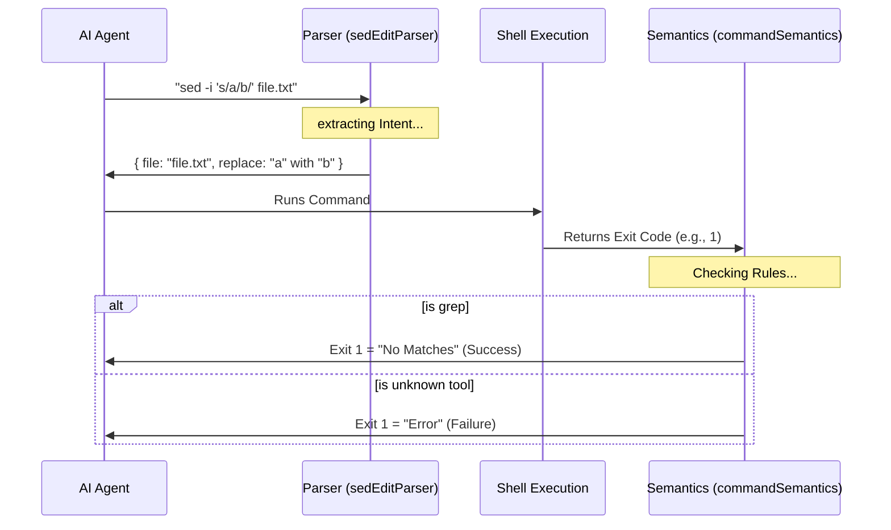

# Chapter 2: Command Semantics & Parsing

Welcome back! In [Chapter 1: Tool Interface & Feedback](01_tool_interface___feedback.md), we built the dashboard that lets us see what the AI is doing. We learned how to display commands and capture their output.

But there is a problem. Computers and humans speak different languages when it comes to "success" and "failure."

## The Motivation: The "Grep" Problem

Imagine the AI wants to search for a specific word in a file using `grep`.

**The Scenario:**
1.  AI runs: `grep "super_secret_password" config.txt`
2.  The file does *not* contain that word.
3.  The `grep` tool finishes and returns an **Exit Code of 1**.

**The Problem:**
In the world of shells (Bash), an Exit Code of `0` usually means "Success," and anything else (like `1`) usually means "Fatal Error."

If we don't translate this, our tool will scream **"COMMAND FAILED!"** just because the AI didn't find the text it was looking for. We need a "translator" that understands that for `grep`, a `1` just means "No matches found," not "The system exploded."

This layer is the **Command Semantics & Parsing** layer.

---

## Part 1: Command Semantics ( The Translator)

We need to teach our tool the "personality" of different shell commands. We do this by mapping commands to specific rules in `commandSemantics.ts`.

### The Default Rule
Most commands follow the standard rule: `0` is good, anything else is bad.

```typescript
// From commandSemantics.ts
const DEFAULT_SEMANTIC = (exitCode, _stdout, _stderr) => ({
  // If exitCode is NOT 0, it is an error
  isError: exitCode !== 0,
  message: exitCode !== 0 
    ? `Command failed with exit code ${exitCode}` 
    : undefined,
})
```
**Explanation:**
This is the fallback. If we don't know the command, we assume that any non-zero exit code is a failure.

### The Specialized Rules
Now, let's look at how we handle `grep`. We create a specific rule that says: "Exit code 1 is okay."

```typescript
// From commandSemantics.ts
const COMMAND_SEMANTICS = new Map([
  ['grep', (exitCode, _stdout, _stderr) => ({
    // It is only a REAL error if code is 2 or higher
    isError: exitCode >= 2,
    // If code is 1, return a helpful message, not an error
    message: exitCode === 1 ? 'No matches found' : undefined,
  })],
  // ... maps continue for other tools like 'diff' or 'find'
]);
```
**Explanation:**
Here we define the "personality" of `grep`.
*   **0:** Found matches (Success).
*   **1:** No matches (Not an error, just empty results).
*   **2+:** Actual error (Syntax error, file not found, etc).

### Interpreting the Result
When a command finishes, we pass the raw data through this logic:

```typescript
export function interpretCommandResult(cmd, exitCode, stdout, stderr) {
  // 1. Find the rule (use grep's rule or default)
  const semantic = getCommandSemantic(cmd);
  
  // 2. Run the rule
  const result = semantic(exitCode, stdout, stderr);

  // 3. Return structured data
  return { isError: result.isError, message: result.message };
}
```
**Explanation:**
This function acts as the bridge. It takes the confusing numbers from the shell and converts them into a clear `isError: true/false` boolean that our application can understand.

---

## Part 2: Parsing Complex Commands (The `sed` Example)

Sometimes, understanding the *exit code* isn't enough. We need to understand the *intent* of the command text itself.

The tool `sed` is a stream editor. It is powerful but looks very cryptic:
`sed -i 's/cat/dog/g' pet_store.txt`

If we just show that string to a beginner user, they might be scared. We want to parse this so we can say:
> "Editing **pet_store.txt**: Replacing **cat** with **dog**."

### Extracting Intent
In `sedEditParser.ts`, we break down that string to find the structured data.

```typescript
// From sedEditParser.ts
export function parseSedEditCommand(command: string) {
  // Check if it's a sed command
  if (!command.trim().startsWith('sed')) return null;

  // ... (Complex parsing logic omitted for brevity) ...

  // Returns an object we can easily read
  return {
    filePath: 'pet_store.txt',
    pattern: 'cat',
    replacement: 'dog',
    flags: 'g'
  };
}
```
**Explanation:**
This parser looks at the raw command string. It extracts the **File Path** (what are we touching?), the **Pattern** (what are we looking for?), and the **Replacement** (what are we changing it to?).

### Why is this "Beginner Friendly"?
Because now, instead of executing a "black box" command, we can:
1.  **Validate it:** Ensure the AI isn't using dangerous regex that hangs the system.
2.  **Preview it:** Show the user exactly what will change before they click "Approve."

---

## Part 3: Internal Flow

How does a command travel from a raw string to a meaningful result?



### Safety and "Sanitization"
One tricky part of parsing `sed` commands is dealing with **Regular Expressions** (regex). Different systems handle special characters differently.

Our parser handles the translation between `sed` syntax (BRE) and JavaScript regex to ensure the preview matches reality.

```typescript
// From sedEditParser.ts
export function applySedSubstitution(content, sedInfo) {
  // Convert sed pattern to JavaScript regex
  // Example: converting sed's "\+" to JS's "+"
  let jsPattern = sedInfo.pattern.replace(/\\\+/g, '+'); 
  
  // Create a real JS RegExp object
  const regex = new RegExp(jsPattern, 'g');
  
  // Return the new file content string
  return content.replace(regex, sedInfo.replacement);
}
```
**Explanation:**
This function allows us to simulate the edit in memory. We can apply the change to the file content inside our code *without* actually writing to the disk yet. This is crucial for the "Read-Only" analysis we will do in later chapters.

---

## Summary

In this chapter, we learned that running a command is more than just typing text and hitting enter.

1.  **Semantics (`commandSemantics.ts`):** We act as a translator. We know that `grep` returning `1` is fine, but `ls` returning `1` is bad. This prevents false alarms.
2.  **Parsing (`sedEditParser.ts`):** We act as an investigator. We break down cryptic strings like `sed` into structured data (File, Pattern, Replacement) so we can understand and preview the AI's intent.

Now that we understand *what* the command means and *if* it succeeded, we need to decide if the AI is actually **allowed** to run it in the first place.

[Next Chapter: Permission Orchestration](03_permission_orchestration.md)

---

Generated by [Code IQ](https://github.com/adityasoni99/Code-IQ)