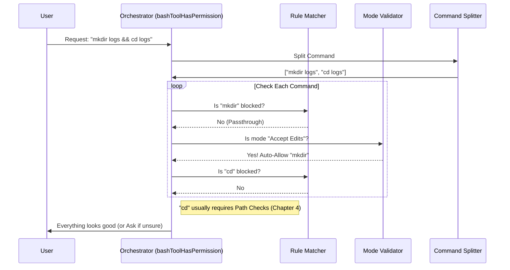

# Chapter 3: Permission Orchestration

Welcome back! 

In [Chapter 2: Command Semantics & Parsing](02_command_semantics___parsing.md), we taught our robot to understand what a command *means* (e.g., translating `grep` exit codes).

However, knowing **how** to run a command is different from being **allowed** to run it. Just because the AI knows how to run `rm -rf /` (delete everything) doesn't mean it should!

## The Motivation: The "Open Door" Problem

Without a security layer, the BashTool is an "Open Door." The AI could accidentally overwrite your work or access private SSH keys. We need a system that pauses execution and asks the user: *"The AI wants to run `git push`. Is this okay?"*

But we don't want to nag the user for *every* little thing. If you've already said "Always allow `ls`," the tool should remember that.

This is **Permission Orchestration**. It is the Chief Security Officer (CSO) of the application.

---

## Part 1: The Chief Security Officer (CSO)

The file `bashPermissions.ts` contains the main logic. Think of the function `bashToolHasPermission` as a security guard standing at the door. Every command must pass through here.

The CSO follows a strict checklist:
1.  **The Guest List:** Is this command explicitly allowed or denied by the user?
2.  **The Weapon Scan:** Does the command contain hidden, dangerous code?
3.  **Department Rules:** Are we in a special mode (like "Fixing Code") that auto-allows things?
4.  **Sub-Contractors:** If it's a complex command (like `A && B`), check `A` and `B` separately.

---

## Part 2: The Guest List (Rule Matching)

Before analyzing what the command does, the system checks if you (the user) have already made a decision about it in the past.

This happens in `bashToolCheckExactMatchPermission`.

```typescript
// From bashPermissions.ts (Simplified)
export const bashToolCheckExactMatchPermission = (input, context) => {
  const command = input.command.trim();
  
  // 1. Check if the user explicitly DENIED this before
  if (isRuleDenied(command)) {
    return { behavior: 'deny', message: 'Denied by rule' };
  }

  // 2. Check if the user explicitly ALLOWED this before
  if (isRuleAllowed(command)) {
    return { behavior: 'allow', updatedInput: input };
  }

  // 3. Otherwise, we don't know yet
  return { behavior: 'passthrough' };
}
```

**Explanation:**
*   **Deny:** If you blocked `curl` previously, the tool stops immediately.
*   **Allow:** If you trusted `git status`, the tool waves it through.
*   **Passthrough:** If there is no rule, the CSO moves to the next check.

---

## Part 3: The Weapon Scan (Safety & Injection)

Hackers (or confused AI models) often try to hide commands inside other commands using "Command Injection."
Example: `echo "Hello" ; rm -rf /`

To a naive system, this looks like an `echo` command. But the `;` separator means it will run `echo`, and then immediately run `rm`.

The Orchestrator uses an **Abstract Syntax Tree (AST)** parser (from Chapter 2) to see the *structure* of the command, not just the text.

```typescript
// From bashPermissions.ts (Simplified Logic)
async function bashToolHasPermission(input, context) {
  // Parse the command structure
  const astResult = await parseCommandRaw(input.command);

  // If the structure is too complex or weird (like hidden subshells)
  if (astResult.kind === 'too-complex') {
    return {
      behavior: 'ask', // Force the user to review it
      reason: 'Command structure is too complex to verify safely'
    };
  }
  
  // ... continue to other checks ...
}
```

**Explanation:**
If the tool cannot 100% guarantee the command structure is simple and safe, it forces an **"Ask"** behavior. It's better to be safe and annoy the user than to let a hidden command run.

---

## Part 4: Department Rules (Modes)

Sometimes, you want the AI to work faster. If you are in **"Accept Edits"** mode, you expect the AI to create and modify files. You don't want to click "Approve" for every `touch` or `mkdir`.

This logic lives in `modeValidation.ts`.

```typescript
// From modeValidation.ts
const ACCEPT_EDITS_ALLOWED = ['mkdir', 'touch', 'rm', 'mv', 'cp'];

function validateCommandForMode(cmd, context) {
  const baseCmd = getBaseCommand(cmd); // e.g. "mkdir"

  // If we are in "Accept Edits" mode, auto-allow file tools
  if (context.mode === 'acceptEdits' && ACCEPT_EDITS_ALLOWED.includes(baseCmd)) {
    return {
      behavior: 'allow',
      decisionReason: { type: 'mode', mode: 'acceptEdits' }
    };
  }

  return { behavior: 'passthrough' };
}
```

**Explanation:**
The Orchestrator delegates to `checkPermissionMode`. If the mode matches the command type (e.g., filesystem operations), it stamps "Approved" automatically.

---

## Part 5: Handling Complex Commands (Splitting)

What happens if the AI tries to run:
`cd src && git status`

This is actually **two** commands.
1.  `cd src`
2.  `git status`

The Orchestrator splits these up and checks them individually.

```typescript
// From bashPermissions.ts (Simplified)
const subcommands = splitCommand(input.command); // ["cd src", "git status"]

// Check every single part
for (const sub of subcommands) {
  const result = await checkCommand(sub);
  
  if (result.behavior === 'deny') return result; // Stop if ANY part is bad
  if (result.behavior === 'ask') askUser = true; // Mark that we need to ask
}

if (askUser) {
  return { behavior: 'ask', message: 'Multiple commands need approval' };
}
```

**Explanation:**
If *any* part of the chain is denied, the whole thing fails. If *any* part needs permission, the user is prompted. This ensures a dangerous command can't sneak in behind a safe one.

---

## Part 6: Internal Flow

How does the data flow through the CSO?



## Summary

In this chapter, we learned about **Permission Orchestration**, the central nervous system of BashTool security.

1.  **The CSO (`bashPermissions.ts`):** The main function that coordinates everything.
2.  **The Guest List:** We respect user rules (Allow/Deny) first.
3.  **Command Splitting:** We break complex chains (`&&`, `;`) into small pieces to check them individually.
4.  **Modes (`modeValidation.ts`):** We allow specific commands automatically if the user has enabled a specific workflow (like Editing).

However, we have skipped one major detail. What if the command is allowed (`cat file.txt`), but the **file itself** is outside the allowed folder?

That requires a specialized inspection of file paths.

[Next Chapter: Path & Filesystem Constraints](04_path___filesystem_constraints.md)

---

Generated by [Code IQ](https://github.com/adityasoni99/Code-IQ)