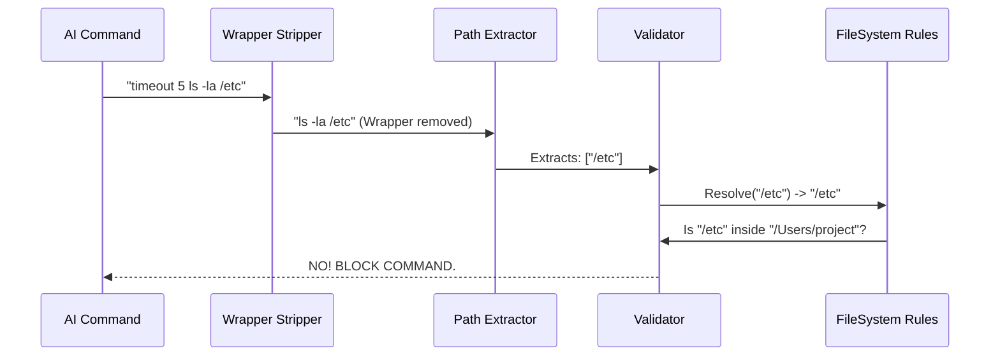

# Chapter 4: Path & Filesystem Constraints

Welcome back! In [Chapter 3: Permission Orchestration](03_permission_orchestration.md), we built the "Security Guard" that decides *which commands* are allowed (e.g., "Yes, you can use `ls`", "No, you cannot use `curl`").

However, there is a massive loophole in that logic.

## The Motivation: The "Hotel Key" Analogy

Imagine giving a hotel guest a key card. You tell them: *"You are allowed to **Open Doors**."*
If you don't restrict **which** doors, they might open the Master Suite, the boiler room, or the safe!

**The Use Case:**
You are working on a project in `/Users/me/my-website`.
1.  **Safe:** The AI runs `rm ./cache.log`. (Deleting a temp file in your project).
2.  **Dangerous:** The AI runs `rm /etc/hosts`. (Deleting a core system file).

Both commands use `rm`. Both passed the Chapter 3 check. But the second one could destroy your computer.

We need an **Electric Fence**. We need a layer that says: *"I don't care what command you are running. If it touches a file outside the project folder, STOP."*

This is the **Path & Filesystem Constraints** layer.

---

## Part 1: How it Works (The Concept)

This layer doesn't look at the command name; it looks at the **arguments**.

### 1. The Allowed Zone
We define a "Safe Zone," usually the Current Working Directory (CWD) where the project lives.
*   **Allowed:** `/Users/me/project`
*   **Allowed:** `/Users/me/project/src`

### 2. Path Resolution (The "Dot Dot" Attack)
Hackers (or confused AIs) try to escape the fence using relative paths:
`cat /Users/me/project/../../etc/passwd`

A naive check sees `/Users/me/project` at the start and thinks it's safe. But `..` means "go up a folder." Two "ups" land you in the root directory!

Our system **resolves** the path first. It calculates the *actual* final destination before checking if it's safe.

---

## Part 2: Extracting Paths from Chaos

Commands are messy. Some parts are files, some are flags (options). We need to extract only the file paths.

This logic lives in `pathValidation.ts`.

### The Path Extractors
Different commands handle files differently. We have specific rules for each tool.

```typescript
// From pathValidation.ts
export const PATH_EXTRACTORS = {
  // 'ls' takes flags (-l, -a) and paths. We want the paths.
  ls: args => {
    // Remove things starting with '-'
    const paths = filterOutFlags(args); 
    // If no path is typed, it implies current directory '.'
    return paths.length > 0 ? paths : ['.'];
  },

  // 'cp' (copy) takes two paths: Source and Destination
  cp: filterOutFlags, 
  
  // 'cd' is special: it changes the Safe Zone itself!
  cd: args => (args.length === 0 ? [homedir()] : [args.join(' ')]),
};
```

**Explanation:**
*   `ls -la src/`: The extractor removes `-la` and keeps `src/`.
*   `ls`: The extractor sees nothing, so it defaults to `.` (current folder), which is safe to check.

### Dealing with "Wrappers" (Peeling the Onion)
Sometimes commands are wrapped inside other commands, like `timeout` (which stops a command if it takes too long).

Command: `timeout 10 rm -rf /`

If we just check `timeout`, we might say "That's not a filesystem command, pass it through!" That would be a disaster. We need to strip the wrapper.

```typescript
// From pathValidation.ts (Simplified)
export function stripWrappersFromArgv(argv: string[]): string[] {
  let a = argv;
  // Loop until we peel off all wrappers
  while (true) {
    if (a[0] === 'timeout') {
       // Skip 'timeout' and the duration (e.g., '10')
       // Return the rest: ['rm', '-rf', '/']
       a = sliceAfterTimeoutArgs(a);
    } 
    else if (a[0] === 'sudo') {
       // Logic to strip sudo...
    }
    else {
      return a; // No more wrappers, this is the real command
    }
  }
}
```

**Explanation:**
This function peels the command like an onion until it finds the *actual* tool running (in this case, `rm`). Then we extract paths from *that*.

---

## Part 3: The Validation Logic

Once we have the raw path (e.g., `../../secret.txt`), we validate it.

```typescript
// From pathValidation.ts (Simplified)
function validatePath(userPath, cwd, allowedContext) {
  // 1. Resolve to absolute path (No more ".." tricks)
  const resolvedPath = path.resolve(cwd, userPath);
  
  // 2. check if it starts with any allowed directory
  const isAllowed = allowedContext.directories.some(dir => 
    resolvedPath.startsWith(dir)
  );

  if (!isAllowed) {
    return {
      allowed: false,
      reason: `Blocked: ${resolvedPath} is outside the allowed zone.`
    };
  }
  
  return { allowed: true };
}
```

**Explanation:**
1.  **Resolve:** We convert relative paths to the full system path.
2.  **Check:** We perform a simple string check. If the file path doesn't start with the project folder path, it is rejected.

---

## Part 4: Internal Flow

How does the data flow when the AI tries to run a command?



### Handling Redirections (`>`)
Even safe commands can be dangerous if redirected.
`echo "hello" > /etc/system_config`

We must check the redirection target too.

```typescript
// From pathValidation.ts
function validateOutputRedirections(redirections, cwd, context) {
  for (const { target } of redirections) {
    // /dev/null is the trash can, it's always safe
    if (target === '/dev/null') continue;

    // Check the file we are writing to
    const result = validatePath(target, cwd, context);
    
    if (!result.allowed) {
      return { behavior: 'ask', message: 'Redirection blocked!' };
    }
  }
}
```

**Explanation:**
If the command uses `>` or `>>`, we treat the target file exactly like an argument to `rm` or `cp`. It must be inside the safe zone.

---

## Part 5: Dangerous Removals (`rm -rf /`)

There is one specific case where being "inside the allowed zone" isn't enough. What if the user sets their allowed zone to `/` (Root) by mistake?

We have a hard-coded safety net for `rm` and `rmdir`.

```typescript
// From pathValidation.ts
function checkDangerousRemovalPaths(command, args, cwd) {
  // Extract paths normally
  const paths = PATH_EXTRACTORS[command](args);

  for (const path of paths) {
    const absolutePath = resolve(cwd, path);

    // Hard check against a list of system critical folders
    if (isDangerousRemovalPath(absolutePath)) {
      return {
        behavior: 'ask', // ALWAYS ask the user
        message: `Dangerous operation detected on ${absolutePath}`
      };
    }
  }
  return { behavior: 'passthrough' };
}
```

**Explanation:**
Even if the user *permissions* say "Allow everything," this function acts as a fail-safe. It detects if you are trying to delete your Desktop, Home folder, or Root, and forces a manual confirmation prompt.

---

## Conclusion

In this chapter, we learned how to build an "Electric Fence" around the AI.

1.  **Wrappers:** We peel off tools like `timeout` to find the real command.
2.  **Extractors:** We pull file paths out of the command arguments.
3.  **Resolution:** We calculate where those paths *actually* go (resolving `..`).
4.  **Validation:** We ensure the final path is inside the project folder.

Now the AI can safely modify files, but only *your* files.

But wait... what if the AI modifies a file inside your project, but the **content** of the modification destroys your code? Or what if it simply reads a file but misses important information?

For that, we need to analyze **Read-Only** operations and perform safety analysis on the content itself.

[Next Chapter: Read-Only & Safety Analysis](05_read_only___safety_analysis.md)

---

Generated by [Code IQ](https://github.com/adityasoni99/Code-IQ)