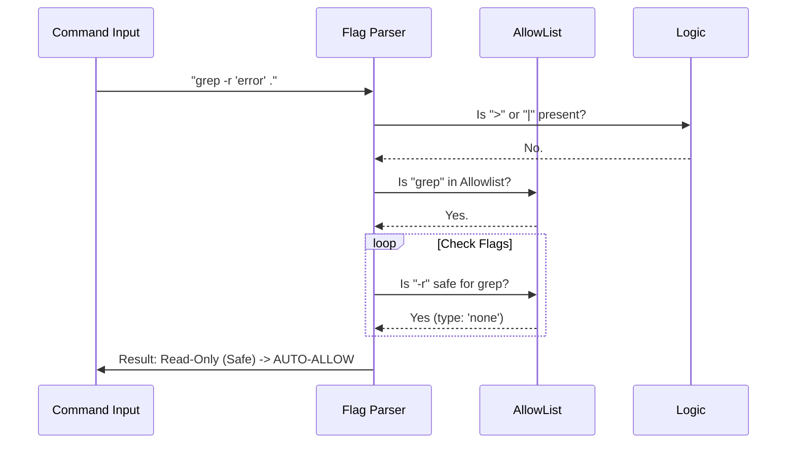

# Chapter 5: Read-Only & Safety Analysis

Welcome to the final chapter of the BashTool tutorial!

In the previous [Chapter 4: Path & Filesystem Constraints](04_path___filesystem_constraints.md), we built an "Electric Fence" around the project directory. We ensured the AI couldn't wander off into your system folders.

However, being in the "Safe Zone" isn't enough.
*   **Safe:** `git status` (Just looking).
*   **Dangerous:** `rm -rf *` (Deleting everything).

Both commands might happen inside the allowed project folder. But one is harmless, and the other is destructive.

## The Motivation: The "TSA Scanner"

Imagine you are at the airport.
1.  **Chapter 3 (Permissions)** verified your ticket (You are allowed to fly).
2.  **Chapter 4 (Paths)** verified your destination (You are going to the right place).
3.  **Chapter 5 (This Chapter)** is the **Luggage Scanner**.

We need to open up the command's "suitcase" (arguments and flags) to see what's inside.
*   Is it carrying a camera? (Read-only operations like `-l`, `--help`).
*   Is it carrying a weapon? (Destructive operations like `--force`, `-i` for overwrite).

This layer, **Read-Only & Safety Analysis**, allows us to **auto-approve** safe commands so the user doesn't get annoyed, while strictly flagging dangerous ones.

---

## Part 1: The Allowlist (The "Safe List")

The core of this system is a massive list of commands and flags that we *know* are safe. This logic resides in `readOnlyValidation.ts`.

We don't just guess; we define exactly what arguments are allowed for every tool.

### Defining a Safe Tool
Let's look at how we define safety for `grep` (a search tool).

```typescript
// From readOnlyValidation.ts
const COMMAND_ALLOWLIST = {
  grep: {
    safeFlags: {
      '-i': 'none',    // Case insensitive (Safe)
      '-c': 'none',    // Count results (Safe)
      '-r': 'none',    // Recursive (Safe)
      '--file': 'string' // Read patterns from a file (Safe)
    }
  },
  // ... other tools like ls, cat, date
};
```

**Explanation:**
*   **'none':** This flag takes no arguments (e.g., `grep -i`). It just changes the display mode.
*   **'string':** This flag takes a value (e.g., `grep --file=patterns.txt`). Since it reads a file, it is safe.
*   **Excluded:** Flags like `--output-file` (which might write data) are **not** in this list. If the AI tries to use them, the check fails.

---

## Part 2: Flag Parsing (The Inspection)

It is not enough to just check if the string contains `-i`. Bash is complex.
`grep -i` is safe.
`grep -i > file.txt` is **not** safe (it overwrites `file.txt`).

We use a function called `isCommandSafeViaFlagParsing` to break the command into tokens.

```typescript
// From readOnlyValidation.ts (Simplified)
export function isCommandSafeViaFlagParsing(command: string) {
  // 1. Break command into tokens: ["grep", "-i", "search", "file.txt"]
  const tokens = parseCommand(command);

  // 2. Check if there are dangerous operators like > or |
  if (tokens.includes('>')) return false;

  // 3. Check every flag against the allowlist
  return validateFlags(tokens);
}
```

**Explanation:**
1.  **Tokens:** We split the command cleanly so we don't get confused by spaces inside quotes.
2.  **Operators:** If we see a redirection (`>`), the command is automatically marked as "Not Read-Only."
3.  **Validation:** We compare every flag used against the `safeFlags` list we saw in Part 1.

---

## Part 3: Deep Inspection (The `sed` Case)

Some tools are "Swiss Army Knives." They can be safe or dangerous depending on how they are used.

Take `sed` (Stream Editor).
*   **Safe:** `sed -n 'p' file.txt` (Just prints the file to the screen).
*   **Dangerous:** `sed -i 's/foo/bar/' file.txt` (Edits the file in place).

We can't just ban `sed`. We need a specialized inspector. This lives in `sedValidation.ts`.

```typescript
// From sedValidation.ts
export function sedCommandIsAllowedByAllowlist(command, options) {
  // 1. Parse flags
  if (command.includes('-i')) {
    // If we are in "Read-Only" mode, -i is forbidden!
    if (!options.allowFileWrites) return false;
  }

  // 2. Check the internal sed expression
  const expression = extractSedExpression(command); // e.g., "s/foo/bar/"
  
  // 3. Look for dangerous commands inside the expression
  // 'w' writes to a file. 'e' executes a command.
  if (expression.includes('w ') || expression.includes('e ')) {
    return false;
  }

  return true;
}
```

**Explanation:**
*   We check the flags (`-i`).
*   We extract the actual code `sed` is running.
*   We scan that code for specific letters like `w` (write) or `e` (execute). If found, we treat it as a weapon and block it.

---

## Part 4: Destructive Warnings (The "Bomb Squad")

Sometimes a command is syntactically correct, allowed by permissions, and inside the right folder... but it is still a terrible idea.

We have a file called `destructiveCommandWarning.ts` that acts as a final sanity check. It looks for patterns known to cause tears.

```typescript
// From destructiveCommandWarning.ts
const DESTRUCTIVE_PATTERNS = [
  {
    // rm -rf is the classic "delete everything" command
    pattern: /rm\s+-[a-zA-Z]*f/, 
    warning: 'Note: may force-remove files',
  },
  {
    // git reset --hard destroys uncommitted work
    pattern: /git\s+reset\s+--hard/,
    warning: 'Note: may discard uncommitted changes',
  }
];
```

**Explanation:**
Even if the user said "Allow all `git` commands," if the system sees `git reset --hard`, it pauses. It injects a **Warning Message** into the permission dialog so the user thinks twice before clicking "Approve."

---

## Part 5: Internal Flow

How does the data flow when the AI tries to run a command like `grep -r "error" .`?



### What if it fails?
If a command fails this check (e.g., `grep -r "error" > log.txt`), it doesn't mean the command is *blocked*.
It simply means **"Not Read-Only."**

The system returns `behavior: 'passthrough'`. This tells the Permission Orchestrator (Chapter 3): *"I can't auto-approve this. You need to ask the human user for permission."*

---

## Conclusion

Congratulations! You have completed the **BashTool** architecture tutorial.

We have built a robust system that transforms a raw, dangerous shell into a safe tool for AI agents.

1.  **[Tool Interface](01_tool_interface___feedback.md):** We visualized what the robot is doing.
2.  **[Command Semantics](02_command_semantics___parsing.md):** We taught the robot to understand exit codes.
3.  **[Permission Orchestration](03_permission_orchestration.md):** We built a security guard to Allow/Deny commands.
4.  **[Path Constraints](04_path___filesystem_constraints.md):** We built an electric fence around the project folder.
5.  **[Safety Analysis](05_read_only___safety_analysis.md):** We built a scanner to inspect flags and detect bombs.

By combining these five layers, we ensure that the AI can be helpful without being harmful. It can search, read, and suggest changes, but it cannot delete your data or hijack your system without your explicit consent.

**End of Tutorial.**

---

Generated by [Code IQ](https://github.com/adityasoni99/Code-IQ)