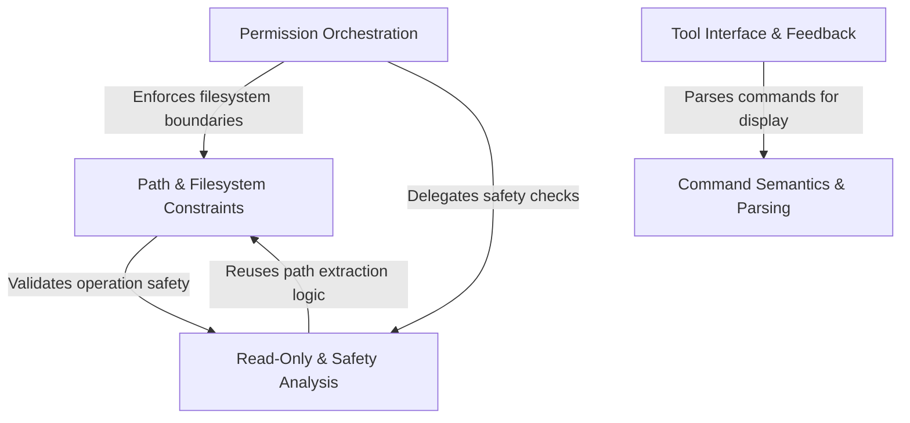

# Tutorial: BashTool

A secure execution environment for shell commands that acts as a **smart wrapper** around the system shell. It employs a central **security guard** to orchestrate permissions, validate paths against filesystem boundaries, and perform deep inspection of commands to prevent dangerous operations. The system also includes semantic parsing and a rich **user interface** to provide clear feedback and interpret command outcomes safely.

## Chapters

1. [Tool Interface & Feedback](01_tool_interface___feedback.md)
2. [Command Semantics & Parsing](02_command_semantics___parsing.md)
3. [Permission Orchestration](03_permission_orchestration.md)
4. [Path & Filesystem Constraints](04_path___filesystem_constraints.md)
5. [Read-Only & Safety Analysis](05_read_only___safety_analysis.md)

---

Generated by [Code IQ](https://github.com/adityasoni99/Code-IQ)