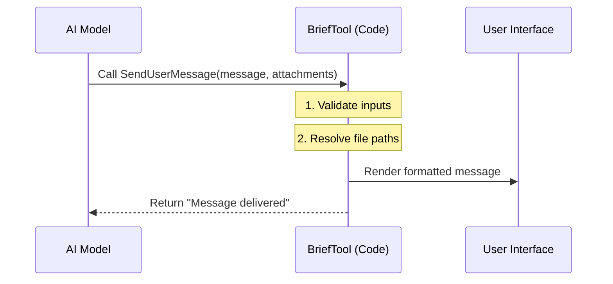

# Chapter 1: Primary Communication Channel (BriefTool)

Welcome to the `BriefTool` project! In this first chapter, we are going to look at the most fundamental part of an AI assistant: **how it speaks to you.**

## The Problem: The Chef vs. The Waiter

Imagine a busy restaurant.
*   **The Chef (Internal Monologue):** Inside the kitchen, the chef mutters, "Chopping carrots... boiling water... sauce is too salty." This is useful information for the cooking process, but you, the customer, don't need to hear it.
*   **The Waiter (Primary Communication):** The waiter walks out to your table, presents a plate, and says, "Here is your Dinner, enjoy."

In our system, the AI does a lot of "muttering" (running commands, checking files, debugging). If we showed all that raw text to the user as the main answer, it would be messy and confusing.

**BriefTool (technically named `SendUserMessage`) is the Waiter.** It is the specific tool the AI uses when it wants to formally address the user.

### Central Use Case
Imagine you ask the AI: *"Check the server logs and tell me what went wrong."*

1.  **Muttering:** The AI reads files, runs `grep`, and analyzes text. You might see these as small loading spinners or debug text.
2.  **BriefTool:** Once the AI finds the error, it uses BriefTool to say: *"I found a timeout error in `server.log`."* This is the message that actually appears in your chat bubble.

---

## Key Concept: The Message Structure

When the AI decides to speak, it doesn't just send a string of text. It sends a structured package. This ensures the message is formatted correctly and can carry extra items (like images or log files).

Here is the simplified structure of a message:

1.  **Message:** The actual text (supports Markdown like bolding and lists).
2.  **Attachments:** A list of files to show alongside the message.
3.  **Status:** The "vibe" of the message (is it a reply or an interruption?).

### How the AI uses it
To send a message, the AI calls the tool `SendUserMessage` with specific inputs.

```typescript
// Example Input: The AI sending a simple reply
{
  "message": "I updated the config file for you.",
  "status": "normal",
  "attachments": []
}
```

If the AI needs to be more complex, it can include a file path:

```typescript
// Example Input: Sending a reply with a file
{
  "message": "Here is the screenshot you asked for.",
  "status": "normal",
  "attachments": ["/users/me/desktop/screenshot.png"]
}
```

> **Note:** The `status` field helps the system understand the context. `normal` means "I am replying to you." `proactive` means "I am interrupting you to tell you something new" (like a background task finishing).

---

## How It Works Under the Hood

When the AI calls `SendUserMessage`, it triggers a specific flow in our code. It's not just printing text; it's a pipeline that validates data and prepares the UI.

### The Flow

Here is what happens when the AI "speaks":

1.  **AI** generates the tool call.
2.  **Validator** checks if the message is valid strings.
3.  **Attachment Logic** checks if the files actually exist.
4.  **UI Renderer** draws the chat bubble for the user.



### Code Deep Dive

Let's look at the actual code definition for this tool (simplified). This is defined in `BriefTool.ts`.

#### 1. Defining the Rules (Schema)
First, we define what valid inputs look like using a library called `zod`. This tells the AI exactly what arguments it is allowed to use.

```typescript
// From BriefTool.ts (Simplified)
const inputSchema = z.strictObject({
  // The main text content
  message: z.string().describe('The message for the user.'),
  
  // Optional list of file paths
  attachments: z.array(z.string()).optional(),
  
  // Intent: replying (normal) or interrupting (proactive)
  status: z.enum(['normal', 'proactive'])
})
```

*Explanation:* We force the AI to provide a `message` and a `status`. `attachments` are optional. If the AI tries to send a number instead of a string for the message, this schema will reject it.

#### 2. The Execution Logic
When the tool is called, the `call` function runs.

```typescript
// From BriefTool.ts (Simplified)
async call({ message, attachments, status }, context) {
  // Capture the exact time the message was sent
  const sentAt = new Date().toISOString()
  
  // Log analytics event (invisible to user)
  logEvent('tengu_brief_send', { proactive: status === 'proactive' })

  // If we have files, prepare them (Simplified)
  if (attachments && attachments.length > 0) {
      // Logic to check files happens here
  }

  // Return the data so the UI can use it
  return {
    data: { message, sentAt }
  }
}
```

*Explanation:*
1.  We stamp the time (`sentAt`).
2.  We log that a message occurred (useful for debugging).
3.  We pass the data back. Note that the actual *drawing* of the UI happens elsewhere, which we will cover in [Context-Aware UI Rendering](02_context_aware_ui_rendering.md).

#### 3. Resolving Attachments
You might notice we skipped over the heavy lifting of `attachments` in the code block above. Handling files is complex! We need to make sure the path is correct and the file isn't too big.

We will cover exactly how files are processed in [Attachment Resolution Pipeline](03_attachment_resolution_pipeline.md).

## Summary

In this chapter, we learned:
1.  **BriefTool** is the "Waiter" that delivers the final plate (message) to the user.
2.  It separates "internal muttering" from "user-facing communication."
3.  It uses a strict structure: `message`, `attachments`, and `status`.

But simply sending the data isn't enough. We need to make it look good on the screen.

**Next Step:** How do we take this raw data and turn it into a beautiful, interactive chat bubble?

[Next Chapter: Context-Aware UI Rendering](02_context_aware_ui_rendering.md)

---

Generated by [Code IQ](https://github.com/adityasoni99/Code-IQ)