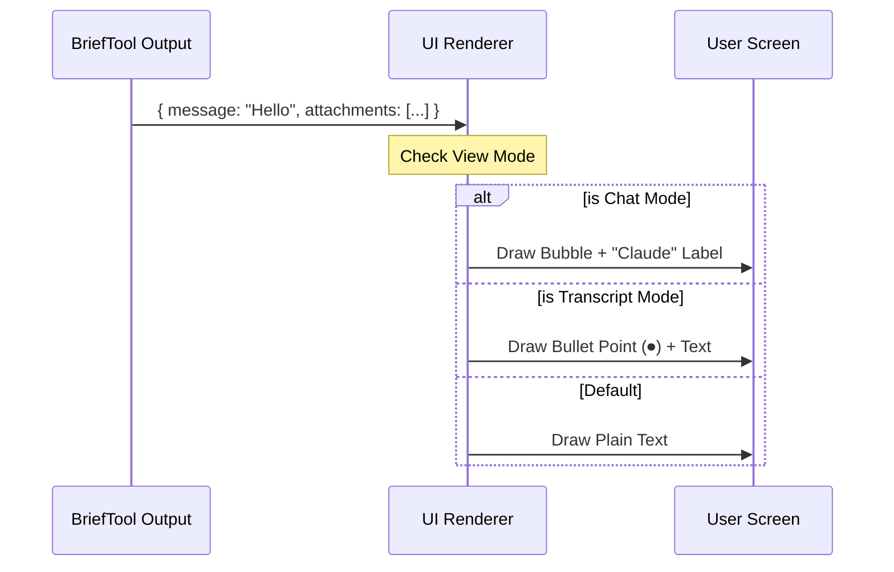

# Chapter 2: Context-Aware UI Rendering

In the previous chapter, [Primary Communication Channel (BriefTool)](01_primary_communication_channel__brieftool_.md), we learned how the AI acts like a "Waiter," using `BriefTool` to deliver a structured message containing text and attachments.

But a Waiter behaves differently depending on the setting. In a fancy dining room, they might use a silver platter. At a drive-through, they use a paper bag. The **food** (the data) is the same, but the **presentation** (the UI) changes completely.

This chapter explains **Context-Aware UI Rendering**: how `BriefTool` takes one message and magically changes its appearance to fit the user's current screen mode.

## The Problem: One Message, Many Contexts

Imagine the AI sends this message:
> "I have analyzed the error." (Attachment: `error.log`)

*   **Scenario A (Chat Mode):** You are chatting with the AI. You expect a speech bubble, a timestamp, and a name label ("Claude"), just like in WhatsApp or iMessage.
*   **Scenario B (Transcript Mode):** You are scrolling through a saved history of the day's work. You don't want wasted space; you want a compact, bulleted log entry.

If we hard-coded the UI to look like a Chat Bubble, the Transcript would look terrible. If we hard-coded it to look like a Log, the Chat would look boring.

**Context-Aware Rendering** solves this by separating the **Data** (what is said) from the **View** (how it looks).

### Central Use Case

We want to write a rendering function that takes the AI's output and behaves like a responsive website:

1.  **Input:** `{ message: "Done", sentAt: "10:00 PM" }`
2.  **Context:** `isChatMode = true`
3.  **Output:** A formatted chat bubble with indentation and a "Claude" label.

---

## How It Works: The Three View Modes

Our system supports three specific "vibes" (contexts). The renderer checks which flag is active and draws the corresponding UI.

### 1. The Transcript View (`isTranscriptMode`)
*   **Goal:** A permanent record.
*   **Visual Style:** Uses a bullet point (⏺) to visually distinguish the AI's final answer from its internal "muttering." It looks like a formal log entry.

### 2. The Chat View (`isBriefOnly`)
*   **Goal:** A conversational experience.
*   **Visual Style:** Adds a "Claude" label, a timestamp, and indentation. This mimics a standard messaging application.

### 3. The Default View
*   **Goal:** Minimalist integration.
*   **Visual Style:** Plain text. It removes the "Claude" label to avoid repetition if the AI speaks several times in a row. It is designed to blend into the command line flow.

---

## The Rendering Flow

When `BriefTool` finishes, it passes its data to the **UI Renderer**. The Renderer looks at the user's settings (the `options` object) to decide which "costume" to put on the message.



---

## Code Deep Dive

Let's look at the implementation in `UI.tsx`. We use a specific function called `renderToolResultMessage`.

> **Note:** We use a library called `Ink` (React for Command Line Interfaces) to draw the UI. `<Box>` is like a `<div>`, and `<Text>` is like a `<span>`.

### 1. The Guard Clause
First, we check if there is actually anything to show. If the message is empty and there are no files, we render nothing.

```typescript
// From UI.tsx
export function renderToolResultMessage(output, options) {
  const hasAttachments = (output.attachments?.length ?? 0) > 0;
  
  // If no text AND no files, don't draw anything
  if (!output.message && !hasAttachments) {
    return null;
  }
```

### 2. Rendering Transcript Mode
If the user is viewing the history log (`isTranscriptMode`), we draw a distinct Black Circle (`BLACK_CIRCLE`) next to the text.

```typescript
  if (options?.isTranscriptMode) {
    return (
      <Box flexDirection="row" marginTop={1}>
        <Box minWidth={2}>
          {/* This is the ⏺ bullet point */}
          <Text color="text">{BLACK_CIRCLE}</Text>
        </Box>
        {/* The actual content */}
        <Box flexDirection="column">
          <Markdown>{output.message}</Markdown>
          <AttachmentList attachments={output.attachments} />
        </Box>
      </Box>
    );
  }
```

### 3. Rendering Chat Mode
If we are in the interactive chat (`isBriefOnly`), we add style. We add padding to indent it and print the name "Claude" with the time.

```typescript
  if (options?.isBriefOnly) {
    const ts = formatBriefTimestamp(output.sentAt);
    return (
      <Box flexDirection="column" marginTop={1} paddingLeft={2}>
        <Box flexDirection="row">
          {/* The visual label */}
          <Text color="briefLabelClaude">Claude</Text>
          <Text dimColor> {ts}</Text>
        </Box>
        {/* The message content */}
        <Box flexDirection="column">
           <Markdown>{output.message}</Markdown>
           <AttachmentList attachments={output.attachments} />
        </Box>
      </Box>
    );
  }
```

### 4. Rendering Attachments
You noticed `<AttachmentList />` in the code above. This is a helper component that loops through the files and draws them with a small icon.

```typescript
// Simplified from UI.tsx
export function AttachmentList({ attachments }) {
  return (
    <Box flexDirection="column">
      {attachments.map(att => (
        <Box key={att.path}>
          {/* pointerSmall is a generic arrow icon */}
          <Text dimColor>{figures.pointerSmall} [file] </Text>
          <Text>{getDisplayPath(att.path)}</Text>
        </Box>
      ))}
    </Box>
  )
}
```

*Note:* This code only handles the **drawing** of the file list. The complex logic of verifying that these files actually exist and are safe to read is handled in the next chapter: [Attachment Resolution Pipeline](03_attachment_resolution_pipeline.md).

## Summary

In this chapter, we learned that raw data is not enough. To make a tool feel "native," it must adapt to the user's environment.

1.  **Transcript Mode** emphasizes structure (using bullet points).
2.  **Chat Mode** emphasizes conversation (using names and timestamps).
3.  **Default Mode** emphasizes flow (minimalism).

We have now covered how the AI **speaks** (Chapter 1) and how that speech **looks** (Chapter 2). But what happens when the AI wants to show you a file? It's not as simple as just printing the filename. We need to ensure the file exists, is readable, and isn't too huge.

**Next Step:** Let's look at how the system safely handles file references.

[Next Chapter: Attachment Resolution Pipeline](03_attachment_resolution_pipeline.md)

---

Generated by [Code IQ](https://github.com/adityasoni99/Code-IQ)