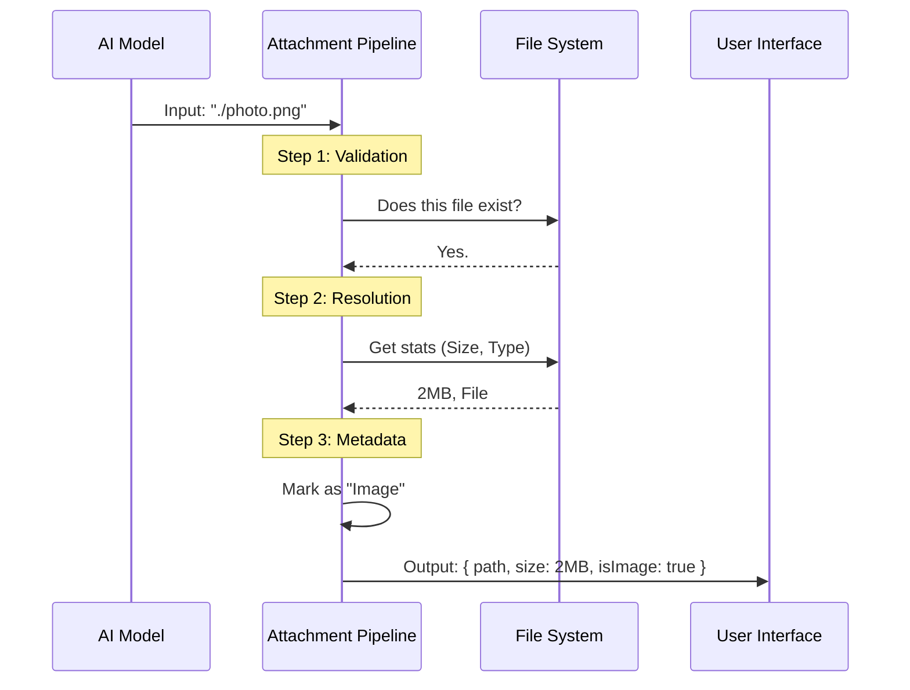

# Chapter 3: Attachment Resolution Pipeline

Welcome back! In the previous chapter, [Context-Aware UI Rendering](02_context_aware_ui_rendering.md), we learned how to make the AI's messages look good on screen. We discussed how `BriefTool` acts as a "Waiter" delivering a "Plate" (the message).

However, sometimes that plate contains more than just text—it contains **files**.

If the AI says, *"I have fixed the bug, see `server.log`,"* we have a potential problem. What if `server.log` doesn't exist? What if it's a folder, not a file? What if the user doesn't have permission to read it?

This chapter introduces the **Attachment Resolution Pipeline**. This is the safety checkpoint that validates files before they are presented to the user.

## The Problem: The "Blind" Waiter

Imagine the Waiter (the AI) tries to bring you a specific bottle of wine from the cellar.
1.  **Scenario A:** The bottle is missing. The Waiter walks to your table with empty hands and looks foolish.
2.  **Scenario B:** The bottle is actually a heavy keg that breaks the table.

The AI works with **text strings**, not physical objects. It knows the *name* of the file (`./data.csv`), but it doesn't instinctively know if that file is real, readable, or safe to open.

We need a **Postal Clerk**. Before the package leaves the back room, the Clerk checks:
1.  **Validation:** Does this address exist?
2.  **Resolution:** How heavy is the package? Is it a picture or a document?

### Central Use Case

**User:** *"Show me the error log."*
**AI (Internal):** *Calls BriefTool with attachment: `['./logs/error.txt']`*

**The Pipeline's Job:**
1.  Check if `./logs/error.txt` exists on the hard drive.
2.  Measure its size (e.g., 2KB).
3.  Determine if it is an image (No).
4.  Bundle these facts into a safe object for the UI.

---

## How It Works: The Pipeline Flow

The pipeline runs *immediately* after the AI tries to call the tool, but *before* the UI draws anything.



---

## Code Deep Dive

The logic for this lives in `attachments.ts`. We split the process into two distinct phases: **Validation** (Safety) and **Resolution** (Data Gathering).

### Phase 1: Validation (`validateAttachmentPaths`)

First, we must ensure the file is valid. If the file is missing, we don't want to crash the UI; we want to tell the AI, "Hey, you made a mistake."

We use the Node.js `stat` command, which asks the Operating System for file status.

```typescript
// From attachments.ts (Simplified)
export async function validateAttachmentPaths(rawPaths: string[]) {
  const cwd = getCwd() // Get current folder

  for (const rawPath of rawPaths) {
    // 1. Expand shortcuts (like turning "~" into "/Users/name")
    const fullPath = expandPath(rawPath)

    try {
      // 2. Ask the OS: "Is this real?"
      const stats = await stat(fullPath)
      
      // 3. Ensure it is a file, not a folder
      if (!stats.isFile()) {
        return { result: false, message: "Not a regular file." }
      }
    } catch (e) {
      // Handle errors below...
    }
  }
  return { result: true }
}
```

#### Handling Errors
If `stat` fails, it throws a specific error code. We catch these codes to give helpful feedback.

```typescript
    // Inside the catch block above...
    const code = getErrnoCode(e)

    // ENOENT = Error NO ENTry (File doesn't exist)
    if (code === 'ENOENT') {
      return { 
        result: false, 
        message: `Attachment "${rawPath}" does not exist.` 
      }
    }

    // EACCES = Error ACCESs (Permission denied)
    if (code === 'EACCES') {
      return { 
        result: false, 
        message: `Permission denied for "${rawPath}".` 
      }
    }
```
*Explanation:* If the Validation returns `false`, the tool call is rejected immediately. The AI receives the error message and can try again (perhaps by correcting the filename).

### Phase 2: Resolution (`resolveAttachments`)

Once we know the files *exist*, we need to gather details about them. The UI needs to know the file size (to display "2.5 MB") and whether it's an image (to decide if it should show a preview).

We transform the raw string path into a rich `ResolvedAttachment` object.

```typescript
// From attachments.ts (Simplified)
export async function resolveAttachments(rawPaths: string[]) {
  const stated = []

  for (const rawPath of rawPaths) {
    const fullPath = expandPath(rawPath)
    
    // We run stat again to get the data
    const stats = await stat(fullPath)

    stated.push({
      path: fullPath,
      size: stats.size, // e.g., 1024 bytes
      isImage: IMAGE_EXTENSION_REGEX.test(fullPath), // e.g., true for .png
    })
  }
  
  return stated
}
```

*Explanation:*
1.  **`path`**: The absolute path to the file.
2.  **`size`**: Used by the UI to show the user how big the file is.
3.  **`isImage`**: A simple regex check (does it end in `.png`, `.jpg`?). If true, the UI might render a thumbnail.

### The Resulting Data

After this pipeline finishes, the data passed to the UI looks like this:

```javascript
[
  {
    path: "/Users/alice/projects/logo.png",
    size: 204800,   // 200 KB
    isImage: true
  }
]
```

Now, the `AttachmentList` component we saw in [Chapter 2](02_context_aware_ui_rendering.md) has everything it needs to verify and draw the file safely!

---

## A Peek at Remote Attachments

You might notice a block of code in `attachments.ts` referencing `BRIDGE_MODE`.

```typescript
if (feature('BRIDGE_MODE')) {
   // Complex upload logic...
}
```

Sometimes, the AI is running on a cloud server, but the user is on a local laptop. In this case, simply verifying the file path isn't enough—the file needs to be **transported** across the network so the user can actually see it.

This process involves generating UUIDs, handling uploads, and security tokens. It is a complex topic, so we have dedicated the entire next chapter to it.

## Summary

In this chapter, we learned:
1.  **Raw strings are dangerous.** We can't trust that a file path from the AI is valid.
2.  **Validation** ensures the file exists and is readable using `fs.stat`.
3.  **Resolution** converts a simple string into a rich object with metadata (`size`, `isImage`).

The "Postal Clerk" has now stamped the package. It exists, it's safe, and we know how much it weighs.

But what if the recipient lives in a different country? How do we get the file from the AI's server to the user's browser?

**Next Step:** Learn how we securely move these resolved files across the network.

[Next Chapter: Bridge Upload Protocol](04_bridge_upload_protocol.md)

---

Generated by [Code IQ](https://github.com/adityasoni99/Code-IQ)