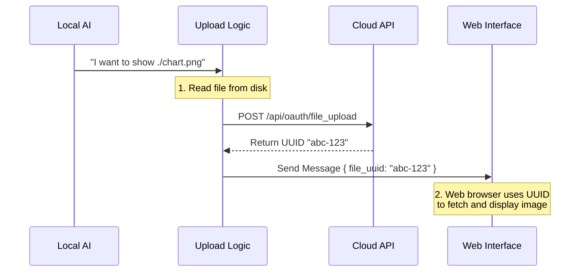

# Chapter 4: Bridge Upload Protocol

Welcome to Chapter 4!

In the previous chapter, [Attachment Resolution Pipeline](03_attachment_resolution_pipeline.md), we acted like a "Postal Clerk." We verified that the files the AI wanted to send actually existed on the hard drive and measured their size.

However, there is a catch.

What if the AI is running on your **local laptop**, but you are viewing the chat on a **web browser** (like the Anthropic Console)?

Your web browser cannot reach inside your laptop's hard drive to show you a picture. If the AI simply sends the text path `C:\Users\Me\photo.png`, the web browser will shrug and say, "I can't see that file."

This chapter introduces the **Bridge Upload Protocol**: the mechanism that transports local files to a secure cloud location so remote users can see them.

## The Problem: The "Air Gap"

Imagine you are talking to a friend on the phone.
1.  **You (Local AI):** "I found the photo! It's right here in my hand."
2.  **Friend (Remote Web UI):** "I can't see your hand. We are on the phone."

To show the photo, you must:
1.  Take a picture of it.
2.  Upload it to a cloud service (like Dropbox or Google Drive).
3.  Send your friend a unique link to view it.

This is exactly what the Bridge Upload Protocol does. It bridges the gap between the **Local File System** and the **Remote Web Interface**.

### Central Use Case

**Scenario:** The user asks the AI to generate a data visualization.
1.  **AI:** Generates `chart.png` on the local machine.
2.  **Problem:** The user is on the web; they can't see the local file.
3.  **Bridge:** Automatically uploads `chart.png` to a private API.
4.  **Result:** The system receives a **UUID** (a unique ID key).
5.  **UI:** The web interface uses the UUID to download and display the image.

---

## How It Works: The Secure Drop-Box

Think of the Bridge Protocol as a secure drop-box service.

1.  **Validation:** The AI checks if the file exists (we did this in Chapter 3).
2.  **Upload:** The AI sends the file data to the `private_api` endpoint.
3.  **Exchange:** The API accepts the file and returns a **`file_uuid`**.
4.  **Delivery:** The AI sends a message to the UI saying: *"Here is an attachment with ID `123-abc`."*
5.  **Viewing:** The UI asks the API, *"Give me the file for ID `123-abc`,"* and displays it.

> **Key Concept: Graceful Degradation**
> If the upload fails (no internet, file too big), the system doesn't crash. It simply falls back to showing the text path (`./chart.png`). The user sees the filename, just not the preview image.

---

## The Workflow

Here is the sequence of events when the AI decides to show a file in "Bridge Mode."



---

## Code Deep Dive

Let's look at how this is implemented. The logic is split into two parts: **Triggering the Upload** and **Performing the Upload**.

### Part 1: Triggering the Upload (`attachments.ts`)

In Chapter 3, we looked at `resolveAttachments`. We deliberately skipped the upload section. Let's look at it now.

We use a feature flag `BRIDGE_MODE`. We only attempt to upload if the system is running in a connected environment (like the CLI tool connected to the web).

```typescript
// From attachments.ts (Simplified)
if (feature('BRIDGE_MODE')) {
  // 1. Import the upload logic dynamically
  const { uploadBriefAttachment } = await import('./upload.js')

  // 2. Upload all files in parallel
  const uuids = await Promise.all(
    stated.map(file => uploadBriefAttachment(file.path, file.size, context))
  )

  // 3. Attach the UUIDs to the file objects
  return stated.map((file, index) => ({
    ...file, 
    file_uuid: uuids[index] // Attach the ticket number!
  }))
}
```

*Explanation:*
1.  We check if `BRIDGE_MODE` is active.
2.  We call `uploadBriefAttachment` for every file.
3.  We receive a list of UUIDs (or `undefined` if an upload failed).
4.  We add the `file_uuid` to the object we send to the UI.

### Part 2: Performing the Upload (`upload.ts`)

This file handles the heavy lifting: reading the file, handling authentication, and sending it over the network.

#### 1. Security Check
Before uploading, we need permission. We check for an OAuth token.

```typescript
// From upload.ts (Simplified)
export async function uploadBriefAttachment(fullPath, size, ctx) {
  // Safety Check: Is the bridge enabled?
  if (!ctx.replBridgeEnabled) return undefined

  // Security Check: Do we have a token?
  const token = getBridgeAccessToken()
  if (!token) {
    debug('skip: no oauth token')
    return undefined
  }
  
  // Size Check: Is it under 30MB?
  if (size > 30 * 1024 * 1024) return undefined
  
  // ... proceed to upload
}
```

*Explanation:* If the user isn't logged in (no token), or the file is massive (over 30MB), we skip the upload. We don't throw an error; we just return `undefined`.

#### 2. Preparing the Package
We need to format the file for the web. We guess the "MIME type" (is it a PNG image or a text file?) and create a package.

```typescript
// From upload.ts (Simplified)
// Read the file from the local disk
const content = await readFile(fullPath)

// Guess the type based on extension
// e.g., ".png" -> "image/png"
const mimeType = guessMimeType(filename)

// Create the URL for the API
const url = `${baseUrl}/api/oauth/file_upload`
```

#### 3. Sending the Request
Finally, we use `axios` to push the data to the cloud.

```typescript
// From upload.ts (Simplified)
try {
  // Send the POST request
  const response = await axios.post(url, body, {
    headers: { Authorization: `Bearer ${token}` }
  })

  // If successful (HTTP 201 Created), get the UUID
  if (response.status === 201) {
    return response.data.file_uuid // Success!
  }
} catch (e) {
  // If anything goes wrong, return undefined
  return undefined
}
```

*Explanation:* This is a standard HTTP upload. If it works, we return the UUID. If it fails (e.g., the server is down), we catch the error and return `undefined` so the AI keeps working without crashing.

---

## Summary

In this chapter, we learned how to bridge the "Air Gap" between a local AI and a remote web user.

1.  **The Challenge:** Web browsers cannot see local hard drives.
2.  **The Solution:** The **Bridge Upload Protocol**.
3.  **The Mechanism:**
    *   Validate the file locally.
    *   Upload it to a secure endpoint (`/api/oauth/file_upload`).
    *   Get a **UUID** in exchange.
    *   Pass the UUID to the UI.

Now, our AI can speak (Chapter 1), present beautiful text (Chapter 2), verify files (Chapter 3), and securely share those files with the web (Chapter 4).

But wait—should *everyone* be allowed to use these features? What if the user hasn't paid for the "Pro" version, or if the "Image Upload" feature is currently disabled by the administrators?

**Next Step:** We need a way to check permissions before we run these tools.

[Next Chapter: Feature Entitlement & Gating](05_feature_entitlement___gating.md)

---

Generated by [Code IQ](https://github.com/adityasoni99/Code-IQ)